# Module R Programming

Authors: David Jacobson, Ph.D., and Wei Wei, Ph.D.

Competency Area: General Programming

**Learning objectives**: After this module, students will be able to

  - Download and Install R and RStudio

  - Import and export data, and create a data frame

  - Install and load R packages

  - Perform vector operations

  - Inspect and edit/manipulate data frames

  - Merge two data frames

  - Use logical operators

  - Manage missing data

  - Create R functions

  - Use loop and if-else statements

  - Generate descriptive statistics and use basic R functions

  - Debug

  - Define numeric, character, date, and logical data types

  - Create matrices

  - Perform basic matrix arithmetic
operations

**Resources**

<https://CRAN.R-project.org>

<https://cran.cnr.berkeley.edu/>

[www.rstudio.com/products/RStudio/](http://www.rstudio.com/products/RStudio/)

<https://www.rstudio.com/products/rstudio/download/>

<http://www.cyclismo.org/tutorial/R/basicOps.html>

http://www.r-tutor.com/r-introduction/vector/vector-arithmetics

<https://cran.cnr.berkeley.edu/doc/manuals/r-release/R-intro.pdf>

<http://www.biostatisticien.eu/springeR/dbsnp123.dat>

<https://dzone.com/articles/learn-r-how-extract-rows>

<https://www.crained.com/822/how-to-use-the-str-function-in-r/>

<http://www.endmemo.com/program/R/names.php>

<http://www.endmemo.com/program/R/summary.php>

<http://www.endmemo.com/program/R/ncol.php>

<http://www.endmemo.com/program/R/dim.php>

<http://www.endmemo.com/program/R/length.php>

<http://www.r-tutor.com/r-introduction/data-frame/data-frame-column-vector>

<http://www.r-tutor.com/r-introduction/data-frame/data-frame-column-slice>

<http://www.datasciencemadesimple.com/cbind-in-r/>

<https://www.r-bloggers.com/which-function-in-r/>

<https://howtoprogram.xyz/2018/01/10/r-remove-delete-column-data-frame/>

https://www.r-exercises.com/2016/01/04/data-frame-exercises/

<https://www.r-bloggers.com/5-ways-to-subset-a-data-frame-in-r/>

<http://rprogramming.net/subset-data-in-r/>

<http://www.endmemo.com/program/R/order.php>

<http://www.endmemo.com/program/R/rbind.php>

<https://www.statmethods.net/management/merging.html>

<http://www.datasciencemadesimple.com/join-in-r-merge-in-r/>

<http://www.datasciencemadesimple.com/stack-and-unstack-function-in-r/>

<http://www.endmemo.com/program/R/transform.php>

<https://www.datamentor.io/r-programming/operator>

<http://www.datasciencemadesimple.com/any-and-all-function-in-r/>

<https://www.statmethods.net/input/missingdata.html>

https://swcarpentry.github.io/r-novice-inflammation/02-func-R/

<http://rfunction.com/archives/770>

<https://stat.ethz.ch/R-manual/R-patched/library/base/html/numeric.html>

<http://www.r-tutor.com/r-introduction/basic-data-types/integer>

<http://www.r-tutor.com/r-introduction/basic-data-types/character>

<https://www.dummies.com/programming/r/how-to-convert-a-factor-in-r/>

<http://www.endmemo.com/program/R/nchar.php>

<https://www.stat.berkeley.edu/~s133/dates.html>

<https://www.rdocumentation.org/packages/base/versions/3.5.0/topics/logical>

<http://www.datasciencemadesimple.com/sample-function-in-r/>

<http://www.endmemo.com/program/R/mean.php>

<http://astrostatistics.psu.edu/su07/R/html/stats/html/weighted.mean.html>

<http://www.r-tutor.com/elementary-statistics/numerical-measures/variance>

<http://www.r-tutor.com/elementary-statistics/numerical-measures/standard-deviation>

<http://www.endmemo.com/program/R/max.php>

<http://www.r-tutor.com/elementary-statistics/numerical-measures/median>

<http://www.endmemo.com/program/R/summary.php>

<http://www.r-tutor.com/elementary-statistics/numerical-measures/quartile>

<http://www.r-tutor.com/r-introduction/matrix/matrix-construction>

<http://www.r-tutor.com/r-introduction/matrix>

<https://stat.ethz.ch/R-manual/R-devel/library/base/html/matrix.html>

<https://www.dummies.com/programming/r/how-to-do-matrix-arithmetic-in-r/>

<http://www.endmemo.com/program/R/det.php>

<http://www.endmemo.com/program/R/diag.php>

<http://www.johnmyleswhite.com/notebook/2009/12/16/quick-review-of-matrix-algebra-in-r/>

<http://philender.com/courses/multivariate/notes/matr.html>

<http://www.datasciencemadesimple.com/rowsums-colsums-rowmeans-columnmeans-r/>

<https://www.r-bloggers.com/r-tutorial-on-the-apply-family-of-functions/>

https://www.dummies.com/programming/r/r-for-dummies-cheat-sheet/

## Download and Install R

R is a free software for statistical computing and graphics. It compiles
and runs on a wide variety of UNIX platforms, Windows and Mac OS. Among
other things, R has

  - An effective data handling and storage facility

  - A suite of operators for calculations on arrays, in particular
    matrices

  - A large, coherent, integrated collection of intermediate tools for
    data analysis

  - Graphical facilities for data analysis

  - A well developed, simple and effective programming language which
    includes conditionals, loops, user defined recursive functions and
    input and output facilities. (Venables et al. 2018)

There are basic R functions to apply statistical analysis and graphing.
Besides the basic functions, there are different packages supplied with
R. The R packages can be downloaded from the CRAN sites via
<https://CRAN.R-project.org>.

To download R, please go to the following link
<https://cran.cnr.berkeley.edu/>. There are three options to download R:
R for Linux, R for (Mac) OS X, and R for Windows. You can choose one of
the options based on the type of computer you have.

If you choose the “Download R for Windows” option, the link takes you to
a site where there is a link showing “install R for the first time”.
Click on that link, and it takes you to another site where there is a
link “Download R \[version\] for \[operation system\]”. Click on that
link, save the executive file and run the .exe file after downloading.

If you choose the “Download R for (Mac) OS X” option, the link takes you
to a site where there is a link showing “R-\[version\].pkg” under
“Latest release”. Click on that link, save the file and run the file
after downloading.

## Download and Install RStudio

RStudio is an integrated development environment (IDE) for R. It
includes a console, syntax-highlighting editor that supports direct code
execution, as well as tools for plotting, history, debugging and
workspace management (based on
[www.rstudio.com/products/RStudio/](http://www.rstudio.com/products/RStudio/)).

To install RStudio, you will have to install R first. RStudio is also an
open resource software that runs on Windows, Mac, and Linux, or in a
browser connected to RStudio Server or RStudio Server Pro
(Debian/Ubuntu, RedHat/CentOS, and SUSE Linux).

To download RStudio, go to
<https://www.rstudio.com/products/rstudio/download/>. Use any link in
the “Installers for Supported Platforms” section to download and install
RStudio.

## Introduction to R and RStudio

Once RStudio is installed, you can find it from the Start Menu of your
computer. The starting page of RStudio is as following (figure 1):

Figure 1. Starting page of RStudio

RStudio starts with three windows: console window,
environment/history/connections, and files/plots/packages/help/viewer
window. The console window is where you type the code or R commands. The
console window starts with the introduction of R and its version. To
clear the console window, use Ctrl+L.

The environment window stores any object, value, function or anything
you create during your R session. The history window keeps a record of
all previous commands. It helps when testing and running processes. Here
you can either save the whole list or you can select the commands you
want and send them to the console or an R script to keep track of your
work (Torres-Reyna 2013). For example, if highlight the previous command
of y=c(2,4,6) and click on “To Console”, the command of y=c(2,4,6) is
moved to the console window (figure 2).

Figure 2. Interaction between History window and Console window.

The Files window shows all of the files under the current working
directory. The plots window shows a graph that you create from the
current command. To review previous graphs, use the blue arrow on top of
the graph (figure 3).

Figure 3. Plot window in RStudio

The package window shows the list of add-ons included in the
installation of RStudio. If checked, the package is loaded into R, if
not, any command related to that package won’t work

(Torres-Reyna, 2013). You can install other packages by clicking on the
“Install Packages” icon and type the package name in the blank (figure
4).

Figure 4. Install an R package from the Packages window.

The help window shows R documentation of the function or command. If you
need help on looking up any command, type the command in the search
window (figure 5).

Figure 5. Search in Help window.

RStudio has another window, which is the R script window. To get to the
R script window, click “File” -\> “New file” -\>“R Script” (figure 6). R
script is where you keep a record of your code.

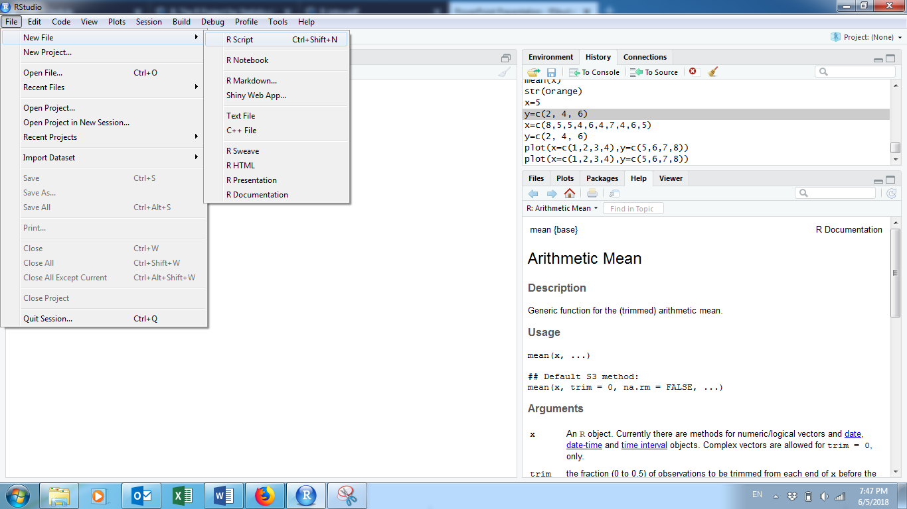

Figure 6. Create a new R script.

When typing the commands in the console window, it issues a prompt when
it expects input commands. The default prompt is “\>”, which on UNIX
might be the same as the shell prompt, and so it may appear that nothing
is happening. For example, if typing “x=5”, and enter, you will not see
what x value is unless if you type “x” in the following line (figure 7).

Figure 7. Example of writing R command.

To assign a vector to a variable, use “variable=c(… , … , …)”. For
example, y=c(1,2,3). The “c” is to initiate a vector (figure 8). The
elements in the vector need to be separated by comma. To assign a value
to a variable or vector, we can use either “=” or “\<-“ (figure 8).

 

Figure 8. Create an R vector.

R is case sensitive, so A and a are different symbols and would refer to
different variables. The set of symbols which can be used in R names
depends on the operating system. Normally all alphabets and numbers are
allowed, plus “.” and “\_”, with the restriction that a name must start
with a letter or “.”.

R commands are separated by a new line. Comments can be inserted
anywhere with a hashmark “\#”. Everything from \# to the end of the line
is a comment. If a command is not complete at the end of a line, R will
give a different prompt, by default “+” on second and subsequent lines
and continue to read input until the command is syntactically complete.

## Vector Operations

Now that we know how to create a vector, we might want to multiply each
element by a scalar constant. In R, this is a simple operation using
just the multiplication operator (\*).

*Example 1:* Multiply each element of the vector (1, 2, 3) by 4 (figure
9).

Figure 9. Vector Operation Example: Multiplication.

Addition, subtraction and division are just as easy.
(<http://www.cyclismo.org/tutorial/R/basicOps.html>)

*Example 2:* For the vector in example 1, add 3 to each element,
subtract 2 from each element and divide each element by 5 (figure 10).

Figure 10. Vector Operation Examples: Addition, Subtraction and
Division.

Vector operations can be extended even further. Let’s say we have two
vectors of equal length. Each of the corresponding elements can be
operated on together.
([http://www.r-tutor.com/r-introduction/vector/vector-arithmetics](http://www.r-tutor.com/r-introduction/vector/vector-arithmetics%20))

*Example 3:* Create two vectors: x = (10, 20, 30) and y = (40, 50, 60).
Do the following operations: x+y, x-y, x\*y, and x/y (figure 11).

Figure 11. Examples of Vector Operations on Two Vectors

*Activity 1:*

Create two vectors: x=(3,5,7), and y=(12, 2, 8), and do the following
operation: x+y, 2\*x, and y/3.

## Create a Data Frame in RStudio

A dataset in R is presented as a data frame. A data frame is a table
with columns representing variables and rows representing individual
cases. Following are the characteristics of a data frame:

  - Column names should be non-empty

  - Data stored in a data frame can be of numeric, factor or character
    type

  - Each column should contain same number of data items

*Example 4*: Create a data frame showing the table below:

| Employment ID | Employer Name | salary | Start Date |
| ------------- | ------------- | ------ | ---------- |
| A             | Jack          | 10.2   | 2012-1-2   |
| B             | Mike          | 32.7   | 2011-3-4   |
| C             | Frank         | 45.6   | 2010-9-7   |
| D             | Kate          | 57.9   | 2010-3-5   |
| E             | Tom           | 35.4   | 2009-8-7   |

Table 1. Example for a data frame

R code (figure 12):

Figure 12. Example of creating a data frame.

Highlight the code and click on Run

This example is to create a data frame table with four columns and five
rows plus a header row.

*Activity 2:*

The table below (table 2) recorded the information for five patients
when they were admitted in the hospital. Create a data frame to show the
information in table
2.

| Patient ID | Gender | Temperature | Systolic Blood Pressure | Oxygen Level (%) |
| ---------- | ------ | ----------- | ----------------------- | ---------------- |
| 1          | Female | 100.6       | 120                     | 98               |
| 2          | Male   | 99.8        | 130                     | 96               |
| 3          | Female | 98.7        | 110                     | 90               |
| 4          | Male   | 98.2        | 109                     | 97               |
| 5          | Male   | 98.5        | 96                      | 95               |

Table 2: activity to create a data frame

## Import Data to RStudio

There are two ways to import an Excel data file: 1) save the Excel file
as .csv vile and use the command

filename\<-read.csv(“directory.csv”, header=TRUE)

For example: mydata\<-read.csv(“C:/Documents/data.csv”, header=TRUE)

The option of “header=TRUE” is to keep the header.

If your data is in .txt format, you can use the following command to
read the data file into R

filename\<-read.table(“directory.txt”,header=TRUE)

2\) from the environment window, click “Import Dataset”-\>”From Text
(base)”, and choose the data file, keep all default settings, and click
“Import” (figure 13).

Figure 13. Import a CSV file to R

If you need to import data from other software, such as SPSS, SAS, or
Minitab, the following table gives the packages and R commands you can
use.

| Software | Package | R function   | File extension |
| -------- | ------- | ------------ | -------------- |
| SPSS     | foreign | read.spss()  | .sav           |
| Minitab  | foreign | read.mtp()   | .mtp           |
| STATA    | foreign | read.dta()   | .dta           |
| SAS      | foreign | read.xport() | .xpt           |

Table 3. Packages and R importation commands

For large data files, you need to specify explicitly the type of each
column. If you do not, R will have to read the entire file to check that
numeric columns are indeed numeric. The following example illustrates
this point with genomic data, well known for their large size. You will
need to download the 50MB file from
<http://www.biostatisticien.eu/springeR/dbsnp123.dat> to your computer,
then try the instructions below (Lafaye de Micheaux et al. 2013).

*Example 5*: Read the genomic data from the website above.

tm\<-Sys.time() \#Gets the current time

dbsnp\<-read.table(“file directory/dbsnp123.dat”)

Sys.time()\<-tm

tm\<-Sys.time()

dbsnp\<-read.table(“file director/dbsnp123.dat”,
colClasses=rep(“character”,3)

Sys.time()

## Export Data

To export R data into a .csv file, use the function “write.csv()”. To
export R data into a .txt file, use the function “write.table()”. The
command is

myfile\<-write.csv(data, file=”directory”)

*Example 6:*

Based on the data frame created from example 4, export the data into a
csv file (figure 14).

Figure 14. Example of export data into a CSV file.

*Activity 3: *

Export the data frame created from activity 2 as a csv file to the
desktop of your computer.

## Inspecting Your Data

Now that we know how to create a data frame or import data, we will want
to spot check it to make sure it looks right. We also want to understand
the structure of the table in order to know how to work with it. Seeing
short excerpts of your data is one easy way to inspect your data. You
can do this using the standard bracket notation for data frames:
df\[rows, columns\] where df is the name of the data frame, and rows and
columns are references to the rows and columns of interest.
([https://dzone.com/articles/learn-r-how-extract-rows](https://dzone.com/articles/learn-r-how-extract-rows%20)
)

*Example 7:* Using the mydata data frame created in example 1, reference
the first three rows and first three columns. Figure 15 shows the most
rudimentary way to reference rows and columns of a data frame.

Figure 15. First three rows and first three columns of the mydata data
frame from Example 1.

Here we are showing the first three rows and first three columns of the
mydata data frame. You do this by passing two vectors, 1:3 and 1:3. That
is shorthand for c(1,2,3) and c(1,2,3). Since the notation for picking
rows and columns is based on vectors, you can deduce that any arbitrary
set of rows and columns can be selected. Consider the example shown in
figure 16.

*Example 8:* Using the mydata data frame, select rows 5, 1, and 3 and
columns 3, 2, and 1. Do the selection in the noted order (figure 16).

Figure 16. Arbitrary subset of mydata.

Notice the order of the vector values determines the order of the rows
and columns. That is, row number 5 prints first, followed by 1 and 3.
Vector order matters.

If we want to get all rows or all columns from the data frame, we can
leave that part blank.

*Example 9:* For the mydata data frame, print the first three rows and
all columns. Then print all the rows and the first three columns (figure
17).

Figure 17. Printing all rows or all columns.

*Activity 4:* Consider the built-in data frame **Formaldehyde.**

1)  Extract the elements of the third row of this data frame.

2)  Extract the elements of the **carb** (carbohydrate) column.

### Data Structure – str Function

The str( ) function gives us a succinct outline of what the data frame
contains.
([https://www.crained.com/822/how-to-use-the-str-function-in-r/](https://www.crained.com/822/how-to-use-the-str-function-in-r/%20)
)

*Example 10:* Use the str( ) function on the mydata data frame (figure
18).

Figure 18. Structure (str) of the mydata date frame.

The first row provides some quick stats: 5 observations (rows) and 4
variables (columns). Below that, we get three columns of information:
column name, data type and a sampling of the first few values. Be sure
to pay attention to the second column. Make sure columns that are
supposed to be numbers are numeric (num) or integer (int), character
columns are chr or factor, date columns are date, etc. Why? R will not
let us do math on character variables or run date functions on non-date
columns.

### Column names – names Function

If you just want a listing of column names, you can run the names( )
function. (<http://www.endmemo.com/program/R/names.php>)

*Example 11:* Generate the vector of column names for the mydata data
frame (figure 19).

Figure 19. Vector of column names of the mydata data frame.

Wondering what that number is in front of the vector every time we print
it? This represents the index number of the first item in that line. For
example, employmentID is item number one, startDate is item number four.

You can access specific values of a vector with the vector\[index
number\] notation.

*Example 12:* Extract the first three column names for the mydata data
frame from the names( ) vector (figure 20).

Figure 20. Extracting certain column names.

The above example shows a basic vector operation to get the first three
values in the names( ) vector.

### Summary Stats – summary Function

summary( ) is often useful if your data frame has several numeric
variables or factors.
([http://www.endmemo.com/program/R/summary.php](http://www.endmemo.com/program/R/summary.php%20)
)

*Example 13:* Use the summary( ) function on the mydata data frame
(figure 21).

Figure 21. summary( ) of the mydata data frame.

For each numeric variable, we get summary statistics like min, max,
mean, etc.

You can also use the bracket notation if you are interested in summary(
) for only specific columns.

*Example 14:* Print the summaries on only salary and startDate (figure
22).

Figure 22. summary( ) of selected columns.

By leaving the rows reference blank, we are keeping all rows.

### Other Quick Inspection Functions

Here are a few more functions that are useful but limited in scope:

  - nrow( ) provides the number of rows in a data frame
    (<http://www.endmemo.com/program/R/ncol.php>)

  - ncol( ) provides the number of columns in a data frame
    ([http://www.endmemo.com/program/R/ncol.php](http://www.endmemo.com/program/R/ncol.php%20))

  - dim( ) provides the number of rows and columns in a data frame. The
    output is a vector of those two numbers.
    ([http://www.endmemo.com/program/R/dim.php](http://www.endmemo.com/program/R/dim.php%20))

  - length( ) counts the number of items in a vector.
    ([http://www.endmemo.com/program/R/length.php](http://www.endmemo.com/program/R/length.php%20))

*Example 15:* Use the functions nrow( ), ncol( ), and dim( ) to find the
number of rows and columns in the mydata data frame. Also find the
length of the salary variable (figure 23).

Figure 23. Examples of the use of other data frame inspection functions.

*Activity 5:* Consider the built-in **USArrests** data frame.

1)  Determine the number of rows and columns for this data frame.

2)  Calculate the median of each column of this data frame.

## Working with Columns

Now that you’ve created a data frame or imported data and done some
light inspection to see what the data looks like, let’s start doing
stuff to your data. Let’s start with columns.

There are four basic things we will want to do with columns in R:

1.  Refer to columns
2.  Create columns
3.  Rename columns
4.  Remove columns

### Referencing Columns – Referencing a Single Column

To reference a single column in R, we use df$columnname where df is the
name of the data frame and columnname is the name of the column. The
most important thing to know is that this is a vector.
([http://www.r-tutor.com/r-introduction/data-frame/data-frame-column-vector](http://www.r-tutor.com/r-introduction/data-frame/data-frame-column-vector%20))

*Example 16:* Use the mean( ) and sd( ) functions to find the mean and
standard deviation of the salary variable. Also extract the specific
values from the employerName variable (figure 24).

Figure 24. Referencing single columns of the mydata data frame.

We ran statistical functions on the salary column. Then we pulled the
values of the employerName column.

### Referencing Columns – Referencing Multiple Columns

Sometimes we want to reference multiple columns in a function, or
extract a few columns and ignore the rest.

*Example 17:* Use the bracket notation to find the summaries of the
employerName and salary variables of the mydata data frame (figure 25).
(<http://www.r-tutor.com/r-introduction/data-frame/data-frame-column-slice>)

Figure 25. Referencing multiple columns of the mydata data frame.

In the df\[\[rows, columns\] notation, by leaving the rows reference
blank, we are requesting all rows be considered.

All we’re doing here is using a vector of column names to specify the
columns we wish to keep, and plugging them into the summary( ) function.
The minimum salary is 10.20, the maximum is 57.90 and the average salary
is 36.36.

### Creating Columns

Let’s create two new columns for the mydata date frame:

  - Age

  - State of Residency

*Example 18:* Create the following vectors: age = (25,32,30,45, 39) and
ResidencyState = (“MN”, “WI”, “MN”, “MN”, “WI”). Create a new data frame
by adding age and ResidencyState as columns utilizing the cbind( )
function (figure 26).
([http://www.datasciencemadesimple.com/cbind-in-r/](http://www.datasciencemadesimple.com/cbind-in-r/%20))

Figure 26. Addition of two new columns to the mydata data frame.

### Renaming Columns

There are usually many ways to accomplish the same thing in R. Renaming
columns in a data frame is one example. The names( ) function provides a
vector of column names. We can change the names of the columns by
changing the values of that vector directly.

*Example 19:* Let’s start by making a copy of the mydata2 data frame
(figure 27).

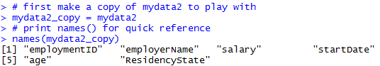

Figure 27. Renaming columns of mydata2 – setup.

We have created a copy of the mydata2 data frame and printed the names
of the columns, just for reference.

*Example* 20: Now let’s rename columns: Rename the employmentID column
to ID, the employerName column to Name, and the ResidencyState column to
State (figure 28).

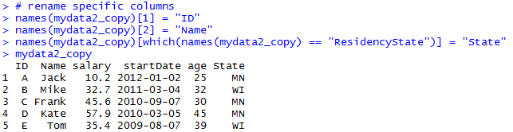

Figure 28. Renaming columns

Since names( ) is simply a vector, we can work with names( ) as we would
any other vector.

In the first two lines of code in figure 28, we renamed columns 1 and 2
by assigning those vector elements the new column names. The third line
uses the which( ) function to replace the hard-coded index numbers.
([https://www.r-bloggers.com/which-function-in-r/](https://www.r-bloggers.com/which-function-in-r/%20))

*Example 21:* Use the which( ) function to return the index number
corresponding to ResidencyState in the mydata2 data frame (figure 29).

Figure 29. Using which( ) function.

As you can see, which( ) returns the index number corresponding to the
vector value in question. Reading that code almost translates to
English: “which item in names(mydata2) is equal to ‘ResidencyState’?”

### Removing Columns – The Simple Way

Sometimes we want to delete columns to simplify our data frame. There
are a few ways to remove a column. We will show you two: a simple way
and a less simple (but more flexible and programmable) way.
([https://howtoprogram.xyz/2018/01/10/r-remove-delete-column-data-frame/](https://howtoprogram.xyz/2018/01/10/r-remove-delete-column-data-frame/%20))

*Example 22:* Remove the column age from mydata2 because we do not plan
on using it. Figure 30 illustrates how you do it.

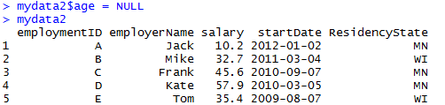

Figure 30. Deleting the age column from the mydata2 data frame.

By setting the column to NULL (case-sensitive), we remove the column
from the data
frame.

### Removing Columns – The Less Simple, but more Flexible and Programmable Way

You saw the which( ) function above in the *Rename Columns* section. We
can also use this function to remove columns by providing negative index
numbers related to the columns we want to remove.

*Example 23:* Make a copy of the mydata2 data frame from example 22 with
age removed. Then delete the following columns using negative index
numbers: employmentID, startDate, and ResidencyState (figure 31).

Figure 31. Deleting multiple columns programmatically.

The which( ) function returns the list of vector index numbers
associated with the three specified columns. The negative sign in front
of which( ) negates that vector of index numbers.

*Example 24:* Using the which( ) function, identify the column index
numbers for the columns removed in example 23 (figure 32).

Figure 32. Negative which( ) for deleting columns.

By providing negative column index numbers, we effectively remove these
columns from the data frame. That is, we are removing columns 1, 4 and
5.

*Activity 6:* Create the following data frame.
([https://www.r-exercises.com/2016/01/04/data-frame-exercises/](https://www.r-exercises.com/2016/01/04/data-frame-exercises/%20))
*  
*

Create the following vector: **Working = c(“Yes”,
“No”,”No”,”Yes”,”Yes”,”No”,”Yes”)**

Create a new data frame adding **Working** as a column variable to the
above data frame.

## Working with Rows

In “working with rows”, the two important features we want to
demonstrate are sorting and filtering a data frame. We will show you two
ways to filter: (a) using bracket notation and (b) using the subset( )
function. The bracket method is more programmable and flexible, but
subset( ) is simpler. The bracket method is more fundamental to R, so
let’s start with that one.

### Filtering with Brackets

One rudimentary way to subset a data frame is with the bracket notation.
([https://www.r-bloggers.com/5-ways-to-subset-a-data-frame-in-r/](https://www.r-bloggers.com/5-ways-to-subset-a-data-frame-in-r/%20))

*Example 25:* Recreate the mydata2 data frame. Then use bracket notation
to select the three individuals from Minnesota maintaining all columns
(figure 33).

Figure 33. Filtering specific rows.

We used the vector (1,3,4) to specify the rows to keep. In a larger data
frame, we usually would not know the row numbers in advance. So we need
a way of generating those numbers formulaically. Recall the which( )
function from selecting specific columns. Now we want to select specific
rows.

*Example 26:* Use the which( ) function to return the row numbers
corresponding to the individuals that reside in Minnesota (figure 34).

Figure 34. Reminder how which( ) works.

The which( ) function returns the row numbers corresponding to the
conditional statement provided. Notice the three numbers, 1, 3, and 4,
match the row numbers we filtered earlier.

*Example 27:* Plug which( ) right into the brackets to select the three
individuals from Minnesota (figure 35).

Figure 35. Select which( ) rows.

### Filtering with subset( )

Let’s first take a look at the structure of the subset( ) function:

subset(x, subset, select, drop = FALSE, …)

x is the data frame, subset is a logical expression indicating the
filter conditions, select is a vector of columns to keep.
(<http://rprogramming.net/subset-data-in-r/>)

*Example 28:* Use the subset( ) function to select the individuals that
reside in Minnesota (figure 36).

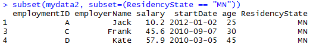

Figure 36. subset( ) data frames

A filter with many conditions is much more pleasant with subset( ) than
with the bracket notation.

### Sorting with order( )

When using row and column index numbers, order matters.

*Example 29:* Print the first three rows of the mydata2 data frame in
natural order (1,2,3) (figure 37).

Figure 37. Rows in natural order.

*Example 30:* Now print the entire data frame in the following scrambled
order: 1,3,2,5,4 (figure 38).

Figure 38. Rows in scrambled order.

This happens to sort the five individuals from youngest to oldest. Index
numbers rule everything. So all we need is a function that returns index
numbers in a desired order. That is the order( ) function.
([http://www.endmemo.com/program/R/order.php](http://www.endmemo.com/program/R/order.php%20))

*Example 31:* Use the order( ) function to return a vector of index
numbers for the age variable (figure 39).

Figure 39. order( ) results for age.

In the mydata2 data frame, row 1 has the youngest individual, row 3 has
the second youngest, and so on with row 4 having the oldest individual.

*Example 32:* Using the order( ) function, sort the mydata2 data frame
by age (from youngest to oldest) (figure 40).

Figure 40. Using the order( ) function for sorting.

In sorting the data frame by age, we get rows 1, 3, 2, 5, and 4, in that
order.

*Activity 7:* Consider the built-in data frame **chickwts**.

1)  Create a subset of the data frame called **chickwts300p** which
    contains all observations for which the weight exceeds 300.

2)  Create another subset called **chickwtsLinseed** which contains all
    observations for which the chicks were fed linseed.

3)  Calculate the average weight of the chicks which were fed linseed.

## Adding New Observations to a Data Frame

New observations can be added to an existing data frame by first
inserting the new observations in a data frame that contains the same
variables and then using the rbind( ) function to join the two data
frames together. The rbind( ) function merges two data frames
“vertically” by binding the rows from them. The two data frames must
have the same variables.
([http://www.endmemo.com/program/R/rbind.php](http://www.endmemo.com/program/R/rbind.php%20))

*Example 33:* Use the rbind( ) function to add the following two new
observations to the existing mydata2 data frame (figure
41).

| Employment ID | Employer Name | salary | Start Date | age | ResidencyState |
| ------------- | ------------- | ------ | ---------- | --- | -------------- |
| F             | Andy          | 46.9   | 2016-4-1   | 42  | MN             |
| G             | Beth          | 51.2   | 2017-10-15 | 36  | MN             |

Figure 41. Combining of two data frames (mydata2 and mydata3) containing
the same variables.

## Merging Data Frames

To merge two data frames that have the same cases but contain different
variables, we accomplish this with the merge( ) function. In most cases,
we want to merge the two data frames by one or more common key variables
to make sure that the rows are matched correctly. The matching is
controlled by the **by** optional argument which defaults to columns
with names that are present in both data frames.
([https://www.statmethods.net/management/merging.html](https://www.statmethods.net/management/merging.html%20))

*Example 34:* We start by creating two example data frames (figure 42).

Figure 42. Creation of two data frames to be used to illustrate merging
of data frames.

As demonstrated above, a shortcut for creating a vector is the :
operator. 1:6 generates the sequence 1, 2, 3, 4, 5, 6 for the id
variable in the dfx data frame. Likewise, 11:16 is equivalent to c(11,
12, 13, 14, 15, 16) for var1 and 15:10 is equivalent to c(15, 14, 13,
12, 11, 10) for var2.

There are four ways to merge two data frames:
([http://www.datasciencemadesimple.com/join-in-r-merge-in-r/](http://www.datasciencemadesimple.com/join-in-r-merge-in-r/%20))

  - Inner join

  - Outer join

  - Left outer join

  - Right outer join

### Inner Join

An inner join only keeps the observations that are present in both data
frames for the variable in the **by** argument.

*Example 35:* Merge the two data frames dfx and dfy by the id variable
(figure 43).

Figure 43. Example of inner join merge.

Note how the unmatched observations from dfx and dfy are discarded from
the merged data frame since the id does not appear in both data frames.

### Outer Join

The outer join keeps all the observations from both data frames
(corresponding to the union of all observations for the variable in the
**by** argument). Setting the all=TRUE argument includes all
observations from both data frames.

*Example 36:* Merge the two data frames dfx and dfy by the id variable
with the all=TRUE argument (figure 44).

Figure 44. Example of outer join merge.

### Left Outer Join

A left outer join keeps all observations and variables from the “left”
data frame and adds the variables from the “right” data frame if they
have a corresponding match for the values from the **by** variable. A
left outer join is undertaken with the all.x=TRUE argument.

*Example 37:* Merge the two data frames dfx and dfy by the id variable
with the all.x=TRUE argument (figure 45).

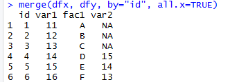

Figure 45. Example of left outer join merge.

### Right Outer Join

A right outer join is the opposite of a left outer join and ensures that
all the rows from the second data frame are always kept in the merged
data frame. Observations from the left data frame are only included if
they have a corresponding match in the right data frame for the **by**
variable values. Setting the all.y=TRUE argument forces a right outer
join.

*Example 38:* Merge the two data frames dfx and dfy by the id variable
with the all.y=TRUE argument (figure 46).

Figure 46. Example of right outer join merge.

Note that NA is inserted for all the outer joins variables when only a
row or id only appear in one of the two data frames.

*Activity 8:* Create a data frame (call it **born**) from the table
below:

| name  | year.born | place.born   |
| ----- | --------- | ------------ |
| Moe   | 1887      | Bensonhurst  |
| Larry | 1902      | Philadelphia |
| Curly | 1903      | Brooklyn     |
| Harry | 1964      | Moscow       |

Create a second data frame (call it **died**) from the following table:

| name  | year.died |
| ----- | --------- |
| Curly | 1952      |
| Moe   | 1975      |
| Larry | 1975      |

Perform an inner merge on the two data frames by using **name** to
combine matched rows.

## Stacking the Columns of a Data Frame Together

Observations from different groups, situations, or conditions are
sometimes stored as separate variables in a data frame. The stack( )
function takes the individual columns and transforms them into a new
data frame. By default, stack( ) stacks all the numeric variables into a
new variable called values and includes a column, ind, that contains the
column name corresponding to the column in the original data frame that
provided the value.
([http://www.datasciencemadesimple.com/stack-and-unstack-function-in-r/](http://www.datasciencemadesimple.com/stack-and-unstack-function-in-r/%20))

*Example 39:* After creating a data frame, use the stack( ) function to
transform the columns into a single vector (figure 47).

Figure 47. Example of stacking data frame columns.

The function unstack( ) reverses the stack( ) function.

## Transforming a Variable

It is often necessary to create a new variable based on the existing
variable(s) or to transform a variable, for example to change its scale.
The transform( ) function can be used to create a new data frame from an
existing data frame and at the same time define or redefine variables
inside the new data frame. As its first argument transform( ) takes the
name of an existing data frame, and changed variables are put as
additional arguments of the form tag=value as shown in example 40.
([http://www.endmemo.com/program/R/transform.php](http://www.endmemo.com/program/R/transform.php%20))

*Example 40:* Using the airquality data frame in base R, create a new
data frame which includes the log transformation of the Ozone variable
from the original data frame (figure 48).

Figure 48. Example of variable transformation.

*Activity 9:* Using the **BOD** data frame in base R, create a new data
frame which includes the square root (**sqrt( )** function in R) of the
**demand** variable from the **BOD** data frame.

## Logical Operations

In examples 20, 21, 26, 27, and 28, we used the symbol ==. This is an
example of a logical operator. In R, == means ‘exactly equal to.’ All
logical operators are expressions that return TRUE or FALSE. For
instance in examples 26, 27, and 28, we used == to select all
individuals where ResidencyState was exactly equal to MN (ResidencyState
== “MN”). Table 4 provides a list of common logical operators in R.
([https://www.datamentor.io/r-programming/operator](https://www.datamentor.io/r-programming/operator%20))

| **Operator** | **Description**          |
| ------------ | ------------------------ |
| \<           | Less than                |
| \<=          | Less than or equal to    |
| \>           | Greater than             |
| \>=          | Greater than or equal to |
| \==          | Exactly equal to         |
| \!=          | Not equal to             |
| \!x          | Not x                    |
| x | y        | x or y                   |
| x & y        | x and y                  |
| isTRUE(x)    | Tests whether x is TRUE  |

*Example 41:* Create two vectors, x and y, of equal length. Using
logical operators perform the following elementwise comparisons: x
\< 5, x \> y, and x \< y (figure 49).

Figure 49. Example of the use of logical operators.

Is x less than or equal to 5? The answer is yes for the first five
values (1, 2, 3, 4 and 5) and no for the last five (6, 7, 8, 9 and 10).
Likewise, 1 \> -5, 2 \> -4, …, 10 \> 4. So x \> y for all elementwise
comparisons. Hence x \> y returns TRUE for all 10 comparisons. In
contrast, x \< y returns FALSE for each of the comparisons.

*Example 42:* Use logical operators to compare the following
expressions: (a) Does 2 equal 3?; (b) Does 2 not equal 3?; (c) Is 2 less
than 3?; (d) Is 2 less than or equal to 3?; (e) Is 2 greater than 3?;
(f) Is 2 greater than or equal to 3? (figure 50)

Figure 50. Using logical operators to compare two numbers.

To test whether all the resulting elements are TRUE, use the all( )
function. Similarly, the any( ) function checks whether any element is
TRUE.
([http://www.datasciencemadesimple.com/any-and-all-function-in-r/](http://www.datasciencemadesimple.com/any-and-all-function-in-r/%20))

*Example 43:* Create two vectors, x and y, of equal length. Use the any(
) and all( ) functions on the expression x \< y (figure 51).

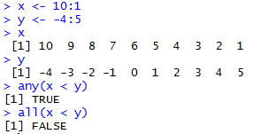

Figure 51. Illustration of the use of the any( ) and all( ) functions.

## Logical Arithmetic

Arithmetic involving logical expressions is very useful in programming
and in selection of variables. The key thing to understand is that
logical expressions evaluate to either true or false (represented in R
by TRUE or FALSE). Numerically, TRUE is the same as 1 and FALSE is the
same as 0.

*Example 44:* Calculate the following: TRUE \* 5 and FALSE \* 5 (figure
52).

Figure 52. Logical arithmetic where TRUE = 1 and FALSE = 0.

Since TRUE = 1, TRUE \* 5 = 5; also since FALSE = 0, FALSE \* 5 = 0.

R provides T and F as shortcuts for TRUE and FALSE, respectively, but it
is best practice not to use them, as they are simply variables storing
the values TRUE and FALSE and can be overwritten as seen in example 45.

*Example 45:* Check the default value of T and then see what happens
when T is assigned a numerical value (figure 53).

Figure 53. Demonstration of why T should not be used as a shortcut for
TRUE.

*Activity 10:* Calculate the expression (**TRUE + TRUE) \* FALSE**.

## Missing Data

In examples 36, 37 and 38 on merging data frames, we saw the expression
NA inserted for some variables due to missing values. NA is entered
simply by typing the letters “N” and “A” as if they were normal text. NA
will often be seen as just another element of a vector. is.na( ) tests
each element of a vector for missingness.
([https://www.statmethods.net/input/missingdata.html](https://www.statmethods.net/input/missingdata.html%20))

*Example 46:* Use the function is.na( ) on the vector c(1, 2, NA, 8, 3,
NA, 3) (figure 54).

Figure 54. Use of the is.na( ) function.

*Example 47:* Calculate the mean of z from example 46 (figure 55).

Figure 55. Calculation of the mean for a vector which includes NA
elements.

The answer is NA since mean returns NA if even a single element is NA.

In order to calculate the mean of the non-missing values in example 47,
you need to specify that the NA are to be removed, using the na.rm=TRUE
argument. There is similar functionality with sum, min, max, var, sd and
other functions.

*Example 48:* Calculate the mean of z from examples 46 and 47 after
removing the missing data (figure 56).

Figure 56. Calculation of the mean after removing the missing data
values.

When the na.rm is TRUE, mean first removes the missing data, then
calculates the mean.

NA works for any kind of vector.

*Example 49:* Use the function is.na( ) on the vector c(“Football”, NA,
“Soccer”) (figure 57).

Figure 57. Use of the is.na( ) function on non-numerical data.

*Activity 11:* Consider the following vector **A \<- c (33, 21, 12, NA,
7, 8)**.

Calculate the mean of A without the missing value.

## Developing Functions

Much of what we need from R can be done with built-in functions or
functions that come in the libraries we install. But sometimes we are
doing something so specific that we are best off writing our own
functions. Or sometimes we need to repeat a specific task within a
program and would rather not copy and paste the same code over and over.

The descriptive anatomy of a custom function is as follows:

functionname \<- function(argument1, argument2, …, argument) {

\<\< commands using the supplied arguments \>\>

return(output)

}

(<https://swcarpentry.github.io/r-novice-inflammation/02-func-R/>)

Creating a function is just like creating any other object. You name it
on the left hand side, and define it on the right hand side. You can
specify as many arguments as you wish. Within the braces, we run
commands and can reference argument 1 through argument N as needed. And
finally, the function will return whatever is in the return( ) function.
If no return( ) is specified, the function will simply return the last
command before the closing brace.

*Example 50:* Create a function to calculate the arithmetic mean of a
single sample. Test the function with some data where we know the right
answer, c(3, 3, 4, 5, 5) (figure 58).

Figure 58. Creation of a function to calculate the arithmetic mean of a
single sample.

*Example 51:* Create a function to calculate the sample variance of a
single sample. Use the function to calculate the variance for the
following sample: c(13, 7, 5, 12, 9, 15, 6, 11, 9, 7, 12) (figure 59).

Figure 59. Creation of a function to calculate the sample variance.

In example 51, mean(x) and length(x) are built-in functions for
calculating the arithmetic mean and determining the sample size,
respectively.

*Example 52:* R does not have a built-in function for calculating the
coefficient of variation. Use the built-in functions mean(x) and sd(x)
to create a function to calculate the coefficient of variation. Use the
function to calculate the coefficient of variation for the vector
consisting of the first 10 positive integers (figure 60).

Figure 60. Creation of a function to calculate the coefficient of
variation.

The first line creates a function and assigns it to cv. The second line
invokes the function, using 1:10 for the value of parameter x. The
function returns the value of its single-expression body, sd(x)/mean(x).

A multiline function uses curly braces to delimit the start and end of
the function body. Also you can refer to functions from within other
functions. A confidence interval (CI) for the population mean is sample
mean \(\pm\) (Student’s \(t\)-value) \(\times\) (standard error of the
mean).

*Example 53:* There is no built-in R function to calculate the standard
error of a mean. Write a function to do so (figure 61).

Figure 61. Creation of a function to calculate the standard error of a
mean.

The R function qt gives the value of Student’s \(t\) with 1
\(–\ \alpha\)/2 = 0.975 and degrees of freedom d.f. = length(x) – 1.

*Example 54:* Create a function called ci95 which uses the function se
from example 53 to compute 95% confidence intervals for a mean. Test the
function with 150 normally distributed random numbers with mean 25 and
standard deviation 3 (figure 62).

Figure 62. Example of a multiline function.

*Activity 12:* Create a function that will return the sum of two
integers.

## If-else Statement in R

### If Statement

The conditional statement in R programming is shown by the syntax of if
statement below:

if (condition\_expression) {

statement

}

If the condition\_expression is TRUE, then the statement gets executed.
If the condition\_expression is FALSE, nothing happens. The
condition\_expression can be a logical or numeric vector. In the case of
numeric vector, zero is taken as FALSE, rest as TRUE. The flowchart of
if statement is shown in figure 63 (source:
<https://www.datamentor.io/r-programming/if-else-statement>).

Figure 63. Flowchart of if statement in R

*Example 55*: Enter a number from the terminal (in interactive use). If
the number entered is positive, print that number.

x=readline(“Please enter a number”)

After this command, R prompts to a line starting with “Please enter a
number”. Then you need to enter a number, and that number is assigned to
x.

if(x\>0) {

print(x) }

### If-else Statement

The syntax of if-else statement is

if (condition\_expression) {

statement1

} else if (condition\_expression) {

statement2

} else if (condition\_expression) {

statement3

} else {

statement4

}

You can include as many conditions as you may. It is important to note
that else must be in the same line as the closing braces of the if
statement. The last else statement is optional. The flowchart of if-else
statement is shown in figure 64.

Figure 64. Flowchart of if-else statement

*Example 56*: Suppose a client pays you a unit price for a job. You
would like to give him a discount of 10% off if he offers you more than
100 hours but less than 200 hours of work. You give him an extra
discount of another 10% off the discounted price if he offers you more
than 200 hours of work. Use if-else statement and create an R function
to calculate the payment. Use the function to find the price of working
for 120 hours with the unit price of $20/hour

*Activity 13*: Suppose you own stocks and make decisions based on the
average price of the previous three days. Here is how you make your
decisions:

  - If the stock value today is lower than the average value of previous
    three days, you buy

  - If the stock value today is higher than the average value of
    previous three days, you sell

  - If the stock value today is the same as the average of previous
    three days, you watch

Write an R function including the if-else statement to return the
decision.

## Repetitive Execution: for loops, repeat and while

Loops are powerful tool that will let us repeat operations. For example,
we can do something to every row of our data frame.

### For Loop

The syntax of a for loop is

for (variable in vector) {

statement

}

The for loop structure does the same thing for n times. The expression
in the parenthesis (variable in vector) is the criteria of making the
decision of doing the thing or not. The variable in the expression is
referred as indicator. If the variable value is in the range of the
vector, the expression returns TRUE, and the loop is executed. If the
variable value is not in the range of the vector, the expression returns
FALSE, and the loop is stopped. At the end of each loop, the indicator
is increased by 1.

*Example 57*: Let x be a vector from 0 to 5. Use for loop to print
\(x^{2}\) values

*Activity 14:* Find the sum of the first 100 squares: \(x\) is from 0 to
100, and calculate the sum of \(x^{2}\).

### While Loop

The syntax of the while loop in R is

while (condition\_expression)

{

statement

}

The condition\_expression is evaluated and the body of the loop is
entered if the result is TRUE. The statement inside of the loop is
executed and the flow returns to evaluate the condition\_expression
again. This is repeated each time until the condition\_expression
evaluates to FALSE, in which case, the loop exists.

The flowchart of the while loop is shown in figure 65.

Figure 65. Flowchart of the while loop

*Example 58*: Find the sum of squares for x\<10. The initial value of x
is 0.

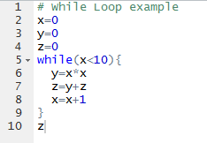

*Activity 15:* Let the initial value of x be 0. Print the \(x^{3}\)
values until x is 10 (not including 10).

### Repeat loop

A repeat loop is used to iterate over a block of code multiple number of
times. There is no condition to check in repeat loop to exit the loop.
We include a condition explicitly inside the body of the loop and use
the break statement to exit the loop.

The syntax of the repeat loop is

repeat {

statement

if (condition\_expression) {

break

}  
}

The flowchart of repeat loop is shown in figure 66.

Figure 66. Flowchart of repeat loop

*Example 59*: Use repeat loop to find the sum of squares for x\<10. The
initial value of x is 0.

*Activity 16*: Use repeat loop to print \(x^{3}\) values until x reaches
10, including 10. Let the initial value of x be 0.

## Debug

There are various options which can be useful to debug a function and
find an error. A useful debugging function in R is the function
browser(). If you insert the instruction browser() in the source of your
function, the program will stop a the place where it was inserted.

*Example 60:*

Run the function and find the intercept for the following X and Y:

X=matrix(c(1,2,3,4,5,6,7,8,9), nrow=3,byrow=TRUE)

Y=matrix(c(3,2,1,4,6,5,9,8,7), nrow=3, byrow=TRUE)

lsq(X,Y)

While running the code, you can see that it stopped at the browser()
(figure 67). Then the program started to debug line by line until it
found an error

Figure 67. Debug using browser().

Here the error message shows that “could not find function T” because
the transpose function is the lower-case t(X).

Another interesting function is debug() which is equivalent to putting
the instruction browser() at the top of a function.

*Example 61*: If we put debug (var) at the top of the function var(1:3),
it marks the function var as debuggable and debug each line of the
function code (figure 68). At the end of the debug, you need to end the
process of debug by using the function undebug(), otherwise, R will put
the function var() as debuggable each time you run it.

Figure 68. Debug using debug() and undebug().

## Data Types

As we have seen in the creation of vectors and data frames, there are
numerous data types in R that store various kinds of data. The four main
types of data most likely to be used are:

  - numeric

  - character (string)

  - Date/POSIXct (time-based)

  - logical (TRUE/FALSE)

The type of data contained in a variable is checked with the class( )
function.
([http://rfunction.com/archives/770](http://rfunction.com/archives/770%20))

*Example 62:* Assign a number to a variable and use the class( )
function to check that it is numeric (figure 769).

Figure 69. Use of the class( ) function.

### Numeric Data

Numeric data is the most common type in R. The most commonly used
numeric data is **numeric**. This is similar to a float or double in
other languages. It handles integers and decimals, both positive and
negative, and zero. A numeric value stored in a variable is
automatically assumed to be **numeric**. Testing whether a variable is
**numeric** is done with the function is.numeric( ).
(<https://stat.ethz.ch/R-manual/R-patched/library/base/html/numeric.html>)

*Example 63:* Use the is.numeric( ) function to verify that the variable
defined in example 62 is **numeric** (figure 70).

Figure 70. Use of the is.numeric( ) function.

Another important, if less frequently used, type is **integer**. As the
name implies, this is for whole numbers only, no decimals. To set an
integer to a variable it is necessary to append the value with an L. As
with checking for a **numeric**, the is.integer( ) function is used.
([http://www.r-tutor.com/r-introduction/basic-data-types/integer](http://www.r-tutor.com/r-introduction/basic-data-types/integer%20))

*Example 64:* Assign an integer value to a variable. Use the is.integer(
) function to verify that the variable is an integer (figure 71).

Figure 71. Creation of an integer variable and verification with the
is.integer( ) function.

Even though i is an **integer**, it will also pass a **numeric** check.

*Example 65:* Use the is.numeric( ) function to verify that the variable
defined in example 64 passes a **numeric** check (figure 72).

Figure 72. Verification that a variable assigned as an integer also
passes the is.numeric( ) check.

R nicely promotes **integers** to **numeric** when needed. This is
obvious when multiplying an **integer** by a **numeric**, but
importantly it works when dividing an **integer** by another
**integer**, resulting in a decimal number.

*Example 66:* Identify the class for the values 4 and 2.8. Determine the
class of the product of these two numbers. Find the class for the values
2 and 5 and for the quotient of 5 divided by 2 (figure 73).

Figure 73. Classes of products and quotients involving integers.

### Character Data

Even though it is not explicitly mathematical, the character (string)
data type is very common in statistical analysis and must be handled
with care. R has two primary ways of handling character data:
**character** and **factor**. While they may seem similar on the
surface, they are treated quite differently.
([http://www.r-tutor.com/r-introduction/basic-data-types/character](http://www.r-tutor.com/r-introduction/basic-data-types/character%20))
([https://www.dummies.com/programming/r/how-to-convert-a-factor-in-r/](https://www.dummies.com/programming/r/how-to-convert-a-factor-in-r/%20))

*Example 67:* Assign the string “data” to the variable x and
factor(“data”) to the variable y (figure 74).

Figure 74. Differences in treatment of **character** and **factor**
data.

Notice that x contains the word “data” encapsulated in quotes, while y
has the word “data” without quotes and a second line of information
about the **levels** of y.

Characters are case sensitive, so “Data” is different from “data” or
“DATA”.

To find the length of a **character** (or **numeric**) use the nchar( )
function.
([http://www.endmemo.com/program/R/nchar.php](http://www.endmemo.com/program/R/nchar.php%20))

*Example 68:* Use the nchar( ) function on the following: x from example
67, the string “hello”, the values 3 and 452, and y from example 67
(figure 76).

Figure 75. Examples of the use of the nchar( ) function.

Note that nchar( ) function does not work for **factor** data.

### Dates

R has numerous different types of dates. The most useful are Date( ) and
POSIXct( ). Date( ) stores just a date while POSIXct( ) stores a date
and time. Both objects are actually represented as the number of days
(Date( )) or seconds (POSIXct( )) since January 1, 1970.
([https://www.stat.berkeley.edu/\~s133/dates.html](https://www.stat.berkeley.edu/~s133/dates.html%20))

*Example 69:* Define a variable date1 using the as.Date( ) function. Use
the class( ) function on date1. Determine the number of days since
January 1, 1970 by use of the as.numeric( ) function. Then define a
variable date2 with the as.POSIXct( ) function. Use the class( )
function on date2. Finally, calculate the number of seconds since
January 1, 1970 with use of the as.numeric( )function (figure 76).

Figure 76. Use of the as.Date( ) and as.POSIXct( ) functions.

Using functions such as as.numeric( ) or as.Date( ) does not merely
change the formatting of an object but actually changes the underlying
type.

*Example 70:* In example 69, we saw that the class( ) function applied
to the variable date1 returned the “Date” data type. Also the
as.numeric( ) function returned the number of days between January 1,
1970 and June 25, 2018. Apply the class( ) function to as.numeric(date1)
(figure 77).

Figure 77. Example of a change in the data type of an object.

### Logical

**Logicals** are a way of representing data that can be either TRUE or
FALSE. Numerically, TRUE is the same as 1 and FALSE is the same as 0. So
TRUE \* 5 equals 5 while FALSE \* 5 equals 0 (see example 44).

Similar to other types, **logicals** have their own test, using the
is.logical( ) function.
([https://www.rdocumentation.org/packages/base/versions/3.5.0/topics/logical](https://www.rdocumentation.org/packages/base/versions/3.5.0/topics/logical%20))

*Example 71:* Assign TRUE to a variable. Then use the functions class( )
and is.logical( ) on the variable (figure 78).

Figure 78. Example of a logical data type variable.

*Activity 17:* Convert 02/07/10, 02/23/10, 02/08/10, 02/14/10, and
02/10/10 into date objects within the variable, **Activity17Dates**.

## Summary Statistics

Some of the most common tools used in statistics and data science are
means, variances, and standard deviations. They are all well represented
in R with easy-to-use functions.

The first thing many people think of in relation to statistics is the
average, or mean, as it is properly called. First we generate a random
sampling of 100 numbers between 1 and 100.

*Example 72:* Use the sample( ) function to generate a random sample of
100 numbers between 1 and 100 (figure 80).
([http://www.datasciencemadesimple.com/sample-function-in-r/](http://www.datasciencemadesimple.com/sample-function-in-r/%20))

Figure 80. Use of the sample( ) function to generate a random sample of
size 100.

The sample( ) function uniformly draws size( ) entries from x. Setting
replace=TRUE means that the same number can be drawn multiple times.

Now that we have a vector of data we can calculate the mean (figure 81).
(<http://www.endmemo.com/program/R/mean.php>)

Figure 81. Use of the mean( ) function.

This is the simple arithmetic mean. We need to consider cases where some
data is missing. To create this we take x and randomly set 20 percent of
the elements to NA.

*Example 73:* Make a copy of x assigning it to variable y. Then choose a
random sample of 20 elements to set to NA (figure 82).

Figure 82. Setting of 20 random elements in a sample to NA.

Using mean( ) on y will return NA (figure 83). This is because, by
default, if mean( ) encounters even one element that is NA it will
return NA.

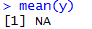

Figure 83. Use of the mean( ) function on a sample containing NA
elements.

To have the NAs removed before calculating the mean, set na.rm to TRUE
(figure 84).

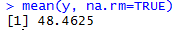

Figure 84. Removal of NAs before calculation of the mean.

To calculate the weighted mean of a set of numbers, the function
weighted.mean( ) takes a vector of numbers and a vector of weights. It
also has an optional argument, na.rm, to remove NAs before calculating;
otherwise, a vector with NA values will return NA.
([http://astrostatistics.psu.edu/su07/R/html/stats/html/weighted.mean.html](http://astrostatistics.psu.edu/su07/R/html/stats/html/weighted.mean.html%20))

*Example 74:* Find the arithmetic mean and weighted mean of the
following student scores: 85, 82, 77, 76 with respective weights of 1/8,
1/8, 1/4, 1/2 (figure 85).

Figure 85. Comparison of calculating the arithmetic mean and a weighted
mean.

Another vitally important metric is the variance, which is calculated
with var( ) (figure 86).
(<http://www.r-tutor.com/elementary-statistics/numerical-measures/variance>)

Figure 86. Use of the var( ) function to calculate the sample variance.

*Example 75:* Refer to example 51. Verify that var( ) calculates the
sample variance (figure 87).

Figure 87. Verification that var(x) calculates the sample variance.

Standard deviation is the square root of variance and is calculated with
sd( ). Like mean( ) and var( ), sd( ) has the na.rm argument to remove
NAs before computation; otherwise, any NAs will cause the answer to be
NA (figure 88).
(<http://www.r-tutor.com/elementary-statistics/numerical-measures/standard-deviation>)

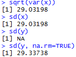

Figure 88. Use of the sd( ) function.

Other commonly used functions for summary statistics are min( ), max( )
and median( ). All of these also have na.rm arguments (figure 89).
(<http://www.endmemo.com/program/R/max.php>)
(<http://www.r-tutor.com/elementary-statistics/numerical-measures/median>)

Figure 89. Use of the min( ), max( ), and median( ) functions.

A helpful function that computes the mean, minimum, maximum and median
is summary( ). There is no need to specify na.rm if there are NAs, they
are automatically removed and their count is included in the results
(figure 90). (<http://www.endmemo.com/program/R/summary.php>)

Figure 90. Use of the summary( ) function.

The summaries also displayed the first and third quartiles. These can
also be computed using the quantile( ) function (figure 91). Quantiles
are numbers in a set where a certain percentage of the numbers are
smaller than that quantile.
([http://www.r-tutor.com/elementary-statistics/numerical-measures/quartile](http://www.r-tutor.com/elementary-statistics/numerical-measures/quartile%20)
)

Figure 91. Use of the quantile( ) function.

*Activity 18:* Using the **chickwts** data frame, compute the
10th, 30th, and 90th percentiles of all
the chick weights.

## Matrices

A very common mathematical structure that is essential to statistics and
data science is a matrix (see example 60). This is similar to a data
frame in that it is rectangular with rows and columns except that every
single element, regardless of column, must be the same type, most
commonly all **numerics**. They also act similarly to vectors with
element-by-element addition, multiplication, subtraction, division and
equality.

### Creating a Matrix

There are several ways of making a matrix. You can create one directly
as in the next example.
([http://www.r-tutor.com/r-introduction/matrix/matrix-construction](http://www.r-tutor.com/r-introduction/matrix/matrix-construction%20))

*Example 76:* Create the 3 x 3 identity matrix (that is, with 1’s along
the diagonal and 0’s as the off-diagonal elements) (figure 91).

Figure 91. Creation of the 3 x 3 identity matrix.

By default, the numbers are entered column-wise. The class and
attributes of X indicate that it is a matrix of three rows and three
columns (these are its dim( ) attributes) (figure 92).

Figure 92. class( ) and attribute( ) function applied to the 3 x 3
identity matrix.

The nrow( ), ncol( ) and dim( ) functions work just like they do for
data frames (figure 93).

Figure 93. nrow( ), ncol( ) and dim( ) functions applied to the 3 x 3
identity matrix.

In the next example, the data in the vector appear row-wise, so we
indicate this with byrow=T.
([http://www.r-tutor.com/r-introduction/matrix](http://www.r-tutor.com/r-introduction/matrix%20))

*Example 77:* From the vector, c(1, 2, 3, 4, 4, 3, 2, 1), create a 2 x 4
matrix where the first row consists of the elements 1, 2, 3, and 4 while
the second row is made up of 4, 3, 2, and 1 (figure 94).

Figure 94. Creation of a 2 x 4 matrix using byrow=T.

Another way to convert a vector into a matrix is by providing the vector
object with two dimensions (rows and columns) using the dim( ) function
(figure 95).

Figure 95. Creation of a matrix using the dim( ) function on a vector
object.

The is.matrix( ) function checks that vector has now become a matrix.
([https://stat.ethz.ch/R-manual/R-devel/library/base/html/matrix.html](https://stat.ethz.ch/R-manual/R-devel/library/base/html/matrix.html%20))

We need to be careful, however, because we have made no allowance at
this stage for the fact that the data were entered row-wise into vector.
As figure 95 shows, a 4 x 2 matrix has been created since R assumes a
default of column-wise entry. The matrix we want is the transpose, t, of
this matrix (figure 96).
([https://www.dummies.com/programming/r/how-to-do-matrix-arithmetic-in-r/](https://www.dummies.com/programming/r/how-to-do-matrix-arithmetic-in-r/%20))

Figure 96. Creation of the transpose of a matrix.

*Activity 19:* Construct a 4 x 2 matrix that’s filled row-wise with the
values 4.3, 3.1, 8.2, 8.2, 3.2, 0.9, 1.6, and 6.5, in that order.

### Matrix Properties

The determinant of a 2 x 2 matrix \(\begin{bmatrix}
a & b \\
c & d \\
\end{bmatrix}\)can be calculated as \(ad - bc\). For larger square
matrices, the calculation becomes more complicated. It can be found in R
using the det( ) function.
([http://www.endmemo.com/program/R/det.php](http://www.endmemo.com/program/R/det.php%20))

*Example 78:* Hilbert matrices are often studied in numerical linear
algebra. Construct the 3 x 3 Hilbert matrix, where entry (\(i,\ j\)) is
1 / (\(i + j - 1\)). Then use the det( ) function to find the
determinant (figure 97).

Figure 97. Use of the det( ) function.

Note that ncol is not required in the command that created it, since the
data argument has been assigned a vector consisting of nine elements; it
is clear that if there are three rows there must also be three columns.

The diagonal elements can be obtained using the diag( ) function (figure
98).
([http://www.endmemo.com/program/R/diag.php](http://www.endmemo.com/program/R/diag.php%20))

Figure 98. Use of the diag( ) function.

We can then compute the trace (the sum of the diagonal entries) using a
home-made function (figure 99).

Figure 99. Creation of a function to calculate the trace of a matrix.

Applying this function to the 3 x 3 Hilbert matrix, we obtain figure
100.

Figure 100. Calculation of the trace of a matrix using the function from
figure 99.

The diag( ) function can also be used to turn a vector into a square
diagonal matrix whose diagonal elements correspond to the entries of the
given vector (figure 101).

Figure 101. Use of the diag( ) function to create a square diagonal
matrix.

As in figure 96, the t( ) function is used to calculate the matrix
transpose (figure 102).

Figure 102. Use of t( ) to calculate the matrix transpose.

### Matrix Arithmetic

Multiplication of a matrix by a scalar constant is the same as
multiplication of a vector by a constant.
([http://www.johnmyleswhite.com/notebook/2009/12/16/quick-review-of-matrix-algebra-in-r/](http://www.johnmyleswhite.com/notebook/2009/12/16/quick-review-of-matrix-algebra-in-r/%20))

*Example 79:* Use the X matrix from figure 102 and multiply each element
by 2 (figure 103).

Figure 103. Multiplication of a matrix by a scalar constant.

Elementwise addition of matrices also proceeds as for vectors (figure
104).

Figure 104. Elementwise addition of matrices.

When adding matrices, always ensure that the dimensions match properly.
If they do not match correctly, an error message will appear (figure
105).

Figure 105. Attempted addition of matrices where dimensions do not
match.

In figure 105, YT is a 2 x 3 matrix while X is 3 x 2.

The command X \* Y performs elementwise multiplication (figure 106).

Figure 106. Elementwise multiplication of matrices.

This differs from the usual form of matrix multiplication that we will
discuss in the next section. Again, in order for this kind of
multiplication to work, the dimensions of the matrices must match.

### Matrix Multiplication

If A and B are matrices, then the matrix product AB is the matrix
representing the composition of the two operations: first apply B, then
apply A to the result. For matrix multiplication to be a properly
defined operation, the matrices to be multiplied must conform. That is,
the number of columns of the first matrix must match the number of rows
of the second matrix. The resulting matrix AB will have its row
dimension taken from A and its column dimension taken from B.

In R, this form of matrix multiplication can be performed using the
operator %\*%.
([http://philender.com/courses/multivariate/notes/matr.html](http://philender.com/courses/multivariate/notes/matr.html%20))

*Example 80:* Using the operator %\*%, multiply the transpose of the
matrix Y (figure 103) by the matrix X (figure 102) (figure 107).

Figure 107. Matrix multiplication using the operator %\*%.

t(Y) has three columns and X has three rows, so we can perform the
multiplication YTX. The result is a 2 x 2 matrix, since t(Y)
has two rwos and X has two columns.

If we failed to transpose Y, we would obtain an error, as in figure 108.

Figure 108. Error message for multiplying matrices that do not conform.

### Calculations on Rows or Columns of the Matrix

We could use subscripts to select parts of the matrix, with a blank
meaning ‘all of the rows’ or ‘all of the columns’.

*Example 81:* Create a 4 x 5 matrix using the following code: X \<-
matrix(c(1, 1, 3, 1, 0, 1, 1, 0, 2, 3, 0, 2, 5, 1, 2, 1, 3, 3, 2, 0)).
Then find the mean of the rightmost column (number 5), calculated over
all the rows (blank then comma). Also find the variance of the bottom
row, calculated over all of the columns (a blank in the second
position). (figure 109)

Figure 109. Calculation of the mean of column 5 and the variance of row
4.

There are some special functions for calculating summary statistics on
matrices (figure 110).
([http://www.datasciencemadesimple.com/rowsums-colsums-rowmeans-columnmeans-r/](http://www.datasciencemadesimple.com/rowsums-colsums-rowmeans-columnmeans-r/%20))

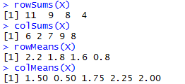

Figure 110. Matrix summary statistics: row and column sums and means.

The apply( ) function is used for applying functions to the rows or
columns of matrices or data frames. Often you want to apply a function
across one of the margins of a matrix. Margin 1 refers to the rows and
margin 2 to the columns.
([https://www.r-bloggers.com/r-tutorial-on-the-apply-family-of-functions/](https://www.r-bloggers.com/r-tutorial-on-the-apply-family-of-functions/%20))

*Example 82:* Use the apply( ) function to find the row totals (four of
them) and the column totals (five of them) of the X matric from example
81 (figure 111).

Figure 111. Use of the apply( ) function to find row and column totals.

Note that in both cases, the answer produced by apply( ) is a vector
rather than a matrix. You can apply( ) functions to the individual
elements of the matrix rather than to the margins. The margin you
specify influences only the shape of the resulting matrix. (figure 112)

Figure 112. Use of the apply( ) function on the individual elements of a
matrix.

### Adding Rows and Columns to the Matrix

Assume we have been asked to add a row at the bottom showing the column
means, and a column at the right showing the row variances (figure 113).
([http://www.r-tutor.com/r-introduction/matrix/matrix-construction](http://www.r-tutor.com/r-introduction/matrix/matrix-construction%20))

Figure 113. Addition of row 5 (column means) and column 6 (row
variances).

Note that the number of decimal places varies across columns, with one
in columns 1 and 2, two in columns 3 and 4, none in column 5 (integers)
and five in column 6. The default in R is to print the minimum number of
decimal places consistent with the contents of the column as a whole.

Next, we need to label the sixth column as ‘variance’ and the fifth row
as ‘mean’ (figure 114).
([https://www.dummies.com/programming/r/r-for-dummies-cheat-sheet/](https://www.dummies.com/programming/r/r-for-dummies-cheat-sheet/%20))

Figure 114. Labeling of rows and columns of a matrix.

*Activity 20:* Create the following four matrices:

\(M = \ \begin{bmatrix}
1 & 1 \\
2 & 3 \\
4 & 1 \\
\end{bmatrix}\), \(N = \ \begin{bmatrix}
3 & 4 \\
1 & 3 \\
4 & 1 \\
\end{bmatrix}\), \(O = \ \begin{bmatrix}
3 & 4 & 2 \\
1 & 3 & 2 \\
\end{bmatrix}\), and \(P = \ \begin{bmatrix}
3 & 4 & 2 \\
1 & 3 & 2 \\
1 & 2 & 1 \\
\end{bmatrix}\).

1)  Calculate \(M\  + N\).

2)  Calculate \(M - N.\)

3)  Calculate 3\(M\).

4)  Calculate \(M*O\ \)using \(M\) %\*% \(\text{O.}\)

5)  Calculate \(O*M\ \)using \(O\) %\*% \(M\).

6)  Calculate \(M^{T}\).

## References

Venables, N. W., Smith, M. D., and the R Core Team, (2018). An
Introduction to R, Notes on R: A Programming Environment for Data
Analysis and Graphics, V3.5.0. Available at

<https://cran.cnr.berkeley.edu/doc/manuals/r-release/R-intro.pdf>

Torres-Reyna, O., (2013). Introduction to RStudio (v1.3). Princeton
University. Available at

<http://dss.princeton.edu/training/>

Martin, T., (2009). The Undergraduate Guide to R: A beginner’s
introduction to the R programming language. Princeton University.
Available at <https://sites.google.com/site/undergraduateguidetor/>

Matloff, N., (2008). R for Programmers. University of California, Davis.
Available at
<https://archive.org/download/ost-computer-science-rforprogammers/RforProgammers.pdf>
