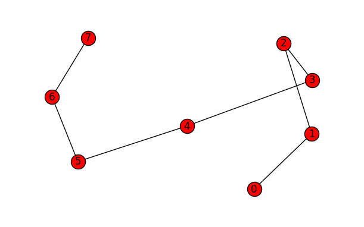
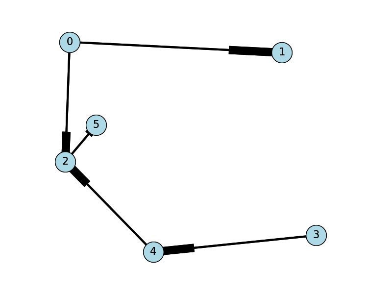

# Module: Graph Theory – 1 Credit / 15 hours

Competency: Mathematical Reasoning of Data 

Author: Jack Pope 

## Instructor overview & objective

This course module is about Graph Theory. 

Given that this module is to be worth 1 credit, or 15 hours of
coursework, the instructor should prepare three to five subtopic
discussions. These should account for at least 5 hours of instructional
material and might be in the form of lecture notes or lecture videos.
The additional hours should be comprised of student labs or assignments.
 

Traditionally, a course in Information Theory takes a theoretical
approach, on paper. However, the field of Data Science is an empirical
endeavor that programmatically emphasizes empirical evidence. 

Axioms which we accept as true are what support logical proof. Evidence
(data) supports empirical proof, certainty based on a measurement and
its statistical significance. A weakness of logical proof occurs when
erroneous accepted "facts" support an axiom. A weakness of the empirical
proof occurs when the data sample does not represent a population.

To accommodate our purposes, we will use the Python programming
language. The choice of programming language is ultimately left to the
instructor.

Schedule 

|Unit| Topic
|---|---

|1| Overview

|2| Graph quantification and comparison

| | Exercise

| 3|Graph as adjacency matrix 

| | Exercise

| 4| Graph as adjacency list 

| | Exercise

| 5 | Graph traversal

| | Exercise

|6| Shortest path problems

| | Exercise

| | Traveling salesman problem

## Overview

A graph data structure is a collection of distinct vertices (nodes),
connected by lines referred to as edges or arcs. Each vertex may be
associated with a label or ID, and it may have a numeric value
representing connecting edges.

The representation of each vertex and edge depends on the data structure
employed. In object oriented programming there can be a Vertex class
that contains a list of neighboring vertices and associated edges. An
understanding of linked lists is prerequisite to formulating graphs as
such. 

More formally, a graph G can be described as a set of a sets of vertices
V and a set of edges E. We can denote a graph G(V, E) such that V = V(G)
and E = E(G). 

When there is an edge e1 that connects two vertices v1 and v2, we say
vertices v1 and v2 are "adjacent or neighbors."  That is e1 represents
the pair v1 and v2, or e1 = {v1, v2}. The term "endpoints" may thus
refer to v1 and v2.

Graphs can also be represented by adjacency matrices and adjacency
lists. These data structures can, in turn, be made of parallel lists or
arrays or hash tables.

Properties of graphs in general:

  - Edge – Connects a distinct pair of vertices.

  - Subgraph – A graph may exist within a graph. Given G = G(V, E), it
    may be denoted as H = H(V', E').

  - Digraph – A directed graph, wherein edges enforce direction of
    traversal. 

  - Connected graph: Defined by a path between any two vertices.

  - Strongly connected – When a digraph has a path from every vertex to
    every other vertex.

  - Weighted graph – the edges have numeric values in terms of weight,
    cost, distance, .... 
    
    

  - Degree of vertex – The number of edges incident to a vertex. Ex:
    deg(v1) = 2

  - In-degrees and out-degrees – Pertain to the degrees in a digraph.

  - Isolated vertex – has no degree of incidence. 

  - Regular graph – when every vertex has the same degree.

  - Path – A sequence of vertices from an origin vertex to a destination
    vertex. 

  - Distance – Sum of the values for all intermediate edges of a path. 

  - Cyclic graph – When a path within a graph returns to a vertex
    within, a cycle exists.

  - Acyclic graph – When no cycles exist within a graph.

  - Finite path – Any pair of vertices is connected by exactly two end
    points.

  - Infinite path – One vertex originates paths having more than one
    distinct end point. (Like a ray)

  - Finite graph – Graph of finite paths and no vertex is in more than
    one path.  

  - Locally finite – Subgraph that if finite.

  - Infinite graph – Graph of infinite paths.

  - Multigraph – When parallel or multiple edges connect the same vertex
    pairs if a graph.

  - Euler graph (path) – A path through a finite graph that traverses
    every edge exactly once. 
    
        

  - Eulerian circuit – Euler path that ends and begins at the same
    vertex.

  - Loops – When an edge connects to a vertice to itself for self
    reference. Multiple loops on a single vertex allows it to be
    multigraph. 

  - Sparse graph – Most vertices of the graph are not connected.
    
        

  - Dense graph – Most vertices of the graph are connected. 

Example of a connected and undirected graph:


Undirected graphs can be:

  - Connected 

  - Complete 

  - Disconnected

Properties of a connected graph:

  - Path exits between every pair of vertices.
  - Complete – If it has an edge between every distinct vertex pair.
  - Directed and complete – If each vertex pair has two directed edges.

Graph that is
a connected simple path from vertex 0 to vertex 7:

Graph that is
complete:

Graph that is
disconnected and exhibits a simple cycle:

Adjacency: Two vertices, such as v3 and v4 above, are adjacent given
that there is an undirected edge between them. This is equivalent to
parallel directed edges, such that v3 → v4 and v3 ← v4. If the edge is
directed only such that v3 → v4, then v4 is adjacent to v3 and v4 is not
adjacent to v3.

## Graph construction

One way to construct a graph:

  - Make a class Vertex with attributes:
    
      - label
      - degrees
      - adjacent neighbor list and associated edge weights
      - Possible counter for traversals or "visits"

  - Use a list data structure to contain the Vertex objects. Possibly
    define a stack or queue. A hash table may be used.

In pseudo code, a Vertex class of a simple graph having implied edges:

```
class Vertex:
  Vertex[] neighbor
  int[] distance2neighbor 
  int degrees = 0
  Vertex(Vertex adjacentNeighbor, int distance):
    degrees = degrees + 1 
    neighbor[degrees] = adjacentNeighbor
    distance2neighbor[degrees] = distance
```
Conversely, an Edge class can be defined to have Vertex class
attributes. 

In Python we can have:

```python
class Vertex:
  def __init__(self, val ):
    self.val = val
    self.edges = []

class Graph:
  def __init__(self, vertices=[] ):
    self.vertices = vertices

  def add_vertex(self, val ):
    new_vertex = Vertex(val )
    self.vertices.append(new_vertex )
  def add_edge(self, vertex1, vertex2 ):
    vertex1.edges.append(vertex2)
    vertex2.edges.append(vertex1)
```
### Exercise

1. Write a Python program to build a simple connected graph. Populate
your graph from data, either hard coded into your program or by file
I/O. Run your program to display your graph as standard output.
(Optionally, use the Networkx Python library for more visual appeal. See
<https://networkx.github.io/> )
2. Write a function in Python to verify that a graph is regular.

Submit your code and your tested output.

## Graph quantification and comparison

### Quantification of graphs:

- Total degrees in a graph: 2 * edgeCount
- Density of graph of n vertices: 2 * edgeCount / n * (n - 1)
    - Maximum density is 1, or 100%. 
    - Minimum density is 0 (isolated graph).
- Number of edges in a graph of n vertices:
  - Complete directed graph: n - 1
  - Complete undirected graph: n \* (n - 1) / 2
  - Directed graph: n \* (n – 1)
- Edge weight: may be assigned or computed, as below
- Distance (see shortest path discussion below)

### Edge weight:

A weighted graph gives values to its edges, such as weight, cost, time,
or distance. This is unlike an unweighted graph that represents
relationships simply as true or false, or as 0 or 1. 

It may be the case that weights must be derived by your program. One
method to compute distance is to assign Cartesian (x, y) coordinates to
each vertex and then to compute the sum of distances between each vertex
from the origin and the destination vertex. Between any two vertices in
an XY plane, the distance, or Euclidean distance is:

\[
\left( (x_1 - x_2)^2 + (y_1 - y_2)^2\right)^{1/2}
\]

The advantage of having weights based on Euclidean distance is that it
affords representing graphs beyond two or even three dimensions, such
that the distance between any vertex pairs can be determined as:

\[
\left((x1 - x2)^2 + (y1 - y2)^2 + … + (z1 -
z2)^2 )\right)^{1/2} 
\]

Such coordinates can be useful for highly dimensional factor analytics.

Graph density example:

Using Python, density may be computed as follows. Suppose we have a
graph represent be the following adjacency list G (more about adjacency
lists below):

```python
G = { 
  "a" : ["b", "d"],
  "b" : ["a", "b", "c", "d"],
  "c" : ["a", "b"],
  "d" : ["a", "b"]
}
```

Populate a data structure:
```python
edges = []
for vertex in G:
  for neighbor in G[vertex]:
    if {neighbor, vertex} not in edges:
      edges.append({vertex, neighbor})
```

A density algorithm:
```python
def density(G):
  n = len(G.keys())
  edgeCount = len(G.edges())
  return 2.0 * edgeCount / (n * (n - 1))
```
Comparing of graphs:

  - Equality: same structure, data and order; equal objects are
    identical
  - Identity: same data and order; maybe different structure (identical
    may be equal)
  - Isomorphism: same number of vertices, edges and degrees at each
    level (data irrelevant) 

Two graphs are isomorphic if they can be mapped one-to-one to each other
and preserve the relationships between vertices. These are essentially
the same graphs though they may look different.

Applications of graph comparison include analysis of fingerprints and
social networks.  

Incidentally, a connected undirected graph can be equivalent to a
directed graph if each of the vertex pairs of the former connect by two
directed edges, one going in each direction between nodes.

### Exercise

Write a Python program that generates two undirected graphs G1 and G2,
each with vertices A to Z, and each with randomly connected vertices (no
more than one connection to a pair of vertices). The connection weights
should be random integers from 1 to 10. Determine if G1 and G2 are
equal, identical and isomorphic.

Submit your code and your tested output.

## Graph as adjacency matrix 

We can construct an adjacency matrix to see which vertices are adjacent.
Intersections in the matrix may be assigned 0 or 1 (true of false) for
unweighted graphs or have other values if weighted. 

An adjacency matrix can be constructed using a multi-dimensional array
or parallel lists. An algorithms with a nested loop allows iteration
over all possible vertex pairs. 

The following pseudo code counts the number of edges for an undirected
adjacent matrix:

```
for i 0 to n :
  for j 0 to m :
    if pair[i][j] != pair[j][i] :
    count = count + 1
```

Since the adjacency matrix is symmetric about the diagonal, neither the
diagonal nor values above the diagonal are counted. Hence, for an
undirected adjacent matrix, 

total number of possible edges = n \* (n - 1) / 2 

For a directed
graph, entries are only made in the adjacency matrix if direction to a
vertex exists. For example, consider the following adjacency matrix for
the directed graph on the right. As you can see, the pair (1, 2) has and
entry of 0 while the pair (2, 1) has an entry of 1. Because of the
direction from vertex 1 to vertex 2, vertex 2 is adjacent to vertex 1
and vertex 1 is not adjacent to vertex 2.


The total possible edges for this graph is: 8 \* (8 – 1) / 2 == 56 / 2
== 28. However, the directional edges indicate just 10 neighbors. Stated
differently, the connections of a directed graph have a head and a tail,
whereby only the heads are counted.

### Exercise

1. Write a function in Python to generate an adjacency matrix from a
list of of vertex pairs.
2. Write a function in Python to determine if a graph is directed or
undirected. 

Submit your code and your tested output.

## Graph as adjacency list

The adjacency list is an alternative way to represent adjacency
matrices. This is a list consisting only of those vertex pairs that are
"adjacent." Because the adjacency list excludes the data of
non-adjacent vertices, it requires fewer system resources, such as
memory and disk space, than the adjacency matrix. 

An adjacency list is recommended for representing large sparse graphs. 

The implementation of an adjacency list can be via list, trees, or hash
table.

An adjacency list can be represented as follows:
```
 G = [v5:v1, v3; v6:v1, v3, v5; … vN{}]
```
showing each vertex followed by a lists of its neighbors.

Alternatively:

G = [v5:1, 3; v6:1, 3, 5; … vN{}]

… where each vertex is followed by the index of its neighbors in the
adjacency table, or `G[i:i,j]`

As a hash table the adjacency list can have a key associated with a list
of neighbors:
```
G[v5] = {v1,v3,...
```
In Python such an adjacency list can look as follows:
```python
graph = {
  5: [1, 3],
  6: [1, 3, 5]
}
```
If the graph is weighted, perhaps with percentiles, the adjacency list
can be denoted as:
```
G = { (5, 1):0.5, (5, 3):0.8, (6, 1):0.2, (6, 3):0.4, (6, 5): 0.9 }
```
Or, in Python as:
```python
weight = {
  (5, 1): 0.5,
  (5, 3): 0.8,
  (6, 1): 0.2,
  (6, 3): 0.4,
  (6, 5): 0.9
}
```
For example, reading an adjacency list from file graphdata.txt,
```
graphdata.txt:
0,1,3
0,2,4
2,5,7
3,4,6
4,2,5
```
Now draw the graph (in Python with Networkx library):
```python
import sys
import matplotlib.pyplot as plt
import networkx as nx

options = {
  'node_color': 'lightblue',
  'node_size': 900,
  'width': 3,
  'arrowstyle': '-|>',
  'arrowsize': 12,
  'font_size': 15
}

the_file = "graphdata.txt"
G = nx.DiGraph()

with open(the_file) as f:
  for line in f:
    a, b, w = map(int, line.strip().split(','))
    G.add_edge(a, b, weight = w)
    pos = nx.spring_layout(G,scale=1)
    nx.draw(G,pos,font_size=8)
    nx.draw_networkx(G, pos, arrows=True, **options)
    plt.show()
```


### Exercise

Write a function graph\_density that determines if a graph is dense or
sparse according to a file containing an adjacency list. If the graph is
sparse, the function calls another function, adjacency\_matrix, to
generate an adjacency matrix. 

Your graph\_density function should additionally read a file containing
an adjacency matrix. If the adjacency matrix is dense, your function
calls another function, adjacency\_list, to generate an adjacency
list.  

Provide your functions and your test results. 

## Graph traversal

  - Traversal begins with any vertex – the "origin" vertex
  - Visiting a vertex in a graph does not entail processing its data.
  - Only vertices that are connected can be traversed. 
  - Methods include Depth First Search and Breadth First Search

Depth first search and breadth first search methods:

  - Find all neighbors of a vertex.
  - Find all paths between an origin and destination vertex.

Depth first search (DFS): Visit a neighbor of the origin, a neighbor of
the neighbor, and so on, advancing as far as possible from the origin.
Then go back to the first neighbor and repeat this procedure from there,
traversing to unvisited neighbors. Sometimes a stack data structure is
used to ensure that each path of neighbors is traversed in reverse to
get back to the origin. DFS is also used for a topological sort (see
below).

In Python, we have the following depth first and breadth first search
functions, as popularized by Guido van Rossum, the creator of Python
(<https://www.python.org/doc/essays/graphs.html> … link is now defunct).

A recursive DFS algorithm:
```python
def dfs(graph, start, path=[]):
  path += [start]
  for vertex in graph[start]:
    if not vertex in path:
      path = dfs(graph, vertex, path)

  return path
```

An iterative DFS algorithm:

```python
def dfs(graph, start, path=[]):
  front = [start]

  while front:
    vertex = front.pop(0)

    if vertex not in path: # versus bfs... if not vertex in path
      path += [vertex]
      front += graph[vertex]

return path
```

The aforementioned algorithms can be tested on a graph of the following
adjacency list form:
```
graph = {
  'A': ['B', 'C'], 
  'B': ['D', 'E'],
  'C': ['E'], 
  'D': ['F'], 
  'E': ['F'],
  'F': ['G', 'D'],
  'G': []
}
```
Breadth first search (BFS): Visit each neighbor, then each neighbor's
neighbor, and so on. Sometimes a queue data structure is used to ensure
that no neighbor is visited more than once. DFS can additionally yield
the minimum edge accumulation in a path (shortest path). 

In Python:
```python
def bfs(graph, start, path=[]):
  front = [start]

  while front:
    vertex = front.pop(0)

  if not vertex in path:# versus iterative dfs... if vertex not in path
    path += [vertex]
    front += graph[vertex]

  return path
```

Note how the above algorithm is almost identical to the iterative DFS
function above.

### Shortest path problems

Graph traversal methods for finding the shortest path entail adding up
the connecting edges in the chain of neighbors between the origin vertex
and destination vertex. The solution to an unweighted shortest path
problem will be the path having minimum number of edges.

Recall that edges can be weighted. That is, associated values vary over
some range, such as distance, correlation, or time. A path can represent
a sum of decisions and have an associated cost. A solution will have a
"total distance" or "total cost."

total vertices in shortest path \< n – 1

Some shortest path methods:  

  - Dijkstra's algorithm
  - All pairs (Floyd-Warshall) algorithm
  - Topological ordering
  - Minimum spanning tree

Dijkstra:

  - Set origin distance to 0. 
  - Set all vertex distances to max possible distance.
  - Select unvisited vertex V1 having minimum distance from origin V0.
    (some use a queue)
  - Select unvisited vertex V2 having minimum distance from vertex V1.
  - … Repeat until at destination vertex.

The Dijkstra algorithm exhaustively finds the shortest path between the
origin vertex and every other of the graph's vertices. 

All pairs:

  - Set origin distance to 0. 
  - Set all vertex distances to max possible distance.
  - For every vertex, accumulate the minimum distance to every neighbor.
  - Given distance\[i\]\[j\] == 0 where i and j represent the origin,
    the destination distance depends on specified i,j 

The all-pairs (Floyd-Warshall) method computes the shortest path between
all vertex pairs. The method is relatively straight forward:
```
for (int i = 0; i < n; i++) {
  for (int j = 0; j < n; j++) {
    for (int k = 0; k < n; k++) {
      distance[i][k] = min(distance[i][k], distance[i][j] + distance[j][k]);
    }
  }
}
```
Given a weighted adjacency matrix, using a dictionary of form... 
```
g[1,1] = 2
g[1,3] = 4
g[1,5] = 6
```
In Python we can have:
```python
def all_pairs(g, n):
  dist = {0: g}

  for i in range(1, n + 1):
    dist[i] = {}

    for j in range(1, n + 1):
      for k in range(1, n + 1):
      dist[i][j, k] = min(dist[i - 1][j, k], dist[i - 1][i, j] + dist[i - 1][i, k])

  return dist[n]
```
Topological sort:

For modeling systems wherein there are subsets of required sequence or
dependencies, we can use a topological sort. In the context of a
directed graph, the vertices of subgraphs or paths are queried with
respect to edge weights. Another term for this is "precedence graph." 

Formally, a topological sort of a directed acyclic graph G = (V, E) is a
linear ordering of vertices such that if an edge (u, v) exists in G,
then u is listed before v in the linear sequence.

For the shortest path problem of a weighted acyclic graph G with
vertices V, the topological sort can be used as follows:

- Initialize collections:
  ```
  for i 1 to n of G:
  dist[i] = maxint
  ```
- Initialize the origin vertex:
  ```
  dist[Vo] = 0 . . . the origin vertex
  ```
- Topologically sort all vertices:
  ```
  for every vertex V[i]:
    for every vertex V[j]:
      if(V[j] is adjacent to V[i]):
        if(dist[j] > dist[i] + weight(i, j)):
        dist[j] = dist[i] + weight(i, j) 
  ```
Minimum spanning tree:

A tree is an acyclic graph that is connected. When that tree connects
all vertices in an undirected weighted graph at minimum distance, we
have a minimum spanning tree (MST). 

Formally, given an undirected weighted graph G = (V, E), an MST is the
set T of edges in E that connect all vertices with a minimum total
distance. These edges form a tree because each vertex has only one
parent apart from the root vertex.

MST algorithm:

1.  Rank the graph edges from least to most weight, storing the results
    in list ranked\_edges.
2.  Traverse ranked\_edges, removing those that do not disconnect the
    graph.

Or:

1.  Rank the edges from most to least weight, storing the results in
    list ranked\_edges.
2.  Traverse ranked\_edges, summing the weights of edges that do not
    create a cycle.

Based on the second version of this algorithm, find the MST of a graph
of vertices A, B, C, D, E, and F. 

Edges:  B-D A-E D-F B-F C-E A-C A-F B-E B-C        

Weight:  2      4      5     6     7      8     8      9     9          

Add?  Yes  Yes   Yes  No  Yes   No Yes  No  No

Edges of MST:  B-D A-E D-F  C-E A-F   

Sum of edges:    2 + 4 + 5  + 7 + 8  == 26 

Exercises

For the following tasks, submit tested code and and related output.

Tasks:

1\. Devise a function to determine if a graph is strictly a tree.  

2\. Given any two random vertices in a connected graph, write a Python
program to compare Dijkstra and MST approaches for computing the
shortest path. See that you get the same results. How doe there
processing times compare? 

3\. Write an algorithm to topologically sort a graph. Test your
algorithm on graphs that contain a cycle and those that don't. Compare
the run times and output of these two scenarios. What do you find most
remarkable? 

4\. Euler theorized that the "Eulerian graph" exists if and only if each
vertex has an even numbered degree. Write a Python program to prove
Euler correct, or not.

Traveling salesman problem (summation of paths)

Consider a cyclic and connected graph that permits every node to be
visited at least once. Such a graph is also called a "Hamiltonian
circuit." Unlike a Eulerian circuit, which must traverse each edge
exactly once (and can repeat vertex visits), the Hamiltonian circuit
must visit each vertex exactly once (and can re-traverse edges). 

Like a Hamiltonian circuit, the traveling salesman problem entails a
visit to locations. The challenge is to determine the path that
minimizes total distance, for multiple locations. As the number of
cities increases, there is a combinatorial explosion in the number of
possible routes. 

Total possible routes (Hamiltonian circuits) in a complete graph having
n vertices:

H = (n – 1)\! / 2

Solutions put forth in the programming communuity have included the
following techniques:

  - Brute force nearest neighbor assessment
  - Simulated annealing
  - Genetic algorithms
  - Minimum spanning trees
  - Neural networks
  - Implementation of constraints
  - Other exotic and sophisticated methods.

A somewhat naïve approach using the nearest neighbor method:

  - For every targeted vertex, compute the distance to each of the other
    targeted vertices
  - For each target vertex, sort the other targeted vertices by distance
    
  - Move to the nearest target vertice that has not been visited.
  - Repeat, until circuit is complete

TSP makes for an interesting exploration of computation that might suit
a distinct competency module in its own right. Look for working examples
in the Big Data Analytics course module.

Additional Internet resources

[http://graphviz.org](http://graphviz.org/gallery/)

<https://networkx.github.io/>

<https://www.python.org/doc/essays/graphs/> 

<http://mitpress.mit.edu/books/introduction-algorithms-third-edition>

<https://scipbook.readthedocs.io/en/latest/routing.html>
