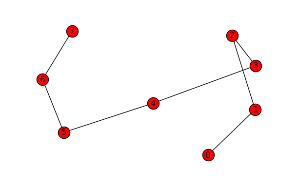
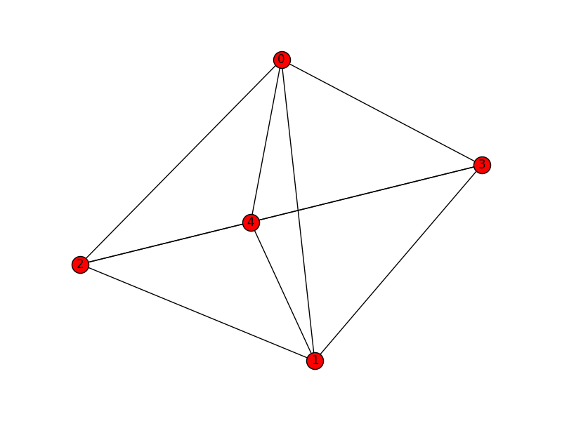

## Overview

A graph data structure is a collection of distinct vertices (nodes),
connected by lines referred to as edges or arcs. Each vertex may be
associated with a label or ID, and it may have a numeric value
representing connecting edges.

The representation of each vertex and edge depends on the data structure
employed. In object oriented programming there can be a Vertex class
that contains a list of neighboring vertices and associated edges. An
understanding of linked lists is prerequisite to formulating graphs as
such. 

More formally, a graph G can be described as a set of a sets of vertices
V and a set of edges E. We can denote a graph G(V, E) such that V = V(G)
and E = E(G). 

When there is an edge e1 that connects two vertices v1 and v2, we say
vertices v1 and v2 are "adjacent or neighbors."  That is e1 represents
the pair v1 and v2, or e1 = {v1, v2}. The term "endpoints" may thus
refer to v1 and v2.

Graphs can also be represented by adjacency matrices and adjacency
lists. These data structures can, in turn, be made of parallel lists or
arrays or hash tables.

Properties of graphs in general:

  - Edge – Connects a distinct pair of vertices.

  - Subgraph – A graph may exist within a graph. Given G = G(V, E), it
    may be denoted as H = H(V', E').

  - Digraph – A directed graph, wherein edges enforce direction of
    traversal. 

  - Connected graph: Defined by a path between any two vertices.

  - Strongly connected – When a digraph has a path from every vertex to
    every other vertex.

  - Weighted graph – the edges have numeric values in terms of weight,
    cost, distance, .... 
    
  - Degree of vertex – The number of edges incident to a vertex. Ex:
    deg(v1) = 2

  - In-degrees and out-degrees – Pertain to the degrees in a digraph.

  - Isolated vertex – has no degree of incidence. 

  - Regular graph – when every vertex has the same degree.

  - Path – A sequence of vertices from an origin vertex to a destination
    vertex. 

  - Distance – Sum of the values for all intermediate edges of a path. 

  - Cyclic graph – When a path within a graph returns to a vertex
    within, a cycle exists.

  - Acyclic graph – When no cycles exist within a graph.

  - Finite path – Any pair of vertices is connected by exactly two end
    points.

  - Infinite path – One vertex originates paths having more than one
    distinct end point. (Like a ray)

  - Finite graph – Graph of finite paths and no vertex is in more than
    one path.  

  - Locally finite – Subgraph that if finite.

  - Infinite graph – Graph of infinite paths.

  - Multigraph – When parallel or multiple edges connect the same vertex
    pairs if a graph.

  - Euler graph (path) – A path through a finite graph that traverses
    every edge exactly once. 
    
        

  - Eulerian circuit – Euler path that ends and begins at the same
    vertex.

  - Loops – When an edge connects to a vertice to itself for self
    reference. Multiple loops on a single vertex allows it to be
    multigraph. 

  - Sparse graph – Most vertices of the graph are not connected.
    
        

  - Dense graph – Most vertices of the graph are connected. 

Example of a connected and undirected graph:


Undirected graphs can be:

  - Connected 

  - Complete 

  - Disconnected

Properties of a connected graph:

  - Path exits between every pair of vertices.
  - Complete – If it has an edge between every distinct vertex pair.
  - Directed and complete – If each vertex pair has two directed edges.

Graph that is a connected simple path from vertex 0 to vertex 7:




Graph that is complete:



Graph that is disconnected and exhibits a simple cycle:


Adjacency: Two vertices, such as v3 and v4 above, are adjacent given
that there is an undirected edge between them. This is equivalent to
parallel directed edges, such that v3 → v4 and v3 ← v4. If the edge is
directed only such that v3 → v4, then v4 is adjacent to v3 and v4 is not
adjacent to v3.

### Graph construction

One way to construct a graph:

  - Make a class Vertex with attributes:
      - label
      - degrees
      - adjacent neighbor list and associated edge weights
      - Possible counter for traversals or "visits"

  - Use a list data structure to contain the Vertex objects. Possibly
    define a stack or queue. A hash table may be used.

In pseudo code, a Vertex class of a simple graph having implied edges:

```
class Vertex:
  Vertex[] neighbor
  int[] distance2neighbor 
  int degrees = 0
  Vertex(Vertex adjacentNeighbor, int distance):
    degrees = degrees + 1 
    neighbor[degrees] = adjacentNeighbor
    distance2neighbor[degrees] = distance
```
Conversely, an Edge class can be defined to have Vertex class
attributes. 

In Python we can have:

```python
class Vertex:
  def __init__(self, val ):
    self.val = val
    self.edges = []

class Graph:
  def __init__(self, vertices=[] ):
    self.vertices = vertices

  def add_vertex(self, val ):
    new_vertex = Vertex(val )
    self.vertices.append(new_vertex )
  def add_edge(self, vertex1, vertex2 ):
    vertex1.edges.append(vertex2)
    vertex2.edges.append(vertex1)
```
### Exercise

1. Write a Python program to build a simple connected graph. Populate
your graph from data, either hard coded into your program or by file
I/O. Run your program to display your graph as standard output.
(Optionally, use the Networkx Python library for more visual appeal. See
<https://networkx.github.io/> )
2. Write a function in Python to verify that a graph is regular.

Submit your code and your tested output.
