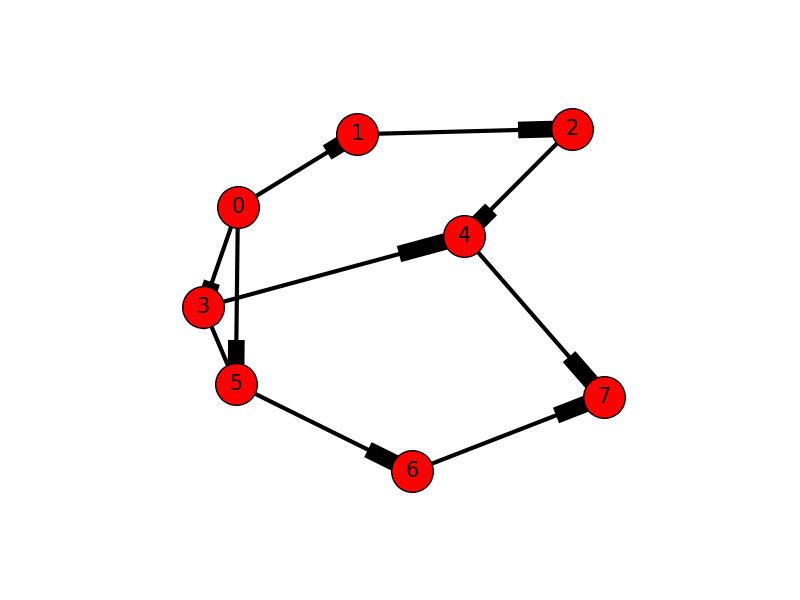

## Graph as adjacency matrix 

We can construct an adjacency matrix to see which vertices are adjacent.
Intersections in the matrix may be assigned 0 or 1 (true of false) for
unweighted graphs or have other values if weighted. 

An adjacency matrix can be constructed using a multi-dimensional array
or parallel lists. An algorithms with a nested loop allows iteration
over all possible vertex pairs. 

The following pseudo code counts the number of edges for an undirected
adjacent matrix:

```
for i 0 to n :
  for j 0 to m :
    if pair[i][j] != pair[j][i] :
    count = count + 1
```

Since the adjacency matrix is symmetric about the diagonal, neither the
diagonal nor values above the diagonal are counted. Hence, for an
undirected adjacent matrix, 

total number of possible edges = n \* (n - 1) / 2 

For a directed
graph, entries are only made in the adjacency matrix if direction to a
vertex exists. For example, consider the following adjacency matrix for
the directed graph on the right. As you can see, the pair (1, 2) has and
entry of 0 while the pair (2, 1) has an entry of 1. Because of the
direction from vertex 1 to vertex 2, vertex 2 is adjacent to vertex 1
and vertex 1 is not adjacent to vertex 2.





The total possible edges for this graph is: 8 \* (8 – 1) / 2 == 56 / 2
== 28. However, the directional edges indicate just 10 neighbors. Stated
differently, the connections of a directed graph have a head and a tail,
whereby only the heads are counted.

### Exercise

1. Write a function in Python to generate an adjacency matrix from a
list of of vertex pairs.
2. Write a function in Python to determine if a graph is directed or
undirected. 

Submit your code and your tested output.
