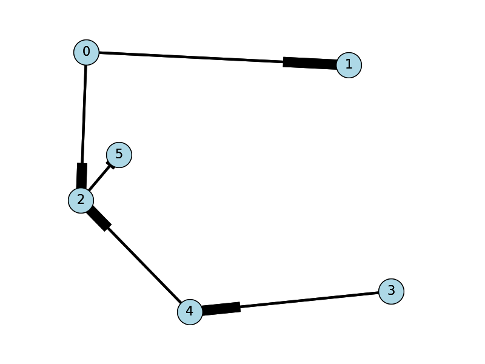

## Graph as adjacency list

The adjacency list is an alternative way to represent adjacency
matrices. This is a list consisting only of those vertex pairs that are
"adjacent." Because the adjacency list excludes the data of
non-adjacent vertices, it requires fewer system resources, such as
memory and disk space, than the adjacency matrix. 

An adjacency list is recommended for representing large sparse graphs. 

The implementation of an adjacency list can be via list, trees, or hash
table.

An adjacency list can be represented as follows:
```
 G = [v5:v1, v3; v6:v1, v3, v5; … vN{}]
```
showing each vertex followed by a lists of its neighbors.

Alternatively:

G = [v5:1, 3; v6:1, 3, 5; … vN{}]

… where each vertex is followed by the index of its neighbors in the
adjacency table, or `G[i:i,j]`

As a hash table the adjacency list can have a key associated with a list
of neighbors:
```
G[v5] = {v1,v3,...
```
In Python such an adjacency list can look as follows:
```python
graph = {
  5: [1, 3],
  6: [1, 3, 5]
}
```
If the graph is weighted, perhaps with percentiles, the adjacency list
can be denoted as:
```
G = { (5, 1):0.5, (5, 3):0.8, (6, 1):0.2, (6, 3):0.4, (6, 5): 0.9 }
```
Or, in Python as:
```python
weight = {
  (5, 1): 0.5,
  (5, 3): 0.8,
  (6, 1): 0.2,
  (6, 3): 0.4,
  (6, 5): 0.9
}
```
For example, reading an adjacency list from file graphdata.txt,
```
graphdata.txt:
0,1,3
0,2,4
2,5,7
3,4,6
4,2,5
```
Now draw the graph (in Python with Networkx library):
```python
import sys
import matplotlib.pyplot as plt
import networkx as nx

options = {
  'node_color': 'lightblue',
  'node_size': 900,
  'width': 3,
  'arrowstyle': '-|>',
  'arrowsize': 12,
  'font_size': 15
}

the_file = "graphdata.txt"
G = nx.DiGraph()

with open(the_file) as f:
  for line in f:
    a, b, w = map(int, line.strip().split(','))
    G.add_edge(a, b, weight = w)
    pos = nx.spring_layout(G,scale=1)
    nx.draw(G,pos,font_size=8)
    nx.draw_networkx(G, pos, arrows=True, **options)
    plt.show()
```


### Exercise

Write a function graph\_density that determines if a graph is dense or
sparse according to a file containing an adjacency list. If the graph is
sparse, the function calls another function, adjacency\_matrix, to
generate an adjacency matrix. 

Your graph\_density function should additionally read a file containing
an adjacency matrix. If the adjacency matrix is dense, your function
calls another function, adjacency\_list, to generate an adjacency
list.  

Provide your functions and your test results. 
