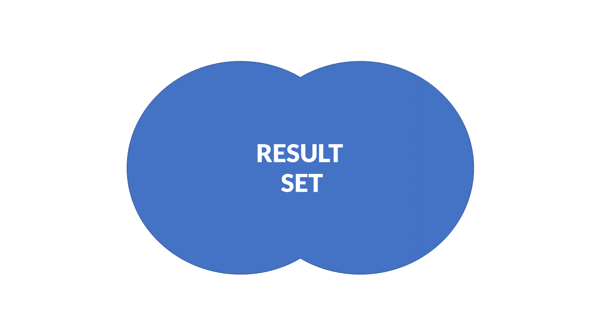
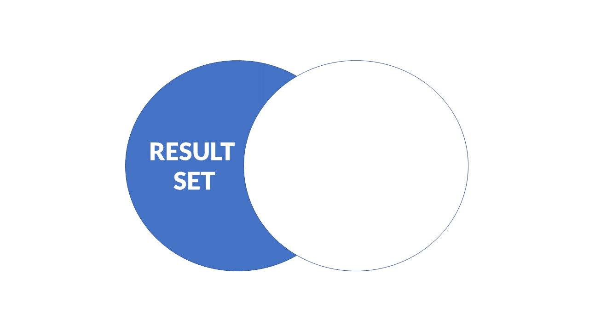
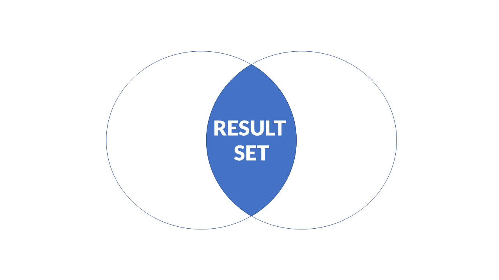
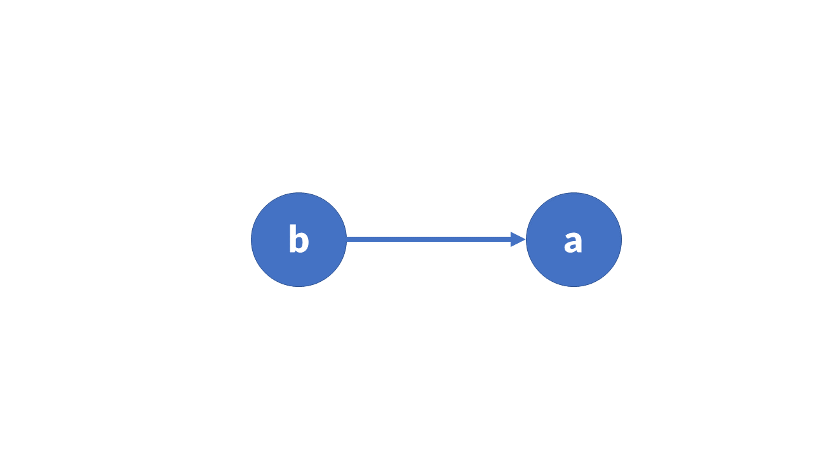
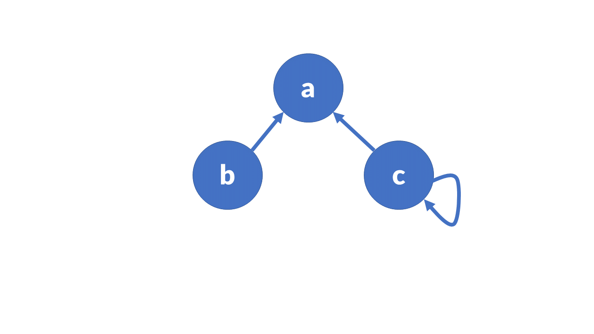

# Module: Set Theory – 1 Credit / 15 hours

**Competency: Mathematical Reasoning of Data**

Author: Jack Pope 

## Instructor Overview and Objective

This course module is about set theory. It embodies categorical classes
and sets in terms of relations and functions. 

Given that this module is to be worth 1 credit, or 15 hours of
coursework, the instructor should prepare three to five subtopic
discussions. These should account for at least 5 hours of instructional
material and might be in the form of lecture notes or lecture videos.
The additional hours should be comprised of student labs or assignments.
 

Traditionally, a course in Set Theory takes a theoretical approach, on
paper. However, the field of Data Science is an empirical endeavor that
programmatically emphasizes empirical evidence. 

Axioms which we accept as true are what support logical proof. Evidence
(data) supports empirical proof, certainty based on a measurement and
its statistical significance. A weakness of logical proof occurs when
erroneous accepted “facts” support an axiom. A weakness of the empirical
proof occurs when the data sample does not represent a population.

To accommodate our purposes, we will use a combination of the
programming languages Standard Meta Language (SML) and Structured Query
Language (SQLite). To a lesser extent procedural languages are
mentioned. SML affords us functional programming and SQL expedites
processing larger sets of data in tables. Within the functional
paradigm, SML has relatively concise expressions in comparison to
procedural languages such as C or Java, better reflecting mathematical
expressions. 

SML was originally devised by Robin Milner as a computational theorem
proving system. Along with SQLite's build-in set operators, we can
thoroughly learn set theory using data.

The choice of programming language is ultimately left to the instructor.

## Table of Contents 

|Unit | Topic
|---|---
|1 | **Sets – Overview**
| |Number types
| |Set types
| |Set type examples
| | Installation of software (SML, SQLite)
| | Exercise
|2 |**Programming**
| | Set operations in Standard ML
| | Exercise
| |Set operations in SQL (SQLite)
| |Exercise
|3 |**Relation**
| |Properties of relations
| |Domain and range of relations
| |Relational graphs 
| |Exercise
|4|**Function**
| |Properties of functions
| |Inverse function
| |Composition of function
| |Exercise

## Sets – Overview

A set is an unordered collection of distinct elements. It can be
represented by a list, string, array, etc. Formally, set elements are
denoted in the form { a, b, c, d }. Because order does not matter, the
same set is represented as { c, b, d, a }.

The values represented in sets can be the members of some class, such as
number types, animals, automobiles, or some other categorical
classification. For example, a line may be drawn that connects
infinitely many points, together which comprise a set of points. Such a
set could also be represented by an equation.

We say that elements constitute sets, and that sets are comprised of
elements. However, sets may be empty or comprised of other sets,
subsets. 

The character S is typically used as a symbol signifying a set. The
symbol is arbitrary. It may be A, B, … So, we can have S = { } or E = {
e1, e2, … }, such that e1 is in E. 

### Number types and their conventions:

  - N: all natural numbers = { 1, 2, 3, 4, … }… 0 is not in the set of
    natural numbers
  - Z: all integers = { ..., -4, -3, -2, -1, 0, 1, 2, 3, 4, … }
  - Z+: all positive integers
  - Q: all rational numbers; can be expressed as a ratio of an integer
    to a non-zero integer.
  - I: all irrational numbers
  - R: all real numbers; have decimal representation
  - W: all whole numbers = { 0, 1, 2, 3, 4, … }
  - i: product of a real number and square root of -1. (0 is both real
    and imaginary.) 
  - C: all complex numbers; includes real numbers, imaginary numbers and
    their sums and differences. Form: a + bi, where a + b are real
    numbers.

If s is an element of set S, then we write: s ∈ S. 

If t is not an element of set S, then we write: t ∉ S

If S = {2.2, 3.1, 4.5, 5.8},

Then 3.1 1 ∈ S AND 2.5 ∉ S

We can represent sets in tables or with “set builder” notation.

Tabular form, where elements can represent fields and different sets
represent records (rows):

A = {1, 2 , 3, 4}

B = {1, 3 , 5, 7}

C = {2, 4 , 6, 8}

Set builder form:

A = { a : p(a) }, where 'a' is an element of set A.

For example, given a set of integers A = { 1, 2, 3, 4 }, we have A = { a
: 1 ≤ a \< 5 }, where a is an integer that is greater than or equal to 1
and less than 5.

When you see notation for a set S = { s | s ∈ N }, it indicates that s
is an element of S and that S is the set of all natural numbers. The
colon “:” or the vertical bar “|” stands for “such that” and allows
specification of conditions. 

The cardinality (cardinal number) of a set is its element count, denoted
with |{}|. For example 

| {a, b, c, x, y} | = 5

| { 1, 2, 3, 4 } | = 4

Cardinality may be infinite and expressed such as: 

| {1, 2, 3, 4, … } | = ∞

Two sets A and B with the same cardinality are denoted as:

|A| = |B|

Two sets A and B with unequal cardinality are denoted such as:

|A| \>= |B|

|A| \< |B|

Set equivalence:

if |A| \>= |B| AND |A| \<= |B| THEN |A| == |B|

### Set types

  - Universal … U ... all elements and subsets of a particular class.
    (The alphabet is the universal set of the chars x, a and w.)

  - Complement … A′ = (U - A), or A′ = { a | a ∉ A } ... the Universal
    set of elements which are not in a set. 

  - Finite: contains a definite number of elements

  - Infinite: contains infinite number of elements

  - Subset ... A ⊆ B ... if every element of A is an element of set B,
    then A is a subset of B

  - Proper subset ... A ⊂ B ... a set that is subset of a larger set.
    Given that every element of A is an element of B and |A| \< |B|.

  - Singleton … unit set {s} ... contains just one element. 

  - Empty or null … ∅ ... contains no elements. The cardinality is zero.

  - Equal... two sets containing the same elements.

  - Equivalent … two sets with same cardinality.

  - Overlapping ... A∩B ≠ ∅ ... two sets with at least one common
    element.

  - Disjoint ... A∩B = ∅ ... two sets are disjoint if they have no
    elements in common. 

  - Pairwise disjoint .. all sets from N sets are disjoint.

  - Partitions … various sets within a sets; exist between pairwise
    disjoint sets.

  - Cartesian (cross) product … A x B … all possible ordered pairs (a,
    b) where a ∈ A, b ∈ B. 
    
    Given the sequence (a, b), all elements of A and all elements of B
    are paired as (a, b). 
    
    A Cartesian Product of more than two sets makes a “tuple” such as
    (a, b, c).

  - Union ... A∪B = { a | a∈A OR a∈B } ... elements which are in A, B,
    or in both A and B. 

  - Intersection ... A∩B = { a | a∈A AND a∈B } ... set of elements which
    are in both A and B.

  - Difference … A - B = { a | a∈A AND a∉B } ... set of elements which
    are in A but not in B. 

  - Power set … P(S) … set of all subsets of S, including the empty set.
    Its cardinality is 2<sup>n</sup>. 

  - Partitioned set … a collection of disjoint subsets, P1, P2, … Pn,
    that satisfy:
    
      - P<sub>i</sub> ≠ {∅} for all 0 \< i ≤ n
      - Union of the subsets is the entire original set … P1 ∪ P2∪ … ∪
        Pn = S
      - Intersection of any two distinct sets is empty. Pa ∩ Pb = {∅},
        for a ≠ b where n ≥ a, b ≥ 0
      - Bell numbers … Bn … the number of ways a set of N elements can
        be partitioned into non-empty subsets. N is the cardinality of
        the set. Given A = {1, 2, 3}, cardinality n = |A| = 3. There are
        Bn = 5 possible partitions:

1. {1, 2, 3}
2. {1}, {2, 3}
3. {1, 2}, {3}
4. {1, 3}, {2}
5. {1}, {2}, {3}

### Set Type Examples  

Finite set:S = { s | s ∈ N AND 0 \< s \< 100}

Infinite set:S = { s | s ∈ N AND s \> 0}

Subset:A = { 1, 2, 3 }, B = { 1, 2, 3 }, B ⊆ A

Proper subset:A = {1, 2, 3, 4 }, B = {1, 2}, |B| \< |A|, B ⊂ A

Empty set:S = { s | s ∈ N AND 0 \< s \< 1 } = ∅

Unit set:S = { s | s ∈ N, 0 \< s \< 2 } = { 1 }

Equal set: A = { 2, 4, 6 }, B = { 6, 2, 4 }, |B| == |A|, A = B

Equivalent set:A = { 1, 3, 5, 7 }, B = { 2, 4, 6, 8 }, |B| == |A| == 4 ,
A == B

Note: While equivalent sets contain the same number of elements, equal
sets additionally contain the exact same elements, regardless of order.

Overlapping sets:A = { 1, 2, 3, 4 }, = { 0, 2, 6, 8 }, A∩B = 2

Disjoint sets:A = { 1, 3, 5, 7 }, B = {2, 4, 6, 8 }, A∩B = ∅

Union:A = { 1, 2, 3, 5 }, B = {1, 2, 4, 6 }, A∪B = { 1, 2, 3, 4, 5, 6 } 

Intersection:A = { 1, 2, 3, 5 }, B = {1, 2, 4, 6 }, A ∩ B = { 1, 2 } 

Difference: A = { 1, 2, 3, 5 }, = {1, 2, 4, 6 }, A - B = { 3, 5 }, B - A
= { 4, 6 } 

Complement:U = { 1, 2, 3, 4 }, A = { 2, 4 }, A' = { 1, 3 } 

Cartesian product:A = { 1, 3 } AND B = { 2, 4 }, AxB = { (1, 2), (1, 4),
(3, 2), (3, 4) } 

Power set: For S = { 1, 2, 3, 4}, 

P(S) = {{∅}, {1}, {2}, {3}, {4}, {1, 2}, {1, 3}, {1, 4}, {2, 3}, {2,
4},{3, 4}, 

{1, 2 , 3}, {1, 2, 4}, {1, 3, 4}, {2, 3, 4}, {1, 2, 3, 4 }} 

|P(S)| = 2<sup>n</sup> = 16

### Installation of Software (SML and SQLite)

#### SML

SML features:

  - Pattern matching
  - Strongly-typed: ea expression has a type
  - Abstract types and polymorphism
  - Modularization
  - Higher-order modules (functors)
  - Exceptions

Information for the download and install can be found at:

<http://www.smlnj.org/dist/working/110.82/index.html> 

Start SML in interactive mode (Read Eval Print Loop – REPL):
```bash
sml
```
In an editor, write a test program:

```sml
(* hello.sml *)
fun helloWorld() =
print "Hello World!\n"
val _ = helloWorld()
```
To load a .sml program in the REPL, enter:
```sml
use hello.sml 
To exit, enter Ctrl-d
To run a standalone program:
sml < hello.sml
```
Or:
```sml
sml < hello.sml > output.txt
```
Windows OS: right-click the program icon for options to run, etc.

For a standalone executable, there are commands to use in the REPL (See
<http://www.smlnj.org/doc/CM/new.pdf> ). However, that way is
problematic. You are better off installing MLton (
[http://www.mlton.org](http://www.mlton.org/) ). 

Then compile as follows:
```sml
mlton hello.sml
./test
→ Hello World!
```
#### SQLite

“SQLite is a software library that implements a self-contained,
serverless, zero-configuration, transactional SQL database engine.
SQLite is the most widely deployed SQL database engine in the world. The
source code for SQLite is in the public domain.” – SQLite website

Installation (version 3): <http://sqlite.org/download.html> 

At your command prompt, enter: sqlite. Then enter: 

```sql
sqlite> SELECT "Hello World!";
→ Hello World!
```
As a stand along program on the command-line in file hello.sql:

```sql
/* hello.sql */
SELECT "Hello World\!";
```
Run as:

```sql
sqlite3 < hello.sql
→ Hello World!
```
Or, using a text file:
```sql
/* SQLite file IO example */
.mode csv
.separator ,
--.output output.csv   -- optional

CREATE TABLE test(a INTEGER, b INTEGER);
.import input.csv test

SELECT a FROM test;
```
This SQLite program would read a text file input.csv consisting of:
```csv
1,5
2,6
3,7
4,8
```
### Exercise

Given the number types N for all natural numbers, Z for all integers, Z+
for all positive integers, Q for all rational numbers, I for all
irrational numbers, R for all real numbers, W for all whole numbers, and
C for all complex numbers, write simple programs in SML and SQLite to
display your understanding of number types. 

Given the numbers 1, -5 and 1/5, your program syntax will simply
generate the following output string in “ “ quotes:

SML:print “-5 is an element of N: true”;

SML:print “1/5 is an element of W: false”;

SQLite: SELECT “-5 is an element of N: true”;

SQLite: SELECT “1/5 is an element of W: false”;

Besides introducing number types, this exercise provides an introduction
to the SML and SQLite programming languages. Therefore, these programs
should be installed on your computer (See the Programming unit below.).

If you think these exercises are trite and redundant using the both SML
and SQL, you are correct. Apart from ensuring that your installations
work, we want to enforce some basic understanding of number types for
now. 

## Programming

We can show how different sets of elements have certain relationships in
terms of union, intersection and so on. Instead of demonstrating these
relationships using pen and paper, we will use SML and SQL to display
set elements in these contexts.  

### Set operations in Standard ML

Computer programming languages have data types, or categorical sets of
data types such as integer, character and real. So, it behooves the
budding programmer to understand what kind of data belong to what
broader type. This idea is enforced in textbook from section 1.1 through
section 1.7. 

When we define a collection, we have a set. We can groups these sets
into another set. For example, the set automobile is comprised of sets
of sedans, trucks, jeeps, suvs, . . . In SML, creating our own type as such
looks like:

```sml
datatype Automobile =  Car | Truck | Jeep;
```

We assign an element like:

```sml
val cj = Jeep;→val cj = Jeep : Automobile
```
However, to compose distinguishing attributes of a type, we need a
feature called a constructor. We define a constructor such as:

```sml
datatype Automobile = Transmission * Radio;
```
Suppose that Transmission might be “standard” or “automatic” and Radio
might be AM or FM. The programmer could specify these types by calling
the constructor such as:

```sml
Automobile(“Standard”, “FM”);
  →  val it = Automobile (“Standard”, “FM”) : Automobile
```

The definition of the constructor could include default values as well,
such as:

```sml
datatype Automobile = Transmission of { standard : bool } | Radio of { modulation: string, gps : bool };
```

A union of number types would look like the example on page 40 in the
textbook:

```sml
datatype num = Int of int | Real of real;
  → datatype num = Int of int | Real of real
```
This allows for alternative contexts:
```sml
Int(5);         →       val it = Int 5 : num
Real(5.5);      →       val it = Real 5.5 : num
```
Set functions in SML

Not all functions that we want are built into a programming language.
Programming may be expedited by creating your own functions. For
example, we want a function “f(x) = x + 3” that accommodates various
inputs for the variable x. The statement “x + 3” is called a
“parametized expression.” 

Here we look at functions in terms of user defined functions, recursive
operations and function defaults or exceptions.

To define a function in SML, use the “fun” keyword:
```sml
fun myFunction(x,y) = x + y + 5;
  → val myFunction = fn : int * int -> int
```
Using this function:
```sml
myFunction(5, 8);
  → val it = 18 : integers
```
The formal parameters above are x and y, with actual parameters of 5 and
8 respectively.

There will be times when a single function should behave differently for
certain parameters, much like a switch-statement in Java. In SML this is
referred to as “pattern matching,” as the appropriate function signature
applies to the user's parameter pattern. For example:

```sml
fun f(1) = 0 | f(x) = (x * x - 1) div (x - 1); 
    → val f = fn : int -> int
f(2);   
    → val it = 3 : int
```
Notice that a supplied parameter of 1 generated output of 0, and input
of 2 yields 3.

Using the same approach we can accommodate a different number and type
of parameters. In languages like Java we refer to such accommodation as
method overloading. Now the function can deal with various linked
contexts among categorical sets.

For example, lets consider an example of a car mileage calculator. The
formula here is admittedly erroneous, as it it left to you to “correct”
it as as an exercise below. First, define two sets of transmission,
automatic and standard:

```sml
datatype transmission = automatic | standard;
datatype car = sedan | suv | jeep;
```

Transmissions have different drag (PSI) on the drive train of a vehicle:

```sml
fun getDrag(automatic) = 2.4 | getDrag(standard) = 1.5;
```

How about car weight (pounds/1000), depending on instance of car:

```sml
fun getWeight(sedan) = 2.2 | getWeight(suv) = 2.5 | getWeight(jeep) = 2.1;
```

And the cylinder count per instance of car:

```sml
fun getEngine(sedan) = 4.0 | getEngine(suv) = 6.0 | getEngine(jeep) = 8.0;
```
Create a function mpg that computes “miles per gallon” for a car:

```sml
fun mpg(car, transmission) = 3.0 \* getEngine(car) - getDrag(transmission) - 
getWeight(car); 
```

Now use the mpg function:

```sml
mpg(jeep, standard);
```

#### Recursion, exceptions and default values

Often we need to repeat an operation over and over again. Rather than
using an iterative loop of some sort, we can define a function with a
call to itself. Building on our function pattern (function overloading)
discussion above, here is the obligatory recursive factorial function,
in ML:

```sml
fun factorial(0) = 1 | factorial(n) = n \* factorial(n - 1); 
```

To use the factorial function:

```sml
factorial(5); 
    → val it = 120 : int
```

As you can see in the above example, the case where the parameter is 0
yields output of 1. This is known as the “base case” and it provides and
end to the recursive operation. Without it, our program would run
indefinitely. Indeed, even in non-recursive functions, we should often
should incorporate a case whereby the function halts its work based on a
certain value. For example, if the user furnishes an unacceptable
parameter, such as:

```sml
factorial(goat);
    → stdIn:34.11 Error: unbound variable or constructor:goat
```
The “unbound variable” leads here to a compilation error, not an
exception. SML does not know what to do with “goat” and so it emitted
the error message. We could get around that message by having the
function emit a message “use an integer” when one is not provided. In
other words, we have a kind of default output for the function.

### Exercises

Write programs in SML for the following exercises:
1. The example that computes gas mileage in out setsSML pdf uses an
erroneous formula. Use the Internet to research a correct formula and
provide it with SML syntax. Show your test output as well.
2. Make a data type “Animal” which has data constructors for various
kinds of animals, such as cat, primate, reptile. Make sure to include a
field for the subtype of animal, such as lion.
3. Make a data type “Library” which has data constructors for various
kinds of books, such as fiction, reference, biography. Make sure to
include a field for the subtype of book, such as science fiction.
4. For exercises 2 and 3, show how you would use the constructors.

### Set operations in SQL (SQLite)

In SQL, SET operators are used to combine the same type of data from two
or more tables. Although more than one SELECT statement is used, only
one result set is returned. According to the formal definition of a
“set,” elements are to be unique. This is enforced in SQL using the
DISTINCT clause. 

#### Set operation rules

  - Column names or aliases must be determined by the *first* select
    statement.
  - Data types of corresponding columns must be compatible.
  - Each query must have the same number of columns.
  - Each query must have matching columns in the same order.
  - Sorting of results should have the ORDER BY clause in the *last*
    query statement.

#### Set operators

These allow us to combine two or more select statements. All have the
same precedence.

  - UNION Combine result sets into a single output set, without
    duplicates.
  - UNION ALL Combine result sets into a single output set, including
    duplicates.
  - INTERSECT Retrieve data common to result sets.
  - EXCEPT (MINUS)Retrieve data from first result set that is *not also
    in* the second

Set operators treat NULLS as equivalent. Other than UNION ALL, their
yielded results are distinct. EXCEPT matches NULLS while its cousin, NOT
EXISTS, does not.

#### Unions

Tables resulting from the component select queries must be compatible
for the union operation (*union compatibility*). They must have the same
number of columns with comparable data types. In other words, SELECT
statements of a UNION must specify equivalent columns from each table
and multiple columns must be in the same order. 

Ways to get a union from non-compatible tables:

  - Select the same columns from each table

  - Use subsets of the existing tables
    
      - Create a new table 
      - Use views

  - Add columns using common data types and populate with arbitrary
    values or NULLs (leave blank) where appropriate.

Syntax:
```sql
SELECT column_1, column_2,... FROM table_1
UNION
SELECT column_1, column_2,... FROM table_2;
```
For example, query customers who reside in the same cities as product
suppliers:
```sql
SELECT City, PostalCode FROM Customers
UNION
SELECT City, PostalCode FROM Suppliers
```
The sequential execution of the query means that the SQL interpreter
(such as SQL Server) runs the first query, then the second, and finally
combines the results of the two queries while discarding duplicates.
This contrasts with the apparent parallel operation of a join, where the
resulting table is constructed row by row as SQL Server matches rows for
the join. 

UNION ALL returns the same information and also includes any duplicates.

#### Intersections

The INTERSECT operator combines two queries such that values common to
both are returned. In other words, we find elements that are in set A
that are also in set B. 
```sql
SELECT column_1, column_2,... FROM table_1
INTERSECT
SELECT column_1, column_2,... FROM table_2;
```

#### IN and NOT IN for set operations

The output of the above intersection can be achieved using the IN
predicate with DISTINCT. You can use NOT IN to simulate EXCEPT and get
the difference between sets. 

EXCEPT is functionally equivalent to the MINUS operator and the NOT IN
operator, but with simpler syntax. The EXCEPT operator returns results
that are in the first query and not also in the second. In other words,
it is the difference between two sets. 

Like UNION, the output of EXCEPT is unique. Unlike UNION, EXCEPT does
*not* ignore NULL values and treats them as matching. Hence our use of
IS NOT NULL above. 

#### Examples

First generate random sets of data as temporary in-memory tables (there
is no need to actually populate a database; see
https://sqlite.org/inmemorydb.html ). Based on these virtual sets we
will run the our “empirical proofs.”

Here is how to generate three virtual sets in SQLite:

```sql
/* each table represents a set of points in an X-Y plane, at the
coordinates (x,y) */

CREATE TEMPORARY TABLE numbers1 (
  id INTEGER PRIMARY KEY NOT NULL,
  x REAL NOT NULL,
  y REAL NOT NULL
);

CREATE TEMPORARY TABLE numbers2 (
  id INTEGER PRIMARY KEY NOT NULL,
  x REAL NOT NULL,
  y REAL NOT NULL
);

CREATE TEMPORARY TABLE numbers3 (
  id INTEGER PRIMARY KEY NOT NULL,
  x REAL NOT NULL,
  y REAL NOT NULL
);

INSERT INTO numbers1
  WITH RECURSIVE
    tmp( id, x, y) AS (
    VALUES(1 , random()%11, random()%11) UNION ALL
    SELECT id+1,random()%11,random()%11 FROM tmp WHERE ID\<10)
    select * from tmp;

INSERT INTO numbers2
  WITH RECURSIVE
    tmp( id, x, y) AS (
    VALUES(1 , random()%11, random()%11) UNION ALL
    SELECT id+1,random()%11,random()%11 FROM tmp WHERE ID\<10)
    select * from tmp;

INSERT INTO numbers3
  WITH RECURSIVE
    tmp( id, x, y) AS (
    VALUES(1 , random()%11, random()%11) UNION ALL
    SELECT id+1,random()%11,random()%11 FROM tmp WHERE ID\<10)
    select * from tmp;

/* verify table contents */
SELECT * FROM numbers1; 
SELECT * FROM numbers2;
SELECT * FROM numbers3;
```
Now, run two queries as a UNION of above tables numbers2 and numbers3. 
```sql
/* setOps.sql */
.read "../randTemp.sql"

SELECT DISTINCT x, y
FROM numbers2
UNION
SELECT DISTINCT x, y
FROM numbers3;

/* This is the equivalent of: */
CREATE TEMPORARY TABLE resultSet1 (
  x REAL NOT NULL,
  y REAL NOT NULL
);

INSERT INTO resultSet1 (x, y)
SELECT DISTINCT x, y from numbers2;
INSERT INTO resultSet1 (x, y)
SELECT DISTINCT x, y from numbers3;
SELECT DISTINCT x, y FROM resultSet1;
```



This yields in arbitrary order all numbers in each table that is are not
duplicates. If we want to include duplicates, use the UNION ALL clause
instead. 

Continuing, try the EXCEPT operator for results which are in the first
query and not in the second. 

```sql
SELECT DISTINCT x, y
FROM numbers2
EXCEPT 
SELECT DISTINCT x, y                              
FROM numbers3;                 

/* This is the equivalent of: */
SELECT DISTINCT n2.x, n2.y
FROM numbers2 n2
WHERE NOT EXISTS (
  SELECT n3.x, n3.y
  FROM numbers3 n3
  WHERE (n2.x = n3.x AND n2.y = n3.y) 
    OR (n2.x IS NULL AND n2.y IS NULL) 
    AND (n3.x IS NULL AND n3.y IS NULL)
); 
```



The INTERSECT operator yields results which are common to both queries. 
```sql
SELECT DISTINCT x, y
FROM numbers2
INTERSECT
SELECT DISTINCT x, y
FROM numbers3;   result set

/* This is the equivalent of: */
SELECT DISTINCT x, y
FROM numbers2 n2
WHERE EXISTS (
  SELECT DISTINCT n3.x, n3.y
  FROM numbers3 n3
  WHERE n2.x = n3.x AND n2.y = n3.y
); 
```



### Exercise

Using SQL, generate three random sets of alphabetical characters (Have
10 random letters in each of three tables.). Using these sets,
demonstrate the following set operations: union, intersect, except.

## Relation

As we see when querying tables in SQL or comparing lists in SML, we can
compare elements in a set to other elements in the same set, or those of
others sets. 

There is a binary relation between sets A and B may be written as R(a,b)
or aRb. This relation can be made to depend on certain conditions, such
as equivalence, greater than and less than. That means that their order
matters. For example, a parent-child pair is only valid for a certain
order. 

R(parent, child) ≠ R(child, parent)

The pair order matters. The relationship can be said to belong to a set
“begets” in that a parent begets a child. The inverse set would be
“inherits” since the child inherits from the parent.

R(parent, child) ∈ begets

R(child, parent) ∈ inherits

While for two sets a relation will be pairwise, relations among more
sets may be ternary R(a, b, c) or for a greater number of sets R(a, b,
…).  

A relation between two sets A and B is a subset of the cross product of
A and B. That means the cardinality will range from 0 to N x M, where N
is the number of elements in set A for each i element, and M is the
number of elements in set B for each j element. Indeed, the resulting
set of a relation between sets A and B can have many more elements.

For testing the equality of sets A = {1, 3, 5, 7} and B = {1, 3, 5, 7},
we test for equal elements from i to N from each set in tandem to get
the subset relation:

R = { (1, 1), (3, 3), (5, 5), (7, 7) }

Note that the relation R is itself a set.

Conversely, given non-equivalent sets A = {1, 3, 5, 7} and B = {1, 3, 4,
6}, the subset of equal pairs is:

R = { (1, 1), (3, 3) }

Given three sets A, B and C, we can use the “composition of relation” of
A and C to infer a relationship with B. Given a relation R between A to
B and another relation S between B to C, we can say elements of A and C
such that a(S o R)c iff there exists some elements for which aRb and
bSc. 

### Properties of relations

Empty: the empty set ∅ or E

Full: the set AxB

Inverse: the set R′ ={ (b, a) | ( a, b) ∈ R } … flip all a's and b's

#### Properties of self-referential relations

Identity: the set A { (a, a) | a ∈ A }

Reflexive: aRa relation holds for every element of A … ∀a ∈A       … ∀a
… for all a

Irreflexive: no aRa; relation holds for any element of A … no a∈A

Symmetric: a1Ra2 → a2Ra1 or ∀a1 ∈ A AND ∀a2 ∈ A … all pairs of elements

Anti-Symmetric: a1Ra2 AND a2Ra1 → a = b ∀a1 ∈ A AND ∀a2 ∈ A

Transitive: a1Ra2 AND a2Ra3 → (a1Ra3, ∀a1, a2, a3) ∈ A 

Equivalence: reflexive AND symmetric AND transitive

### Domain and Range of Relations

Domain:

Given two sets A and B, the domain Do of their relation R is the set of
A's elements that have a relation to elements in set B. This can be
written as;

DoR(a, b) = { a | (a, b) ∈ R }

In terms of equal sets A = { 1, 3, 5, 7 } and B = { 1, 3, 5, 7 }:

DoR = { 1, 3, 5, 7 } == A == B

For unequal sets A = { 1, 3, 5, 7 } and B = { 1, 3, 4, 6 }, where aRb is
“less than” we have:

R = { (1, 3), (1, 4), (1, 6), (3, 4), (3, 6), (5, 6) }

… and the domain is:

DoR = {1, 3, 5} 

Range (image):

RaR(a, b) = {b | (a, b) ∈ A}

For example, for the unequal sets A = {1, 3, 5, 7} and B = {1, 3, 4, 6},
where aRb is “less than” we have R = { (1, 3), (1, 4), (1, 6), (3, 4),
(3, 6), (5, 6) }, where the range is:

RaR = { 3, 4, 6 } 

### Relational Graphs 

Visual visual aids help us represent relations. At first, we might use a
table with rows representing the domain and columns representing the
range. 

Using sets A = {1, 3, 5, 7} and B = {1, 3, 4, 6}, get aRb in the context
of “greater than” and show the range and domain. Mark “x” where this
condition is satisfied.

```
         B
      1 3 4 6
  1  
A 3   x
  5   x x x
  7   x x x x
```
Therefore, the relation set R is comprised of the respective pairs
indicated by the “x” in the table:

R = { (3, 1), (5, 1), (7, 1), (7, 3), (7, 4), (7, 6), (5, 3), (5, 4) },

The domain of the relation is the list of *unique* (no duplicates) “a”
elements comprising each pair:

DoR = { 3, 5, 7 } 

The range of the relation is the list of *unique* (no duplicates) “b”
elements comprising each pair:

RaR = { 1, 3, 4, 6 } 

Instead of using a tables, we can represent relations using graphs.
(Conversely, when studying graphs, we may want to construct an adjacency
matrix.)

In a graph, a set's elements are each represented by a vertex (or node).
An ordered pair entails a directed graph with the edge that connects two
vertices indicating the condition of the relationship. As we saw where
“x” marked a relationship in the table above, not all vertices may be
connected.  

Here is a relation between elements a and b. Suppose b derives from a,
or that a is greater than b.



Suppose c also derives from a, We then have.


To represent the relation R = { (b, a), (c, a) } of a set S = { a, b, c
}

Given an ordered (c, c), we have a self-loop on vertices. If this is the
case for all vertices, then the graph is said to be “reflexive.” If node
c in the above graph has a self-loop, it it would look like this:



The relation is then R = { (b, a), (c, a), (c, c) } 

Example SML:

Given the following lists and function:
```sml
val A = [1, 2, 3, 4 ];
val B = [1, 5, 7, 9 ];
fun contains(x, []) = false
  | contains(x, y::rest) =
    if x = y then true
    else contains(x, rest);

contains(5, B);
```
### Exercises

1. Given three sets, A = {a, b, c}, B = {1, 2} and C = {a, b, d}, and
the two relations R = { (a, 1), (a, 2), (b, 2), (c, 1) } and S = { (1,
a), (2, b), (2, d) }, determine the relation S o R.
2. Given the set A = { 1, 2, 3, 4 } and the relation R = { (1, 2), (2,
3), (3, 4), (2, 1) }, determine the transitive closure of R.
3. Suppose set B = { 10, 12, 14, 8, 7 } and relation R = { (10, 11),
(10, 12), (10, 14), (10, 8), (10, 7), (12, 12), (12, 8), (12, 7), (14,
14), (14, 8), (14, 7), (8, 8), (8, 7), (7, 7) }. Determine if R is:
    - Antisymmetric
    - Reflexive
    - Symmetric
4. Suppose that you have two sets A = {a, c, e, g, h, i} and B = {a, c,
d, f, i, k}. Use SML for the following:
    - Display a relational matrix.
    - Demonstrate if the relation is Reflexive. 
    - Demonstrate if the relation is Transitive.
    - Demonstrate if the relation is Symmetric.

    Matrix traversal may not seem intuitive to you using Standard ML.
    Solutions may seem easier in an imperative language such as C++ or Java,
    or in SQL. 

    For example, given the set A={1, 2, 3, 4}, demonstrate that the relation
    is R = { (1, 2), (2, 1), (3, 2), (2, 3) } is symmetric. Your program
    should display:

    Relation R= { (1, 2), (2, 1), (3, 2), (2, 3) } is symmetric for set A =
    { 1, 2, 3, 4 }

## Function

As defined, a function f is from a set X to a set Y is a relation from X
to Y such that each x ∈ X is related to exactly one y ∈ Y. 

X is called the domain and Y is the codomain. 

A function is also called a mapping.

The range may be equivalent to the codomain, or the range can be a
subset of the codomain if not all elements of the domain are mapped to
the codomain.

The function may be denoted as 

f(x) = y

A set can consist of functions as they are evaluated. Consider a line in
an XY plane, where one x corresponds to only one y. Accordingly, we can
use a programming language like SML to pass functions to other
functions, store functions in variables and return them from other
functions. This is because functions in SML are what are known as “first
class values.” 

A function may be considered a relation or an element mapping from
domain to range.

Functions map set elements to a set that is related. 

f: A → B, where A is the domain of f and B is the codomain.

Range versus image:

Image is synonymous for range, the output of function. So, if we have:

f : R → R

with f(x) = x<sup>2</sup>

The codomain represents the possible output of a function. The codomain
is real numbers (-∞, ∞) and the range is \[0, ∞), the real numbers \>=
0. 

In effect, 

f : R → R 

... can be defined with a codomain as:

f : R → \[0, ∞)

Surjective (onto): When the range and the codomain are the same. 

Inverse image (pre-image): Given a subset S of a function's codomain,
the inverse image is the set of all elements of the domain that map to
the members of S. As defined for a set S with f:X→Y, the inverse image
is:

S' = { x ∈ X : f(x) ∈ S }

Certain elements of S will map to the image. Those that do are
identified as the inverse image.

### Properties of functions

Every function has a domain and range. 

Domain: set of values of the variable for which the function is defined.

Range: set of values of the codomain for which there is some minimum to
maximum application of the function. 

The interval of a range from its minimum to its maximum is denoted like
\[5, 20\] for values and (a1, a2) for variables. A range of all real
numbers is denoted as (-∞, ∞)

Discontinuities: when the range has more than one interval, given that a
function is not defined for all values of the variable. Discontinuity
can be quickly verified with this on-line calculator:
<https://www.wolframalpha.com/calculators/discontinuity-calculator/>

Injective (one-to-one): A function that maps from exactly one element of
the domain to exactly one element of the range. The range element is
mapped to by no more than one domain element.

f(x) = x + 1 is one-to-one 

Surjective (onto): a function f from set A to set B is onto if for every
element 'b' there is at least one element 'a' such that f(a) = b

Example: all the elements of the range set are applied by all the
elements of the domain set. 

f(x) = x + 1 is onto because the range is infinite (-∞, ∞). 

f(x) = x<sup>2</sup> is not onto because the range ignores negative
values.

Onto may also be many-to-one: A function that maps from many elements of
A to one element “b.”

f(x) = x<sup>2</sup> is many-to-one because, for both x = -2 and x = 2,
f(x) is 4

A function is surjective onto if the image of f is equivalent to its
range. That is: 

for every b ∈ B there is some a ∈ A such that f(a) = b

For example:

f:N→N, f(x) = x + 1 is not surjective.

The function maps elements from the set of natural numbers to the set a
set of natural numbers, yet it excludes 1.

f:N→ \[1, ∞), f(x) = 2x is surjective. 

The function maps elements from the set of natural numbers to the set of
non-negative even numbers.

f:R→R, f(x) = x<sup>2</sup> is not surjective.

The function cannot represent a real number with a square that is
negative, as it does not exist.

f:N→ N, f(x) = 2x is not surjective.

The function only maps the set of natural numbers to a set of
non-negative even numbers. It excludes odd numbers.

Bijective (one-to-one correspondence; both injective and surjective):
iff every possible image is mapped to by exactly one argument. (Each
element in the domain maps to exactly one element in the range, and each
element in the range is mapped to by only one element in the domain.)

A function is bijective iff it is both injective and surjective.

You may have functions that are:

  - Onto but not one-to-one
  - One-to-one but not onto
  - One-to-one correspondence
  - Not permitted: one-to-many

### Inverse function

A function if:A→B is invertible if its inverse g:B→A exists. That is:

f(a) = b ↔ g(b) = a

For example:

For f:Z→Z, f(a) = a + 5

The inverse is g(a) = a - 5, therefore function f is invertible.

Conversely, a function f(a) = a<sup>2</sup> is not invertible because
(-a)<sup>2</sup> = a<sup>2</sup> which is not one-to-one like the first.

Two elements in the domain map to one element in the range. Such a
function is not invertible. The inverse function requires one-to-one
correspondence.

Try not to confuse an inverse function with an inverse image of a
function, which is a subset of the domain as applied to a subset of the
codomain.

### Composition of Function

A function can map two sets via a middle third set. Consider the output
of function f that must go through function g, such as g(f(a)). 

Also consider SML's composition operator “o” that is somewhat like a
Unix “|” pipe.

Two functions f:A→B and g:B→C can be composed to give a function from A
to C such that (gof)(a) = g(f(a)). This is composition and is called
gof. 

Composition properties:

  - If f and g are one-to-one then the function (gof) is also
    one-to-one.
  - If f and g are onto then the function (gof) is also onto.
  - Composition is associative (when composing three functions).
  - Composition is not commutative.

For example:

Given f(a) = a + 2 and g(a) = 2a + 1, then (fog)(a) and (gof)(a) are:

(fog)(a) = f(g(a)) = f(2a + 1) = 2a + 1 + 2 = 2a + 3

(gof)(a) = g(f(a)) = g(a + 2) = 2(a + 2) + 1 = 2a + 5

Therefore, (fog)(a) ≠ (gof)(a)

### Exercises

1. Devise SML functions for the following operations on a set:
    - addElement
    - removeElement
    - cardinalityOfSet
    - containsElement
2. Devise SML functions to affect the following set relations:
    - isRelated
    - makeInverse
    - findImage
3. Devise SQL queries for the following operations on a set:
    - cardinalityOfSet
    - containsElement
    - isRelated
    - findImage
4. Devise an SML function that partitions a set (all possible
partitions).
5. Devise an SQL query that partitions a set (all possible partitions).
