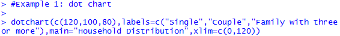
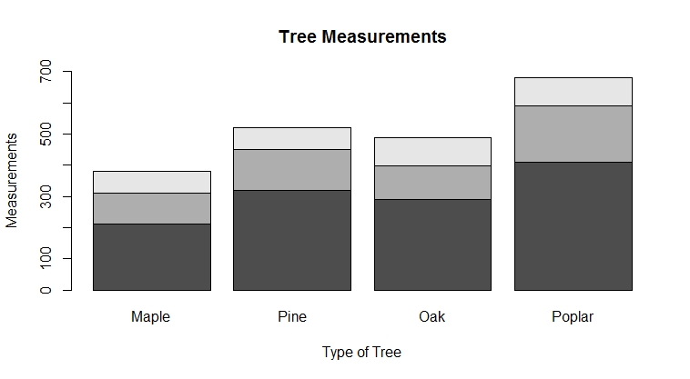
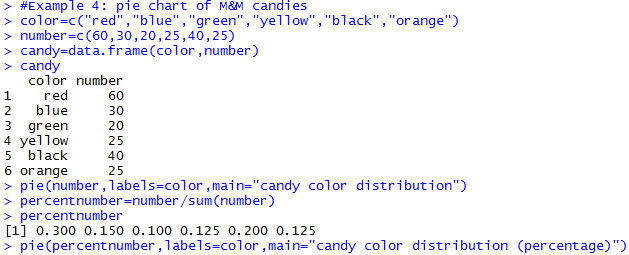
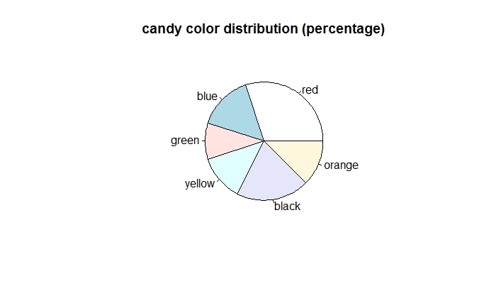
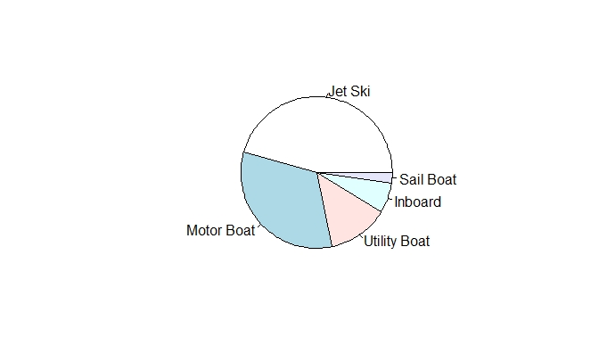

Module Visualization in R for Qualitative Variables
===================================================

Introduction and Learning Objective
===================================

Introduction

Data visualization helps us to interpret a dataset. It helps us to
observe the patterns of data, identify outliers and influential points,
and understand important features of the data. Exploratory data
visualization helps to see the details of the data. For example, if we
use the R function plot(ChickWeight\$Time, ChickWeight\$weight) to
explore the Chick Weight data as following, then we can see the weight
vary with time, and the weight deviates more through time (figure 1).

{width="4.74805227471566in" height="3.0in"}

Figure 1. Explore the Chick Weight data in R.

The way a variable is presented graphically should be adapted to the
type of variable. For a qualitative variable, dot charts, bar charts,
stacked bar charts, and pie charts are commonly used. In this module, we
will introduce different R functions for plotting qualitative variables.

Learning Objectives

After this module, students will be able to

-   Generate dot plot

-   Generate pie chart

-   Generate bar chart

-   Generate histogram

-   Generate mosaic plot

### Learning Objective One: Construct Dot Charts

***Introduction***

A dot chart shows the number of counts for each category using dots.
Typically, the horizontal axis shows the categories, and the vertical
axis shows the number of counts. A dot chart usually shows the total
number of individuals in each group.

***Knowledge***

The R function of creating a dot chart is

dotchart(x, labels=NULL, groups=NULL, gdata=NULL, cex=par("cex"),
pt.cex=cex, pch=21, gpch=21, bg=par("bg"), color=par("fg"),
gcolor=par("fg"), lcolor="gray", xlim, main= NULL, xlab=NULL, ylab=NULL)

The arguments are:

-   x: a vector or matrix of values of the data

-   labels: a vector of labels for each point

-   groups: an optional factor indicating how the elements of x are
    grouped

-   gdata: data values for the groups

-   cex: the character size to be used

-   pt.cex: the cex to be applied to plooting symbols.

-   pch: the plotting character or symbol to be used

-   gpch: the plotting character or symbol to be used for group values

-   bg: the background color of plotting characters or symbols to be
    used

-   color: the color(s) to be used for points and labels

-   gcolor: the single color to be used for group labels and values

-   lcolor: the color to be used for the horizontal lines

-   xlim: horizontal range for the plot

-   main: title for the plot

-   xlab: axis label for the x-axis

-   ylab: axis label for the y-axis

***Key Points to Remember***

A **dot chart** shows the frequencies for each category of a categorical
variable. The R function is **dotchart()**.

When creating a dot plot, we need to make sure the horizontal axis
starts from 0 using xlim=c(0, ). A common deceptive graph is a graph
with the axis scale starting at some value greater than zero that
exaggerates the differences between categories.

***Practice and Reflection***

***Practice***

Example 1: A survey records the number of households in each of the
following category: single, couple, family of three or more. The data is
shown in the table below:

  Type of family            Number of households
  ------------------------- ----------------------
  Single                    120
  Couple                    100
  Family of three or more   80

Generate a dot plot

The R code is

{width="5.895833333333333in" height="0.625in"}

The dot chart is shown in figure 2 below

{width="5.4534722222222225in"
height="2.5833333333333335in"}

Figure 2. Dot chart of the household distribution.

The horizontal axis shows the frequencies for each type of family, and
the vertical axis shows the three categories of the variable, type of
family.

***Reflection***

Activity 1: The table below records the color of 20 M&M candies.
Generate a table to show the number of candies for each color, and then
generate a dot chart to represent the data by counts.

  red      red     yellow   yellow   yellow   red      black    blue    blue   red
  -------- ------- -------- -------- -------- -------- -------- ------- ------ --------
  orange   black   yellow   blue     black    orange   yellow   black   red    orange

***Assessments***

1.  The dataset below shows the hair color of ten girls, generate a dot
    chart to show the frequency of hair color. Show the labels of x- and
    y-axis and title of the graph.

  ------- ------- ------- ------- ------- ------- ------- ------- ------- -----
  Brown   Black   Black   Blond   Blond   Brown   Blond   Blond   Blond   Red
  ------- ------- ------- ------- ------- ------- ------- ------- ------- -----

2.  Using the following data set of paint color shown in a painting
    competition to generate a dot plot showing the frequencies of each
    color. Label the x-axis as Counts and y-axis Color. Use the solid
    dots (pch=16), and color the dots the same as the label. For
    example, a red point should be colored as red.

  yellow   grey    red     blue   green   black   grey     red    red     black
  -------- ------- ------- ------ ------- ------- -------- ------ ------- -------
  black    black   green   blue   blue    black   yellow   grey   black   grey

#### Learning Objective Two: Construct Bar Charts

***Introduction***

Bar chart shows the number of counts in each category as bars. It is
similar to a dot chart. Instead of using dots to represent the
frequencies, a bar chart uses bars to represent the counts. The x-axis
is the category, and the y-axis is the count.

***Knowledge***

The R function for bar chart is

barplot(x, width=1, space=NULL, names.arg=NULL, legend.text=NULL,
beside=FALSE, horiz=FALSE, density=NULL, angle=45, col=NULL,
border=par("fg"), main=NULL, xlab=NULL, ylab=NULL, xlim=NULL, ylim=NULL,
inside=TRUE)

Arguments:

-   x: a vector or matrix of values showing the data

-   width: optional vector of bar width

-   space: the amount of space left before each bar. May be given as a
    single value or one value per bar

-   names.arg: a vector of names to be plotted below each bar or group
    of bars.

-   legend.text: a vector of text used to construct a legend for the
    plot, or a logical indicating whether a legend should be included

-   beside: a logical value. If FALSE, the columns of x are portrayed as
    stacked bars, and if TRUE the columns are portrayed as juxtaposed
    bars

-   horiz: a logical value. If FALSE, the bars are drawn vertically with
    the first bar to the left. If TRUE, the bars are drawn horizontally
    with the first at the bottom

-   density: a vector giving the density of shading lines, in lines per
    inch, for the bars or bar components. The default value of NULL
    means that no shading lines are drawn.

-   angle: the slope of shading lines, given as an angle in degrees for
    the bars or bar components

-   border: the color be used for the border of the bars. Use border=NA
    to omit borders

-   main: title of the plot

-   xlab: label of the x-axis

-   ylab: label of the y-axis

-   xlim: limits for the x-axis

-   ylim: limits for the y-axis

-   inside: a logical value. If TRUE, the lines which divide adjacent
    bars will be drawn

***Key Points to Remember***

A **bar chart** shows the frequencies of each category of a categorical
variable, with the x-axis showing the categories and y-axis showing the
frequencies. The R function is **barplot()**.

When plotting a bar chart, we need to make sure the y-axis starts from
zero to accurately show the difference between categories.

***Practice and Reflection***

***Practice***

Example 2: Use the data in example 1, create a bar chart. The R code is

{width="5.989583333333333in"
height="0.7708333333333334in"}

The ylim=c(0,120) guarantees the graph starts from 0 for the y-axis. The
bar chart is shown in figure 3 below.

{width="4.853857174103237in" height="2.3125in"}

Figure 3. Bar chart of the household distribution.

***Reflections***

Activity 2: Use the data in activity 1, create a bar chart to show the
frequencies of each color of the M&M candy.

***Assessments***

We are interested in investigating the relationship between the
percentage of children who have been immunized and the corresponding
mortality rate for children under five in a country. The table listed
the data of the percentage of immunized children and the mortality rate
for a randomly chosen 9 countries.

  Country          Percentage immunized   Mortality rate per 1000 births
  ---------------- ---------------------- --------------------------------
  Bolivia          77                     118
  Cambodia         32                     184
  China            94                     43
  Czech Republic   99                     12
  Egypt            89                     55
  Ethiopia         13                     208
  Mexico           91                     33
  Senegal          47                     145
  Turkey           76                     87

Generate a bar plot to show the percentage immunized for each country;
Title the graph as "immunization rate of nine countries"; Label the
y-axis as "percent immunized".

#### Learning Objective Three: Construct Stacked Bar Charts

***Introduction***

Stacked bar chart shows several measurements for one individual. A
stacked bar has several layers, with each layer representing one
variable. A stacked bar is used to represent more than one variables for
each category.

***Knowledge***

The R function is the same as the barplot function, with the argument
*beside=FALSE*. The R function is

barplot(x, width=1, space=NULL, names.arg=NULL, legend.text=NULL,
beside=FALSE, horiz=FALSE, density=NULL, angle=45, col=NULL,
border=par("fg"), main=NULL, xlab=NULL, ylab=NULL, xlim=NULL, ylim=NULL,
inside=TRUE)

The arguments were introduced in the previous learning objective
(learning objective two).

***Key Points to Remember***

A **stacked bar plot** shows measurements of multiple variables for each
individual (or category). When plotting the stacked bar, we still need
to use ylim=c(0, ) to make the y-axis start from 0. The R function is
**barplot()** with the argument beside=FALSE.

***Practice and Reflection***

***Practice***

Example 3: The following data listed the height (in cm.), weight (in
lb.), and circumference (in cm.) of three types of trees. Use stack bar
to represent each type of tree.

  Tree     Height (cm)   Weight (lb)   Circumference (cm)
  -------- ------------- ------------- --------------------
  Maple    210           100           70
  Pine     320           130           69
  Oak      290           109           89
  Poplar   410           180           90

The R code is

{width="5.84375in" height="2.3333333333333335in"}

The bar chart is shown in figure 4 below

{width="5.453487532808399in" height="3.0in"}

Figure 4. The stacked bar plot of trees' height, weight and
circumference. The x-axis shows the four types of trees. The y-axis
shows the measurements of height (black), weight (grey), and
circumference (light grey).

***Reflection*** Activity 3: The data below recorded five samples and
the two values associated with each sample. Make a stacked bar plot to
show the data.

  Sample   Value1   Value2
  -------- -------- --------
  A        3        1
  B        2        0
  C        6        5
  D        7        2
  E        3        2

***Assessment***

We are interested in investigating the percentage of children who have
been immunized and the corresponding mortality rate for children under
five in a country. The table listed the data of the percentage of
immunized children and the mortality rate for a randomly chosen 9
countries.

  Country          Percentage immunized   Mortality rate per 1000 births
  ---------------- ---------------------- --------------------------------
  Bolivia          77                     118
  Cambodia         32                     184
  China            94                     43
  Czech Republic   99                     12
  Egypt            89                     55
  Ethiopia         13                     208
  Mexico           91                     33
  Senegal          47                     145
  Turkey           76                     87

Generate a stacked bar plot to show the percentage immunized and
mortality rate for each country; Title the graph as "immunization and
mortality rate of nine countries".

#### Learning Objective Four: Construct Pie Charts

***Introduction***

Pie chart is used to show the proportions (or counts) of categories. A
pie chart is a very common graph that depicts quantitative data as
slices of a circle, in which the size of each slice is proportional to
the frequency count for the category. Although pie charts are common,
they are not very effective.

***Knowledge***

The R function is

pie(x, labels=names(x), clockwise=FALSE, density=NULL, angle=45,
main=NULL, col=variable)

The arguments are:

-   x: a vector of non-negative numerical quantities. The values in x
    are displayed as the areas of pie slices

-   labels: one or more expressions or character strings giving names
    for the slices.

-   clockwise: logical indicating if slices are drawn clockwise or
    counter clockwise; FALSE is the default setting

-   density: the density of shading lines, in lines per inch. The
    default value of NULL means that no shading lines are drawn.

-   angel: the slope of shading lines, given as an angle in degrees.

-   main: title of the graph

-   col: color; if col=names(x), then the color of the pie matches the
    legend

***Key Points to Remember***

A **pie chart** displays the frequency or relative frequency of each
category of a qualitative variable. The R function is **pie()**. A pie
chart is not very visually effective in showing the difference between
categories, and is not recommended.

***Practice and Reflection***

***Practice***

Example 4: A bag of M&M candies has six color: red, blue, green, yellow,
black, and orange. In a sample of 200 candies in a bag, there are 60
red, 30 blue, 20 green, 25 yellow, 40 black and 25 orange. Make a pie
chart to show the number of each color. Make another pie chart to show
the percentage of each color. The R code is

{width="6.5in" height="2.6354166666666665in"}

The pie chart is shown in figure 6 below

{width="5.086037839020123in" height="3.0in"}

Figure 6.a. Pie chart to show the distribution of the six color

{width="5.086037839020123in" height="3.0in"}

Figure 6.b. Pie chart to show the distribution of the six color in
percentage

Normally, a bar chart shows the data more effectively than a pie chart
with a more accurate scale. For example, the data below shows the number
of stolen boats in a recent year. Let us compare the bar chart and pie
chart reprinting the same data (Triola, 2018)

  Boat type      Number stolen
  -------------- ---------------
  Jet Ski        1400
  Motor Boat     1000
  Utility Boat   400
  Inboard        200
  Sail Boat      70

A bar chart is shown in figure 7.a, and a pie chart is shown in figure
7.b.

{width="3.1201706036745405in"
height="2.6in"}{width="3.252804024496938in"
height="2.7in"}

Figure 7.a. Bar chart of boat stolen data Figure 7.b. Pie chart of boat
stolen data

From figure 7, a bar chart does a better job of showing the relative
sizes of different types of boat stolen and the trend. A bar chart
effectively shows the difference among categories with only one color,
while the differences among the utility boat, in board, and sail boat
are not very easy to tell from a pie chart.

***Reflection***

Activity 4: A survey was conducted to study the political affiliation
distribution. Among the 300 people surveyed, 101 of them are
Republicans, 129 are Democrats, and 70 are others. Generate a pie chart
to show the political affiliation distribution.

***Assessment***

Using the following data set of paint color shown in a painting
competition to generate a pie chart showing the frequencies of each
color. Title the graph. Match the legend with the color.

  ------ ------- ----- ----- ------ ----- ------ ------- ------- ------- ----- ----- -------
  blue   black   red   red   grey   red   blue   green   black   black   red   red   black
  ------ ------- ----- ----- ------ ----- ------ ------- ------- ------- ----- ----- -------

#### Learning Objective Five: Construct Mosaic plots

***Introduction***

A mosaic plot shows the relationship between two qualitative variables.
The mosaic plot is based on conditional probability.

***Knowledge***

To illustrate how a mosaic plot is generated, we use an example from a
data set called Berkeley 1973 Admissions data (NCSS.com). This data is
of interest, because it was used to show that males were admitted at a
higher rate than females. From figure 8 below (from ncss.com), the
widths of the boxes are proportional to the percentage of females and
males. There are 41% of females and 59% of males among the applicants.
The heights of the boxes are proportional to the percentage admitted.
There are 45% of the male applicants admitted, and 30% of the female
applicants admitted (Figure 8). The boxes for admitted females and males
are colored blue and the boxes for not admitted females and males are
colored pink. By construction, the percent for each gender is the width
of the box, and the area of each box is proportional to the
corresponding cell frequency.

{width="4.687045056867891in" height="3.4in"}

Figure 8. Mosaic plot of the relationship between gender and admission.

To generate a mosaic plot, we need to firstly install the R package vcd.
The mosaic plot function is

mosaic(x, condvar = )

-   x: the table or formula

-   condvar: vector of integers or character strings indicating
    conditioning variables, if any. The table will be permuted to order
    them first.

***Key Points to Remember***

A **mosaic plot** shows the relationship between two categorical
variables using colored boxes. The height and width of the boxes
proportionally represent each variable value for each category.

The R function is **mosaic()** with the installation of the package vcd
first.

***Practice and Reflection***

***Practice***

In example 5, we will plot the relationship between eye color and hair
color from the R dataset HairEyeColor. The R code is

{width="3.7291666666666665in" height="0.5in"}

The mosaic plot is shown in figure 9

{width="5.114751749781277in" height="3.0in"}

Figure 9. The mosaic plot of the relationship between eye color and hair
color for males and females.

From figure 9, we observe that most of the males are in brown hair and
brown eyes in the sample (the largest rectangle for male), and most of
the females have brown hair and brown eyes (the largest rectangle for
female).

***Reflection***

Activity 5: the data below shows a random sample of 400 University of
Iowa undergraduate students. The students were classified according to
gender and the college in which they are enrolled (Hogg & Tanis, 2006).

           Business   Engineering   Liberal Arts   Nursing   Pharmacy
  -------- ---------- ------------- -------------- --------- ----------
  Male     21         16            145            2         6
  Female   14         4             175            13        4

***Assessment***

In 1912 the luxury liner Titanic, on its first voyage across the
Atlantic, struck an iceberg and sank. Some passengers got off the ship
in lifeboats, but many died. The two-way table gives information about
adult passengers who lived and who died, by class of travel.

                    Survival Status   
  ----------------- ----------------- ------
  Class of Travel   Survived          Died
  First class       197               122
  Second class      94                167
  Third class       151               476

Generate a mosaic plot to show the relationship between survival status
and the class of travel.
