# Module: Big Data Systems

**Competency: Big Data**

Authors: Jack Pope, Prabesh Shrestha

## Instructor overview & objective

This course module is about distributed computing environments for “big data.” It looks at systems that can perform parallel computation or cluster computing. Topics include shared memory, map-reduce, clustering, concurrency, task parallel versus data parallel, database integration, multi-threading and networked file systems.

Given that this module is to be worth 1 credit, or 15 hours of coursework, the instructor should prepare three to five subtopic discussions. These should account for at least 5 hours of instructional material and might be in the form of lecture notes or lecture videos. The additional hours should be comprised of student labs or assignments.

Our examples use Apache Spark and Apache Hadoop. Spark makes for distributed in-memory computing and can write to local as well as networked file systems. A distributed file system called the Hadoop Distributed File System (HDFS) is typically installed with Apache Spark in the enterprise.

Spark essentially allows us to process large data sets faster by employing more than one machine. Spark also easily integrates with popular programming languages, databases and other tools for ensuring high availability.

The lessons in this module use the Python and SQL programming languages on distributed instances of Apache Spark and Apache Hadoop. Installation and configuration of virtual machines takes place on Oracle Virtual Box and Cloudera.

While our example system topology has 8GB of RAM and 32GB disk space per compute node, students can specify fewer resources for testing small data sets. Depending on the operating system for installing Spark, you may be fine with a single 4GB master node for testing and training. Even fewer local resources are required if the set up is in the cloud. Cloud providers who accommodate Spark and Hadoop include Cloudera, Databricks, AWS, Microsoft Azure, Google Cloud, Oracle Cloud and IBM Bluemix.

## Table of Contents

### 1. Introduction
- Overview
- Paradigms for Big Data Processing
- The Map-Reduce Paradigm

### 2. Considerations For Concurrency and Parallelism
- Computational Scales
- Characteristics of Big Data
- The Origin of “Big Data”
- Types of Data
- Distributed File Systems (DFS)
- Exercise

### 3. Apache Spark 
- Overview
- Installation and Configuration of Apache Spark
- Testing the Installation of Apache Spark
- Running a Spark Cluster
- Submitting Jobs to the Spark Cluster
- Exercise

### 4. Apache Hadoop 
- Overview  
- Application of MapReduce in Hadoop
- Installation and Configuration of Hadoop on the Cloudera Virtual Machine
- Testing the Installation of Apache Hadoop
- Exercise

## 1. Introduction

### Overview

The problem, or What is Big Data?

One definition of Big Data, according to Jack Pope: *when the value of your data needs exceeds the value of your local processing resources.*

By this definition, Big Data processing cannot take place on a single machine. Instead, many machines, a “cluster,” must be used in tandem. These machines can be local or virtual machines in the cloud.

For our big data analytics in this course module we will emphasize Apache Spark. Spark makes for distributed in-memory computing and can write to local as well as networked file systems. A distributed file system called the Hadoop Distributed File System (HDFS) is typically installed with Apache Spark in the enterprise.

Spark essentially allows us to process large data sets faster by employing more than one machine. There are other systems that do as much. However, Spark is also somewhat easily integrates with popular programming languages, databases and other tools for ensuring high availability.

A few points of information need to be made to distinguish Big Data Systems from Big Data Analytics. Big Data Systems are platforms. Before installing and configuring a Big Data System, the analytical problem should be understood. This is because a lot of effort and time can go into building a particular Big Data System that is not suitable for the problem, and sometimes we just don't need a sledgehammer to drive a tack.

### The Map-Reduce Paradigm

When faced with huge data sets we are motivated to avoid serial in design and execution, as it can tax patience. Instead, we try to break a workload into parts that can be processed independently using multiple machines. Such parallelization may or may not be feasible given the problem at hand, and we have to think about what problems can be solved in asynchronous task parallel and data parallel fashion.

Processing of partitioned data on cluster nodes takes place independently and concurrently. Results can be consolidated on a master node according to the keys of key-value pairings in the data.

While the map reduce concept goes back a to the time when Lisp was at is zenith, Google managed to win a patent for its version, spelled MapReduce (USPTO patent #7,650,331).

The map-reduce paradigm supports parallel computing. The map function as applied to each value of a data set is readily performed in parallel, as the value and the function are independent. However, in the context of distributed processing, a reduce operation will depend on a completed map operation.

#### Map and Reduce Definitions:

Fundamentally, the map and reduce functions each take as parameters a
data set and a function, which is then applied to each element of data.
The map function then returns a transformed data set. The reduce
function returns an aggregate of the the data set.

  - map definition 2: index and partition input data into a subset for
    each compute node. In tree structured clusters, worker nodes are
    masters of subordinate nodes.

  - reduce definition 2: the master node consolidates compute node
    output into one data set. Reduction may entail sorting, averaging,
    filtering, etc.

In Apache Spark, map and reduce work on local data, and the map-reduce
paradigm is injected with “shuffle” and “sort” operations. We have the
following definitions:

  - map definition 3: Worker nodes apply the map function to their
    respective local data, maintaining results in temporary storage or
    memory. Map operations occur on each partition element and include
    transforming or filtering.

  - shuffle: The transfer of values from the mapper to the reducer.
    Worker nodes are assigned a partition of data associated with a
    sorted range of keys. The keys are generated by a dedicated
    key-value map function.

  - sort: a dependency for shuffle, with ordering by keys, then value.

  - reduce definition 3: Worker nodes aggregate (sum, count) all
    partition values by key.

The pseudo code for a map:

map(key, value) → list(key, value')

The pseudo code for a map:

reduce(key, list(value')) → (key, value'')

Apache Hadoop's implementation of Google's MapReduce entails additional
operations such as split and combine. The following illustration
provides some clarity (Source:
[https://www.mssqltips.com/sqlservertip/3222/big-data-basics--part-5--introduction-to-mapreduce/](https://www.mssqltips.com/sqlservertip/3222/big-data-basics--part-5--introduction-to-mapreduce/)
)


In the past decade, the general map-reduce concept has been convoluted
by various implementations, including complex ones like that of
MapReduce for Hadoop. Apache Spark does not require Hadoop Google's
MapReduce. Spark employs the map-reduce paradigm in partitioning RDDs
and applying transformation to data in dedicated areas of distributed
memory.

## 2. Considerations for Concurrency and Parallelism

Parallel operations can run at different levels of granularity:

- bit-level – processing multiple bits of data in parallel

- instruction-level – executing different instructions from the same
instruction stream in parallel

- task-level – executing separate instruction streams in parallel

Different forms of parallel hardware:

- multi-core processors

- symmetric multiprocessors (multiple CPUs on board)

- general purpose graphics processing unit

- field-programmable gate arrays

- computer clusters

Embarrassingly parallel: very little or no effort is required to separate problem into parallel tasks.

Task parallel versus data parallel . . . simultaneous execution on multiple cores of:

- Task parallel: different functions, same data.

- Data parallel: same function, different data (a partitioned data set;
the parallel for-loop is data parallel).

Some tasks cannot be parallelized, as when the work on each core depends on the results of another core.

Data parallel scheduler: efficiently balance the workload across cores.
Only those workloads that are likely to be time consuming should be
parallelized. Certain thresholds should be considered.

Distributed systems:

- Mutli-core CPUs

- Message passing Interface (MPI)

- Parallel Virtual Machine (PMI)

- HTCondor

- Mosix and OpenMosix

- Boinc

A Big Data System wish list:

Our platform should run as a service for big compute jobs, either
locally, in the cloud or as a hybrid. Ideally, the system should
facilitate selecting on-line data targets, uploading files, selecting
various statistical options, and then running a program.

The system should scale from local servers to remote private and public
cloud nodes. By allowing private clouds to join in parallel computing
efforts, the system facilitates peer-to-peer like clouds.

There should be a status monitor program that communicates node status
in terms of availability, job progress, and errors.

The system should alert the user to problems such as corrupt files and
failed data error checks. Otherwise a node might finish a job with
erroneous output, or it may never finish if bad data or mistaken code
does not ever satisfy some while loop, etc. Without timely notification
of such a problem, the cost of leased resources could escalate without
any benefit in return.

Regardless of the promoted fault tolerances of system, such as Apache
Spark, we cannot take this for granted.

Our examples use Apache Spark and Apache Hadoop. Spark makes for
distributed in-memory computing and can write to local as well as
networked file systems. A distributed file system called the Hadoop
Distributed File System (HDFS) is typically installed with Apache Spark
in the enterprise.

Spark essentially allows us to process large data sets faster by
employing more than one machine. Spark also easily integrates with
popular programming languages, databases and other tools for ensuring
high availability.

### Computational Scales

#### Single Computing Node:

In this type of computing, a single processor is used to compute the
data stored in internal or external hard drives. The storage and
processing capability of the single node may not be sufficient for big
data analysis.

#### Parallel Computing:

Parallel computing refers to a very large number of single computing
nodes; these nodes usually have specialized capabilities and are
connected with each other via a network. Specialized computers are
comparatively expensive.

#### Commodity Clustering:

Commodity clusters are affordable parallel computers with comparatively
lower number of computer nodes. These computers have generic computing
capabilities and are not as powerful as traditional parallel computers
hence they are comparatively cheaper and is commonly used for
distributed computing.

In commodity clustering, computers/nodes are arranged in a rack, and
connected to each other via a fast network. Computing in one or more of
such clusters over a network is called Distributed Computing. Such
architectures enable data parallelism.

### Characteristics of Big Data

The characterization of big data using the 3 V’s was introduced by Doug
Laney of Gartner. According to Laney [6]:

  - Volume: This refers to the vast amounts of data that is generated
    continuously through machines, people or organization.

  - Velocity: This refers to the speed at which data is being generated
    and the pace at which data moves from one point to the next.

  - Variety: Data generated by different source could be structured,
    numeric data in traditional databases to unstructured text
    documents, email, video, audio, stock ticker data, geospatial and
    financial transactions.

In addition to these 3, new V’s has been added to the definition:

  - Veracity: Refers to bias, noise, and uncertainty in the data.

  - Variability: In addition to the increasing velocities and varieties
    of data, data flows can be highly inconsistent with periodic peaks.
    Daily, seasonal and event-triggered peak data loads can be
    challenging to manage, specially the unstructured data \[1\].

The above V’s are the dimensions that characterize big data, and embody
its challenges: huge amounts of data, in different formats and varying
quality that must be processed quickly.

Businesses processes big data to understand hidden patterns, trends or
anomalies for any problem. This will help in understanding the problems
within the organization and help the business make more informed and
data driven decisions. This leads us to next V – value.

Value: Processing big data must bring about value from the insights
gained \[6\].

### The Origin of “Big Data”

#### Infrastructure/Smart devices/Machines:

The flight status app gets its data from the airline sensors, ADS-B and
other sensors in and around airport. These help track flights.

Health sensor data like Fitbit are another example of big data. They can
track various activities of any user and provide data continuously
forming large chunk of data for any data analysis.

In addition to that, different smart devices and sensors can interact
with each other, for example, the traffic light changes based on its
interaction with the sensors that detects the traffic on the road. This
function generates data and the process is termed as Internet of Things
(IoT).

These data form the largest source of big data.

#### People:

Another source of big data is people. The data are generated using
social media. The other source of data generated by people are online
photo sharing, video sharing, blogs, and comments on different websites
or documents.

Most of the data from people are text heavy and unstructured hence
cannot be conformed in a well-defined data model.

#### Organization:

Every business have a specific process that they follow to complete
their job functions. These processes generates data and these data could
be retail transactions, credit card transactions, medical records,
ecommerce or stocks. Traditionally, these data are structured and can be
stored in a table in relational database management system.

### Types of Data

#### Structured:

This refers to traditional data that are well organized and stored in a
relational model or table. Since this type of data is organized,
searching and accessing information is very easy.

#### Semi structured:

This refers to data that do not conform to the structure as defined by
structured data but contains markers to separate semantic elements and
enforce hierarchies of records and fields within the data. Web data such
JSON (JavaScript Object Notation) files, csv files, tab-delimited text
files, XML are examples of Semi-structured data

#### Unstructured:

This refers to data that cannot conform to well-defined data model.
These include text, images, audio or video. They cannot be stored in
relational model but are the major types of data collected and stored
for data analysis

### Distributed file systems (DFS)

Data are generated by different sources and if a business wants to store
the data, they need to store it as a file. When a file is created, it is
stored in a memory in specific order or sequence determined by the
operating system of the computer and is called file system.

If the amount of data is small, the data can be stored in personal
computer and managed individually, however, if the volume of data is
high, multiple computers might be required to store the data. If we have
large volume of data that do not fit in specific hard drive and are
distributed across multiple computer and managed for easy data access,
it is called Distributed File System (DFS). DFS contains group of
computer nodes within a local area network or wide area network.

When a large volume of data needs to be stored using DFS, parts of data
is replicated across the nodes of the DFS, between the nodes and
computers. When data is required for analysis, computation is moved to
the data and not the other way round.

Since the data is replicated within each cluster, failure or one node or
rack doesn’t fail the data accessibility hence having data using DFS
increases fault tolerance. Also, if the data is popular, having
replicated data accessible in parallel, for multiple users, increases
concurrency.

DFS also helps with scalability as nodes could be added without
affecting other terminals or processes.

#### Example to understand DFS:

Let us consider that we have 10 machines with 1 TB as their
memory/storage/hard drives. If we install Hadoop on these machines, we
can treat the cluster as one computer with 10 TB data of hard drive
capacity in one machine.

Since the data is distributed in multiple machines, we can perform
distributed and parallel computation. If it takes 30 minutes to process
a 1 TB data, simple mathematics state that it will take 30 X 10 or 300
minutes to process a 10 TB of data. However, with 10 different computers
working parallel, we can complete the task in 30 minutes instead of 300
minutes.

In addition to that, if 10 TB is not enough for storage, we can increase
or add another computer with higher hard disk without affecting other
terminals. This helps with scalability.

### Exercise

Using the link:
[https://flightaware.com/about/faq#intl](https://flightaware.com/about/faq#intl)
and [https://www.faa.gov/air_traffic/by_the_numbers/](https://www.faa.gov/air_traffic/by_the_numbers/)
, have student gather information on how flight status app works, and
complete the following task:

  - Find the different sources and types of data used by the app

  - Is the data obtained by flight app – a big data? If yes, explain using the Vs

  - How does parallelism and concurrency help the users’ access flight status?

## 3. Apache Spark

### Overview

To analyze “Big Data” one system we use is Apache Spark.

Spark essentially allows us to process large data sets faster by
employing more than one machine. Spark also easily integrates with
popular programming languages, databases and other tools for ensuring
high availability.

On Spark, we are using PySpark (Python) for programming applications for
a Spark cluster. PySpark is included in the installation of Apache Spark
2.3.1 and it works with GraphX, MlLib and Spark SQL libraries that come
with Apache Spark. You must separately install Python (version 2).
PySpark is part of the Spark Core library in Apache Spark.

Spark libraries include:

  - Spark Core – provides task distributions, scheduling, basic I/O, and
    an API for Java, Python, Scala and R.

  - Spark SQL – relies on JDBC and treats tables as RDDs so that queries
    are Spark operations.

  - MLlib (deprecated to ML) – machine learning algorithms.

  - GraphX – graph algorithms.

  - Spark Streaming – real-time stream data processing.

#### Installation and configuration of a 3 node cluster (using VirtualBox)

If you have VirtualBox, you can set up a cluster using a preferred OS.
The nodes for our example will use Ubuntu Linux. These can be cloned for
larger clusters locally or migrated to the cloud for hybrid local-cloud
cluster.

Dependencies:

  - Software: Python, Java, Scala, Spark, SSH (passwordless)
  - Network: Routable nodes; same subnet; resolvable hostnames

Spark configuration:

  - spark-defaults.conf
  - spark-env.sh
  - High availability (HA – multi-nodes): Can optionally use Apache Zookeper

Running:

  - start-master.sh
  - start-slave.sh

Monitoring: Web UI

Example system topology:

host name | memory (gb) | disk space (gb)| ipAddress
---|---|---|---
SparkMaster |8 | 32 | 192.168.1.101
SparkWorker1 ||| 192.168.1.102
SparkWorker2 ||| 192.168.1.103

For disks, use the full disk space and LVM (we can resize later as needed)

On VirtualBox, the first host to create we'll call SparkMaster. From VirtualBox, we are using a Ubuntu 18 ISO to fulfill the system; with “bridged” networking mode.

SparkMaster components to install:

  - Java (Open JDK 8; later versions currently conflict with sbt below, and earlier versions do not support Java lambdas for functional programming.)
  - Git
  - Scala (includes scalac compiler - Need version 2.12 to avoid compile errors.. see install below)
  - sbt – Scala Build Tool
  - Python 2
  - SSH server

Latest stable version of Spark from
[http://spark.apache.org/downloads.html](http://spark.apache.org/downloads.html)

(Build here from source, without Hadoop)

Install procedure (all on SparkMaster):

```
sudo echo "deb https://dl.bintray.com/sbt/debian /" | sudo tee -a /etc/apt/sources.list.d/sbt.list
sudo apt-key adv --keyserver hkp://keyserver.ubuntu.com:80 –recv \

      2EE0EA64E40A89B84B2DF73499E82A75642AC823
sudo apt-get update
sudo apt-get install openjdk-8-jdk python openssh-server
```

Scala and sbt installs:

```
sudo apt remove scala-library scala # in case old version is installed
wget www.scala-lang.org/files/archive/scala-2.12.6.deb
sudo dpkg -i scala-2.12.6.deb
sudo apt-get update
sudo apt-get install scala
sudo apt-get install sbt
```
Spark installs:

```
wget https://archive.apache.org/dist/spark/spark-2.3.1/spark-2.3.1.tgz
tar xvf spark-2.3.1.tgz

sudo mv spark-version-bin-hadoop2.6 /opt/spark
cd /opt/spark
git init
sudo sbt assembly
./build/sbt assembly
```

This build seems to take some patience. Go have some coffee.

Now make an environment variable for a Spark user:
```
echo -e "\nexport SPARK_HOME=/opt/spark" >> ~/.bashrc
echo -e "\nexport PATH=${SPARK_HOME}/bin:${PATH}" >> ~/.bashrc
source ~/.bashrc
source ~/.profile
```

### Testing the installation – running Spark

```
sudo ./sbin/start-master.sh -h localhost -p 7077 --webui-port 8080
```

If when attempting the above command, there is this error message:
```
Failed to find Spark jars directory (/Users/bh/downloads/spark/assembly/target/scala-2.10/jars). You need to build Spark with the target “package” before running this program.
```
then, within /opt/spark:
```
./build/sbt assembly
build/sbt package
```
If you get “permission denied” errors, then you either have to run the
the commands as root user, or using sudo, change the ownership of all
file in /opt/spark to your spark user. The latter is probably best,
since a user with higher privilege can still use the files.

```
sudo chown -R SparkUser:SparkUser $SPARK_HOME
```

The web interface should now be visible at:
http://IPaddress_SparkMaster:8080.

Test the Spark and PySpark terminals:

```
pyspark
    >>> quit()

spark-shell
    scala> :quit
```

The web interface is visible at the default port 8080:
http://IPaddress_SparkMaster:8080/.

At this point we can run programs on the single master node with Scala
and Python. Let us run a test now.
```
$SPARK_HOME/bin/run-example SparkPi 10
$SPARK_HOME/bin/spark-submit examples/src/main/python/pi.py 10
```

More tests at
[https://spark.apache.org/docs/latest/](https://spark.apache.org/docs/latest/)

#### Create cluster (workers):

Clone SparkMaster as SparkWorker

- change hostname from SparkMaster to SparkWorker1, SparkWorker2,  . . .

- change static ip address

- public SSH key (of master put on workers)

- Edit /etc/hosts on each system

Creating a static IP on Ubuntu 18 requires we edit the file /etc/netplan/01-netcfg.yaml to include the following information (including relative indentation):
```
network:
  version: 2
  renderer: networkd
  ethernets:
    enp0s3:
      dhcp4: no
      addresses: [192.168.1.101/24]
      gateway4: 192.168.1.1
      nameservers:
        addresses: [192.168.1.1]
```
For each node to communicate by host name, rather than by ip address, add to your /etc/hosts file information for resolving the respective IP addresses (your subnet may of course differ):

```
127.0.0.1 localhost
192.168.1.101 SparkMaster
192.168.1.102 SparkWorker1
192.168.1.103 SparkWorker2
```

#### Generate the SSH key:

```
cd ~/.ssh
ssh-keygen  # for each question, just enter, enter, enter
cp id_rsa.pub authorized_keys
```

This last step at least allows the workers to have this key once they are cloned from SparkMaster.

As root user, edit /etc/ssh/ssh_config to uncomment the following:

```
StrictHostKeyChecking no
```
This prevents yes/no question when connecting.

#### Preparation for File IO:

When it comes to using files on multiple nodes you have to ensure the
data is distributed. Your options include implementing a distributed
file systems on-the-fly by scripting SSHFS, using a networked file
system or Hadoop (HDFS). Given a small static cluster, it may be
sensible to script a quick file transfer/cleanup that you call from your
PySpark program.

### Integrating an SQL oriented database

Spark SQL can connect to a database via the OBDC library. Keep in mind that if all compute nodes connect to a single database server, that server may become a bottleneck. Alternatively, you can use serverless SQLite (all nodes will need their own installation of SQLite).

More:
[http://spark.apache.org/docs/latest/sql-programming-guide.html\#jdbc-to-other-databases](http://spark.apache.org/docs/latest/sql-programming-guide.html#jdbc-to-other-databases)

For an SQLite install, for get SQLite:
```
wget https://bitbucket.org/xerial/sqlite-jdbc/downloads/sqlite-jdbc-3.8.11.2.jar
```
Move the jar to the appropriate directory:
```
/usr/share/java/sqlite-jdbc-3.23.1.jar
```
Get some test data:
```
wget
https://github.com/lerocha/chinook-database/blob/master/ChinookDatabase/DataSources/Chinook_Sqlite.sqlite
```
Start PySpark as:
```
pyspark --driver-class-path .:/usr/share/java/sqlite-jdbc-3.23.1.jar
```
In PySpark session, enter:
```
df = sqlContext.read.format('jdbc'). \
    options (url='jdbc:sqlite:/home/.../data/Chinook_Sqlite.sq
    dbtable='employee',driver='org.sqlite.JDBC').load()
```
Test:
```
df.printSchema()
```
Class paths can also be added to $SPARK_HOME/conf/spark-defaults.conf
as:
```
spark.driver.extraClassPath /path/to/my.jar
```
### Cloning SparkWorker from SparkMaster

Shutdown SparkMaster to clone it.

```
$SPARK_HOME/sbin/stop-master.sh
sudo shutdown now
```

In VirtualBox, right-click on SparkMaster and select “Linked Clone.”
Then specify worker node names SparkWorker1, SparkWorker2, . . ., SparkWorkerN. If you
soon plan to migrate the VMs to remote hardware, you can alternatively select “Clone” instead of Linked Clone. Otherwise, go with linked clones
now and convert them to full clones later.

#### Virtual clone definition (according to VMWare):

**Full-clone**: A full clone is an independent copy of a virtual machine
that shares nothing with the parent virtual machine after the cloning
operation. Ongoing operation of a full clone is entirely separate from
the parent virtual machine

**Linked-clone**: A linked clone is a copy of a virtual machine that shares
virtual disks with the parent virtual machine in an ongoing manner. This
conserves disk space, and allows multiple virtual machines to use the
same software installation

For each clone, reconfigure as follows:

- edit /etc/hostname and replace SparkMaster with SparkWorker1

- edit /etc/netplan/01-netcfg.yaml so that the static ip address of
SparkWorker is used. So, for SparkWorker1 it is 192.168.1.102

#### Define a cluster group in VirtualBox (optional):

VirtualBox allows us to define groups, as in cluster group. To do so, right-click on a machine, click add-group, then rename the group. Then using the mouse, drag the other virtual machines into the group. VMs can also be part of more than one group. (All this can all be done on the command-line as well.)

Defining a cluster group in VirtualBox allows for powering the entire cluster from one click. You can start/stop grouped VMs in tandem, from any state (including headless mode: hold the shift-key, click the group, and click start).

### Testing the local installation of Spark

[https://spark.apache.org/docs/latest/spark-standalone.html](https://spark.apache.org/docs/latest/spark-standalone.html)

Start up the VirtualBox SparkCluster group in headless mode, then log
into the master and enter the command:
```
$SPARK_HOME/sbin/start-master.sh -h 127.0.0.1 -p 7077 --webui-port 8080
```
This will start a master node with local ip 127.0.0.1 and port 7077. The
web interface is visible from other machines via
[http://IPaddress_SparkMaster:8080](http://IPaddress_SparkMaster:8080/)

On each worker enter:
```
$SPARK_HOME/sbin/start-slave.sh spark://IPaddress_SparkMaster:7077
```

### Running a Spark cluster

The above run commands contrast with the automatic launch of workers
from the master, provided they are listed in $SPARK_HOME/conf/slaves and the master's public ssh key resides on each worker.

Make the following edits in $SPARK_HOME/conf
```
cp spark-defaults.conf.template spark-defaults.conf
echo -e "spark.master \t spark://SparkMaster:7077" >> spark-defaults.conf
cp spark-env.sh.template spark-env.sh
echo SPARK_MASTER_IP=SparkMaster >> spark-env.sh
```
Edit $SPARK_HOME/conf/slaves
```
cp slaves.template slaves
echo SparkWorker1 >> slaves
echo SparkWorker2 >> slaves
```

On SparkMaster, the whole cluster can be expediently launched as:
```
$SPARK_HOME/sbin/start-all.sh
```

The above command should be reaching out to the worker node to run the
following commands:
```
$SPARK_HOME/sbin/start-master.sh
$SPARK_HOME/sbin/start-slave.sh spark://SparkMaster:7077
````
Check the SparkMaster web UI at http://SparkMaster:8080

Check the SparkWorker web UI at http://SparkWorker:8081

### Submitting jobs to the Spark cluster

We are running jobs on the cluster without so called High Availability (HA). That means that SparkMaster is a single point of failure (SPOF) for the cluster; if SparkMaster fails then no other node can take over and the job fails. HA can be integrated into Spark by setting up a standby master. The master and standby master are toggled according to rules set by distributed coordination software (like a load balancer), such as Apache Zookeeper.

Programs that run on the cluster will utilize the Spark API (covered in Big Data Analytics module).

Example programs that you can try are located in
$SPARK_HOME/lib/spark-examples.

Test using example program (in terminal of any node):
```
RESULT=\`$SPARK\_HOME/bin/run-example SparkPi 10\`
echo $RESULT  
  Pi is roughly 3.142803142803143
```
While the program is being run you will see dozens of output lines regarding systems status. However, the result is of interest. Hence the assignment to the result variable above.

More tests:
```
RESULT=`$SPARK_HOME/bin/spark-submit \
  $SPARK_HOME/examples/src/main/python/pi.py 10\`
echo $RESULT 
  Pi is roughly 3.140904

RESULT=`$SPARK_HOME/bin/spark-submit \
  $SPARK_HOME/examples/src/main/scala/org/apache/spark/examples \
  SparkPi.scala 10\`
echo $RESULT 
  Pi is roughly 3.140904

$ spark-submit --class org.apache.spark.examples.SparkPi \
  --master spark://SparkMaster:7077 --driver-memory 512m \
  --executor-memory 512m --executor-cores 1 \
  $SPARK_HOME/lib/spark-examples\*.jar 10
```

Stop everything:
```
$ $SPARK_HOME/sbin/stop-all.sh
```
Check the status of a job (Here is status of Pope's three nodes) at
[http://SparkMaster:8080](http://SparkMaster:8080/)

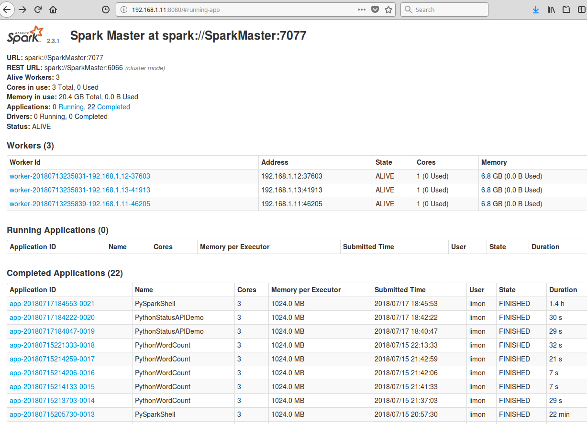

## 4. Apache Hadoop 

### Overview 

The Hadoop platform consists of different services available for analyzing big data. It has 3 main components:

  - HDFS: Hadoop Distributed File System
  - YARN: Schedule Resource Manager
  - MapReduce: Programming model for processing big data

In addition to MapReduce, there are many programs available for use in Hadoop. Some programming models are independent of Hadoop. Most use HDFS and are managed using YARN. These programs are as follows and can be seen in the architectural diagram too \[3\]:

  - Spark (In-memory Data Processing)
  - PIG, HIVE (Data Processing Services using SQL like Query)
  - HBase, Cassandra (NoSQL Database)
  - Mahout, Spark MLlib (Machine Learning)
  - Apache Drill (SQL on Hadoop)
  - Zookeeper (Managing Cluster)
  - Oozie (Job Scheduling)
  - Flume, Sqoop (Data Ingesting Services)
  - Solr & Lucene (Searching & Indexing)
  - Ambari (Provision, Monitor and Maintain cluster)
  - Giraffe (Working with
Graphs)

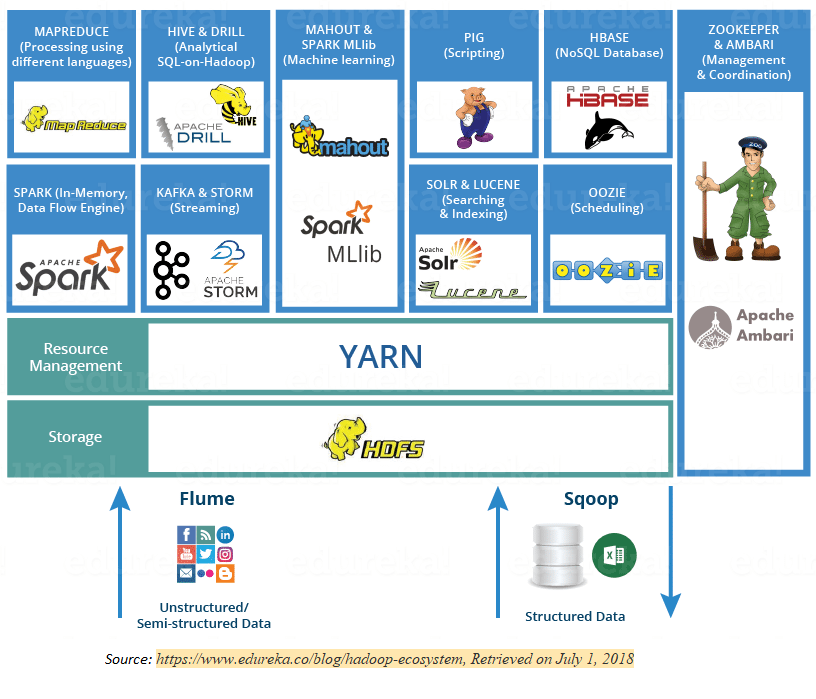

#### HDFS

HDFS is a java based distributed file system that provides scalable and reliable data storage across multiple nodes in Hadoop clusters. It is scalable, fault-tolerant, distributed storage system that works closely with a wide variety of concurrent data access applications, coordinated by YARN. Having distributed storage and computation across many servers, the combined storage resource can grow linearly with demand while remaining economical at every amount of storage.

HDFS has a master/slave architecture. An HDFS cluster comprises of a single Name Node (master) and multiple Data Nodes (slave nodes). Usually, Name Node executes file system namespace operations like opening, closing and renaming files and directories; it contains attributes like permissions, modification and access and disk space quotas, whereas Data Nodes contains the split data and are responsible for serving read and write requests from the clients. The Data Nodes can also perform block creation, deletion and replication upon instruction from the Name Node.


#### YARN

YARN allows multiple data processing engines such as interactive SQL, real time streaming, data science and batch processing to process and handle data stored in HDFS. To be precise, YARN acts as a resource manager for different applications to access the distributed data storage. YARN also performs job scheduling.


#### YARN consists of following components:

**Resource Manager**

Resource Manager receives the processing requests, and then passes the parts of request to corresponding Node Manager, which are installed on every data node.
 
It has a scheduler, which is responsible for allocating resources to the various applications running in the cluster, according to the constraints such a queue capacities and user limits. The scheduler schedules based on the resource requirements of each application.
 
**Node Manager**

Node Managers are responsible for execution of task on every single datanode.

**Application Master**

Application Master is responsible for negotiating appropriate resource containers from the scheduler, tracking their status, and monitoring their progress.

**Container**

It consists of resources like memory, processing unit and network on a single node.

#### How does YARN work \[5\]?


### Application of MapReduce in Hadoop with example

The execution of Map and Reduce task in controlled by Job and Task trackers. Each cluster-node consists of a single Job Tracker and one Task Tracker. The Job tracker acts as a master and is responsible for scheduling the jobs' component tasks on the slaves (Task Tracker), monitoring them and re-executing the failed tasks. The slaves execute the tasks as directed by the master. Job Tracker resides on Name node and Task Tracker on Data node.

#### Example text (WordCount_Example.txt):

*Play Golf? Don’t play if the outlook is rain and it’s windy. Don’t play
if humidity is high, outlook sunny, and it’s not windy. Otherwise, go
play*

#### Phase 1:

**Input Splits:**

During this process the input file is divided into chunks of data to be processed by individual mapper. In our example, the text is divided in a chunk of 4 words each.

**Mapping:**

During mapping process, the output from the input splits is passed to a mapping function to produce output values; job of mapping is to count number of occurrences of each word from input splits and prepare a list in the form of key-value (word, frequency). Please refer to the diagram below and see how each word is seen with frequency of 1.

#### Phase 2: 

**Shuffling:**

This process takes the output of mapping phase. Its task is to
consolidate the relevant records from mapping process. In our example,
the word “and” is in the file twice, so it is grouped and is seen twice
with a frequency of 1 each.

**Reducing:**

This process combines values from shuffling process and returns a single
output value. Considering our example, now the word “and” is seen in the
output only once with the frequency of 2.

### Installation and configuration of Hadoop on the Cloudera Virtual Machine

#### Download and Install Virtual Box

Download link

https://www.virtualbox.org/wiki/Downloads

#### Download and Install Cloudera Virtual Machine
(VM) Image:

Download link

https://downloads.cloudera.com/demo_vm/virtualbox/cloudera-quickstart-vm-5.4.2-0-virtualbox.zip

<span class="underline">Sample text file used for example</span>

Available in the drop box with the file named *WordCount\_Example.txt*

### Testing the installation – running a program in Hadoop

Let us consider the example of wordcount we used earlier for the demonstration on the use of Hadoop. We can run the application using terminal shell

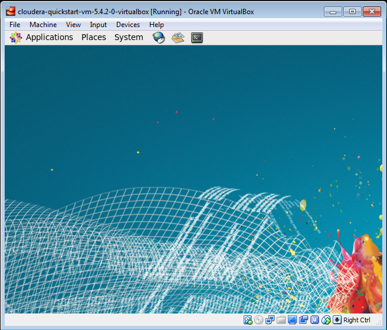

#### Step 1:

Download or generate a file that needs to be used for the application. In our example, a text document titled WordCount_Example.txt is created in the Downloads folder of virtual box. The file can then be transferred to HDFS using the following command:

Code:

```
hadoop fs –copyFromLocal WordCount_Example.txt
```

Screen shot:

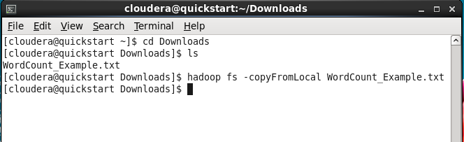

### Step 2:

Check if the file is available in the HDFS

Code:

```
hadoop fs –ls 
```

Screen shot:

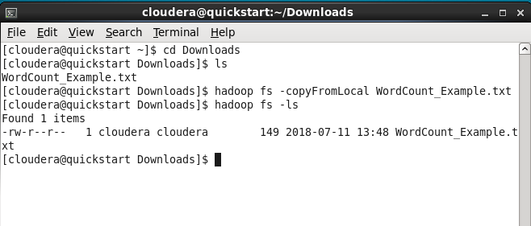

### Step 3:

We can use jar command to run a program in hadoop from a jar file. The jar file is in usr/jars/hadoop-examples.jar, and we are going to use wordcount program on the text file we have in the file system.

Syntax:
```
hadoop jar /usr/jars/hadoop-examples.jar wordcount <input> <output>
```
Code:

```
hadoop jar /usr/jars/hadoop-examples.jar wordcount
WordCount_Example.txt Eout
```

Screen shot:

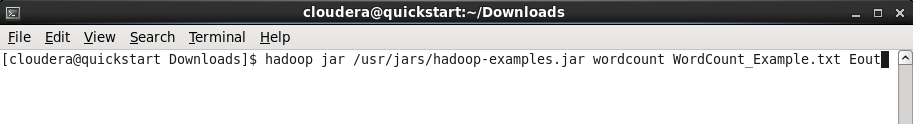

The MapReduce application will now perform the map and reduce task. The process can be monitored on the screen. In the screen below, we can see that the input has been split and is awaiting the map and reduce phase (both at 0%)

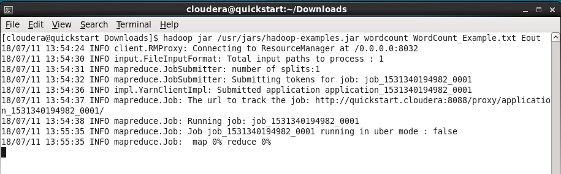

Once Map phase completes, Reduce phase starts

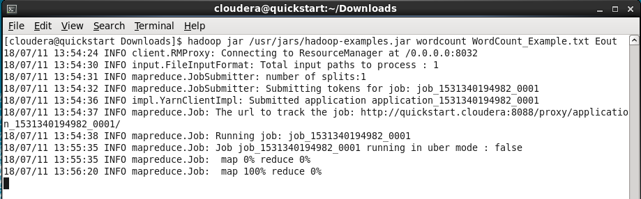

After the completion of Reduce phase, we get the summary of task completed by the application

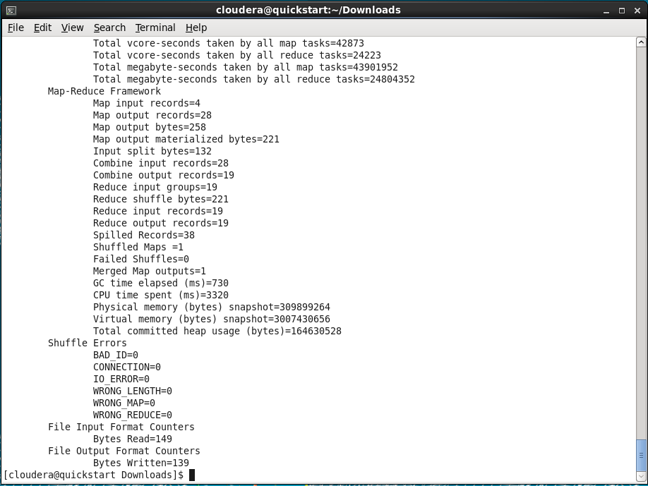

#### Step 4:

Check if the output directory is created

Code:

```
hadoop fs –ls
```

Screen shot:

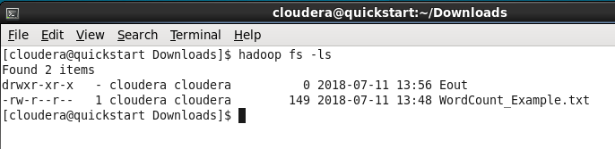

#### Step 5:

Open the directory to check the files in the directory. There are two files in the directory:

Eout/_SUCCESS and \
Eout/part-r-00000.

The Eout/_SUCCESS means that the wordcount job ran successfully. The
other file is the output generated by the process.

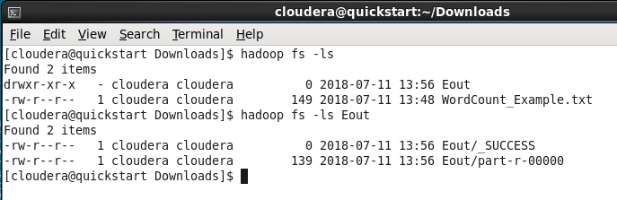

#### Step 6:

The output file can now to copied to local file system from HDFS and view it.

Code:

```
hadoop fs –copyToLocal Eout/part-r-0000 Output.txt
```

Screen shot:

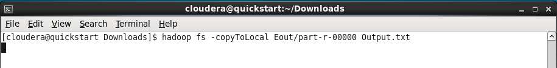

#### Step 7:

We can now read the output file. The file contains the word and the frequency of the word in the file we sent in as an input.

Code:

```
more Output.txt
```

Screen shot:

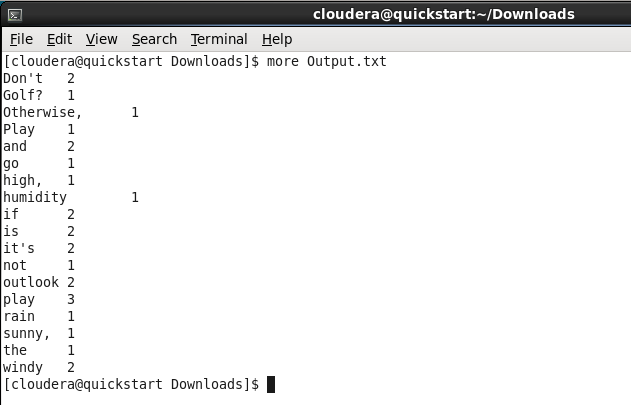

### Exercise

1.  Download the text file from the following link (instructor could provide their own text file, the specified file in the link is used just as an example): [https://www.w3.org/TR/PNG/iso_8859-1.txt](https://www.w3.org/TR/PNG/iso_8859-1.txt)
2.  Copy the file in HDFS
3.  Run wordcount program using MapReduce
4.  Explain each phase of MapReduce and submit the file output to the instructor

## Websites of relevance

1. What is Big Data and why it matters. (n.d.). Retrieved July 1, 2018, from https://www.sas.com/en_us/insights/big-data/what-is-big-data.html
2. MapReduce Tutorial. (n.d.). Retrieved July 1, 2018, from https://hadoop.apache.org/docs/stable/hadoop-mapreduce-client/hadoop-mapreduce-client-core/MapReduceTutorial.html
3. Sinha, S. (2018, July 17). Hadoop Ecosystem | Hadoop Tools for Crunching Big Data | Edureka. Retrieved July 1, 2018, from https://www.edureka.co/blog/hadoop-ecosystem
4. HDFS Architecture Guide. (n.d.). Retrieved July 1, 2018, from https://hadoop.apache.org/docs/r1.2.1/hdfs\_design.html
5.  Subramaniam, A. (2018, July 17). Apache Hadoop YARN | Introduction to YARN Architecture | Edureka. Retrieved July 1, 2018, from https://www.edureka.co/blog/hadoop-yarn-tutorial/
6.  Big Data. (n.d.). Retrieved July 1, 2018, from https://words.sdsc.edu/words-data-science/big-data
7.  Apache Hadoop HDFS. (n.d.). Retrieved July 1, 2018, from https://hortonworks.com/apache/hdfs/
8.  Apache Hadoop YARN. (n.d.). Retrieved July 1, 2018, from https://hortonworks.com/apache/YARN/
9.  https://computing.llnl.gov/tutorials/parallel_comp/
10. https://en.wikipedia.org/wiki/Beowulf_cluster
11. https://www.top500.org/
