# Simple Linear Regression Module

## Learning Objectives

-	Describe applications of regression
-	Explain the concept of a probabilistic model
-	Hypothesize the form of a straight-line model with a single predictor variable
-	Use the method of least squares to estimate the intercept and slope in the simple regression model
-	Specify the model assumptions for a simple regression model
-	Assess the utility of the simple regression model by making inferences about the slope
-	Use the least squares model to estimate the mean value of the response variable for a specific value of the predictor variable
-	Use the least squares model to predict a particular value of the response variable for a given value of the predictor variable
-	Calculate the coefficients of correlation and determination and understand their relationship to simple linear regression
-	Show how residuals can be used to detect departures from the simple linear regression model assumptions
-	Understand procedures for coping with departures from the model assumptions
-	Use the Durbin-Watson Test for detecting residual correlation


## Requirements

Most of the examples, activities, and assessment exercises in this module assume basic knowledge and experience with the R programming language.  Others require the use of MS Excel.  If you are not familiar with R, a good resource is the R module which is also available on D2L.  The code for the examples in this document were produced using Version 1.1.419 of RStudio.  To use the non-base packages, such as **car**, you must install them prior to referencing them with a command such as the **library( )** function.
Prior to undertaking this module, a basic understanding of elementary statistics is assumed.  In particular, one should be familiar with concepts such as probability and sampling distributions, confidence interval estimation, and hypothesis testing.  An excellent source for refreshing your memory on these topics is provided in the next section.


## Supplementary Materials

Besides the information provided in this document, a number of other materials are posted on D2L for your use in learning simple linear regression.  They include:
-	Code for reproducing all of the examples
-	Code for the 10 activities 
-	Code for the Final Assessment questions
-	A pdf file of the third edition of **OpenIntro Statistics** by David M. Diez, Christopher D. Barr, and Mine Cetinkaya-Rundel.  In particular, Chapter 7 (pages 331-371) is an “Introduction to Linear Regression” which provides additional examples and exercises on many of the topics that are covered in the module.  The first six chapters also can be used as a review of material typically covered in an introductory statistics course.
-	Two YouTube videos:
    - Using R for Simple Linear Regression
    - Using MS Excel for Simple Linear Regression

## Resources

Following is a list of online materials which are referenced in the content of this document.  Many of them provide additional explanations and examples beyond what is covered in the following sections.

https://www.deepdyve.com/lp/wiley/francis-galton-and-regression-to-the-mean-rkELkMmOVt

https://www.r-bloggers.com/r-tutorial-series-simple-linear-regression/

https://stat.ethz.ch/R-manual/R-devel/library/datasets/html/women.html

http://www.learnbymarketing.com/tutorials/explaining-the-lm-summary-in-r/

https://www.datamentor.io/r-programming/plot-function

http://www.r-tutor.com/elementary-statistics/quantitative-data/scatter-plot

https://www.math.ucla.edu/~anderson/rw1001/library/base/html/segments.html

https://saylordotorg.github.io/text_introductory-statistics/s14-correlation-and-regression.html

https://stat.ethz.ch/R-manual/R-devel/library/stats/html/confint.html

https://www.r-bloggers.com/extracting-information-from-objects-using-names/

http://data.princeton.edu/R/linearmodels.html

http://www.endmemo.com/program/R/coef.php

https://www.rdocumentation.org/packages/base/versions/3.5.0/topics/numeric

http://www.r-tutor.com/elementary-statistics/simple-linear-regression/confidence-interval-linear-regression

http://www.r-tutor.com/elementary-statistics/simple-linear-regression/prediction-interval-linear-regression

https://thepracticalr.wordpress.com/tag/xlim/

http://www.endmemo.com/program/R/points.php

http://www.endmemo.com/program/R/seq.php

https://stat.ethz.ch/R-manual/R-devel/library/graphics/html/lines.html

https://datascienceplus.com/mastering-r-plot-part-1-colors-legends-and-lines/

http://www.r-tutor.com/elementary-statistics/numerical-measures/correlation-coefficient

https://www.r-bloggers.com/correlation-and-linear-regression/

http://analyticspro.org/2016/03/07/r-tutorial-how-to-use-diagnostic-plots-for-regression-models/

https://www.statmethods.net/advgraphs/layout.html

https://www.investopedia.com/terms/d/durbin-watson-statistic.asp


## Introduction and Regression Applications

Regression models describe the effect that *explanatory* variables (also called the *independent* or *predictor* variables), might have on the value of a continuous outcome variable, called the *response* variable (also called a *dependent*, *criterion*, or *outcome* variable).  The explanatory variables may be continuous, discrete, or categorical.  As described shortly, regression was originally invented by Francis Galton to study the relationships between parents and children, which he described as regressing to the mean.  It has become one of the most widely used modelling techniques and has spawned other models.  

Regression analysis has numerous areas of applications.  A partial list would include economics, finance, business, law, meteorology, medicine, biology, chemistry, engineering, physics, education, sports, history, sociology, and psychology.  

While studying natural inheritance in 1886, scientist Francis Galton collected data on heights of parents and adult children.  He noticed the tendency for tall (or short) parents to have tall (or short) children, but not as tall (or short) on average as their parents.  Galton called this phenomenon the “Law of Universal Regression” for the average heights of adult children tended to “regress” to the mean of the population.  Galton modeled a son’s adult height ($y$) as a function of mid-parent height ($x$), and the term *regression model* was coined[[^]](https://www.deepdyve.com/lp/wiley/francis-galton-and-regression-to-the-mean-rkELkMmOVt). 

An exercise physiologist might use regression analysis to develop an equation for predicting the expected number of calories a person will burn while exercising on a treadmill.  The response variable is the number of calories burned (calculated from the amount of oxygen consumed), and the predictor variables might include duration of exercise (minutes), percentage of time spent at their target heart rate, average speed (mph), age (years), gender, and body mass index (BMI).

From a theoretical point of view, the analysis will help answer such questions as these:

- What’s the relationship between exercise duration and calories burned?  Is it linear or curvilinear?  For example, does exercise have less impact on the number of calories burned after a certain point?
- How does effort (the percentage of time at the target heart rate, the average walking speed) factor in?
- Are these relationships the same for young and old, male and female, heavy and slim?

From a practical point of view, the analysis will help answer such questions as the following:
- How many calories can a 30-year-old man with a BMI of 28.7 expect to burn if he walks for 45 minutes at an average speed of 4 miles per hour and stays within his target heart rate 80% of the time?
- What’s the minimum number of variables you need to collect in order to accurately predict the number of calories a person will burn when walking?
- How accurate will your prediction tend to be?

In general, regression analysis can be used to identify the explanatory variables that are related to a response variable, to describe the form of the relationships involved, and to provide an equation for predicting the response variable from the explanatory variables.

In its simplest form regression is used to determine the relationship between two variables.  That is, given one variable, it tells us what we can expect from the other variable.  This powerful tool is called simple linear regression and is the focus of this module.

## The Straight-Line Probabilistic Model

An important consideration in merchandising a product is the amount of money spent on advertising.  Suppose you want to model the monthly sales revenue $y$ of a department store as a function of the monthly advertising expenditure $x$.  The first question to be answered is this:  Do you think an exact (deterministic) relationship exists between these two variables?  That is, can the exact value of sales revenue be predicted if the advertising expenditure is specified?  This is not possible for several reasons.  Sales depend on many variables other than advertising expenditure – for example, time of year, state of the general economy, inventory, and price structure.  However, even if many variables are included in the model, it is still unlikely that we can predict the monthly sales *exactly.*  There will almost certainly be some variation in sales due strictly to **random phenomena** that cannot be modeled or explained.

Consequently, we need to propose a probabilistic model for sales revenue that accounts for this random variation: $y = E(y) + \varepsilon$.  The random error component $\varepsilon$, represents all unexplained variations in sales caused by important but omitted variables or by unexplainable random phenomena.

In this module, we consider the simplest of probabilistic models – a **simple linear regression model.**  The relationship between a response variable $y$ and a predictor variable $x$ is postulated as a straight-line model:  $y= \beta_0 + \beta_1 x + \varepsilon$, where $\beta_0$ and $\beta_1$ are constants called the *model regression coefficients* or *parameters*, and $\varepsilon$ is a random disturbance or error.  It is assumed that in the range of the observations studied, the linear equation provides an acceptable approximation to the true relation between $y$ and $x$.  In other words, $y$ is approximately a linear function of $x$, and $\varepsilon$ measures the discrepancy in that approximation.  In particular $\varepsilon$ contains no systematic information for determining $y$ that is not already captured in $x$.

The value denoted by $\beta_0$ is called the *intercept*, and that of $\beta_1$ is called the *slope*.  Together, they are also referred to as the *regression coefficients* and are interpreted as follows:

- The intercept, $\beta_0$, is interpreted as the expected value of the response variable when the value of predictor variable $x$ is set to zero. 
- Generally, the slope, $\beta_1$, is the focus of interest.  This is interpreted as the change in the mean response ($y$) for each one-unit increase in the predictor ($x$).  When the slope is positive, the regression line increases from left to right (the mean response is higher when the predictor is higher); when the slope is negative, the line decreases from left to right (the mean response is lower when the predictor is higher).  When the slope is zero, this implies that the predictor has no effect on the value of the response.  The more extreme the value of $\beta_1$ (that is, away from zero), the steeper the increasing or decreasing line becomes.

## Fitting the Model: The Method of Least Squares

The goal is to use our sample data to estimate the regression parameters, yielding the estimates $\hat{\beta}_0$ and $\hat{\beta}_1$; this is referred to as *fitting* the linear model.  This is equivalent to finding the straight line that gives the *best fit* of the points in the scatterplot of the response versus the predictor variable.  In this case, the data comprise $n$ pairs of observations for each individual.  The fitted model of interest concerns the mean response value, denoted $\hat{y}$ for a specific value of the predictor, $x$, and is written as follows:  $\hat{y} = \hat{\beta}_0 + \hat{\beta}_1x$.

We estimate the parameters using the *least squares method*, which gives the line that minimizes the sum of squares of the *vertical differences* from each point to the line.  The vertical distances represent the errors in the response variable.  These errors can be obtained as $\varepsilon_i = y_i- \hat{\beta}_0 - \hat{\beta}_1 x_i,\; i=1, 2, \cdots,n$.  The sum of squares of these distances (often referred to as residuals) can then be written as $SSR = \sum_{i=1}^{i=n} \varepsilon_i^2 = \sum_{i=1}^{i=n}(y_i- \hat{\beta}_0 - \hat{\beta}_1 x_i)^2$.
The values of $\hat{\beta}_0$ and $\hat{\beta}_1$ that minimize SSR are given by

$$\hat{\beta}_1 = \frac{\sum(y_i- y)  (x_i- x)}{\sum(x_i- x)^2}$$

and

$$\hat{\beta}_0 = \bar{y}-\hat{\beta}_1 \bar{x}.$$

Note that we give the formula for $\hat{\beta}_1$ before the formula for $\hat{\beta}_0$ because $\hat{\beta}_0$ uses $\hat{\beta}_1$.  The estimates $\hat{\beta}_0$ and $\hat{\beta}_1$ are called the least squares estimates of $\beta_0$ and $\beta_1$ because they are the solution to the *least squares method*, the intercept and the slope of the line that has the smallest possible sum of squares of the vertical distances from each point to the line.  For this reason, the line is called the *least squares regression line*.  The least squares regression line is given by $\hat{y} = \hat{\beta}_0+\hat{\beta}_1 x$.  Note that a least squares line always exists because we can always find a line that gives the minimum sum of squares of the vertical distances.  In some cases a least squares line may not be unique.  These cases are not common in practice.

For each observation in our data we can compute

$$\hat{y}_i=\hat{\beta}_0+\hat{\beta}_1 x_i,\quad i = 1, 2, \cdots , n.$$

These are called the fitted values.  Thus, the $i$th fitted value, $\hat{y}_i$, is the point on the least squares regression line corresponding to $x_i$.  The vertical distance corresponding to the $i$th observation is

$$e_i = y_i- \hat{y}_i,\quad i=1,2,\cdots, n.$$

These vertical distances are called the *ordinary least squares residuals*.  One property of the residuals above is that their sum is zero.  This means that the sum of the distances above the line is equal to the sum of the distances below the line.

### Fitting Regression Models with `lm()`

In R, the basic function for fitting a linear model is `lm()`[[^]](https://www.r-bloggers.com/r-tutorial-series-simple-linear-regression/).  The format is

```
myfit <- lm(formula, data)
```

where `formula` describes the model to be fit and `data` is the data frame containing the data to be used in fitting the model. The resulting object (`myfit`, in this case) is a list that contains extensive information about the fitted model.  The formula is typically written as

```
Y ~ X
```

where the `~` separates the response variable on the left from the predictor on the right. 

### Fitting Simple Regression Models with `lm( )`

The dataset `women` in the base installation of R provides the height (in inch) and weight (in lb.) for a set of $15$ women ages 30 to 39 (figure 1) [[^]](https://stat.ethz.ch/R-manual/R-devel/library/datasets/html/women.html).
 
 

Figure 1.  Dataset of $15$ women (ages 30 to 39) in the base installation of R.

Suppose you want to predict weight from height.  Having an equation for predicting weight from height can help you to identify overweight or underweight individuals.  The analysis is provided in the listing in figure 2.  The `summary()` function applied to the object returned by `lm()` displays detailed results for the fitted model [[^]](http://www.learnbymarketing.com/tutorials/explaining-the-lm-summary-in-r/).


Figure 2.  Simple linear regression model for predicting weight from height.

From the output, we see that the prediction equation is $\widehat{\mathrm{Weight}}= -87.52+3.45 × \mathrm{Height}$.  Because a height of 0 is impossible, we wouldn’t try to give a physical interpretation to the intercept.  It merely becomes an adjustment constant. The estimate of the slope (3.45) indicates that there’s an expected increase of 3.45 pounds of weight for every 1 inch increase in height.

We’ve printed out the actual, predicted, and residual values (figure 3).  The `fitted( )` and `residuals( )` functions applied to the object returned by lm( ) list the predicted and residual values, respectively, in a fitted model.


Figure 3.  Actual, predicted, and residual values of weight.

The largest residuals occur for low and high heights.  This can also be seen in the scatterplot (figure 4).  `plot()` is a generic function that plots objects in R (its output varies according to the type of object being plotted).  In figure 4, `plot(women$height,women$weight)` places height on the horizontal axis and weight on the vertical axis and plots the $15$ (height, weight) data points.  Axis labels are added with `xlab` and `ylab` [[^]](https://www.datamentor.io/r-programming/plot-function).
The `abline()` function is used to add the fitted least squares regression line [[^]](http://www.r-tutor.com/elementary-statistics/quantitative-data/scatter-plot).


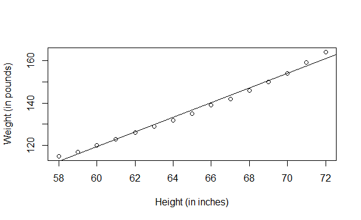

Figure 4.  Scatterplot with least squares line for predicting weight from height.

The plot suggests that you might be able to improve on the prediction by using a line with one bend.

#### Activity 1:  
`cars` is a standard built-in dataset in R.  You can access this dataset simply by typing in `cars` in your R console.  You will find that it consists of 50 observations (rows) and 2 variables (columns) – `dist` and `speed`.  The first six observations are shown below.


The aim of this activity is to build a simple regression model that we can use to predict distance (`dist`) by establishing a linear relationship with speed.

- a. Construct a scatter plot to visualize the linear relationship between the predictor and response.
- b. Find the least squares linear regression equation for predicting the distance to stop from speed.  Note that the data were recorded in the 1920’s.
- c. Apply the `summary()` function to the object returned by `lm()` in (b).
- d. Find the actual, predicted, and residual values of distance.
- e. Plot the regression line on the scatter plot created in (a).


### Illustrating Residuals

When the parameters are estimated, the fitted line is referred to as an implementation of *least squares regression* because it is the line that minimizes the average squared difference between the observed data and itself.  This concept is easier to understand by drawing the distances between the observations and the fitted line, formally called *residuals*.

To create a plot where residuals are displayed by connecting observations to corresponding points on the fitted line, you can use the code shown in figure 5.


Figure 5.  R code for displaying residuals.

The function `segments()` draws line segments; its arguments are the endpoint coordinates in the order $(x_1, y_1,x_2,y_2)$[[^]](https://www.math.ucla.edu/~anderson/rw1001/library/base/html/segments.html).  The plot is shown in figure 6.


 
Figure 6.  Plot of line segments representing residuals.

Now, imagine a collection of alternative regression lines drawn through the data (achieved by altering the value of the intercept and slope).  Then, for each of the alternative regression lines, imagine you calculate the residuals (vertical differences) between the response value of every observation and the *fitted value* of that line.  The simple linear regression line estimated in figure 2 is the line that lies “closest to all observations.”  By this, it is meant that the fitted regression model is represented by the estimated line that yields the smallest overall measure of the squared residual distances.  For this reason, another name for a least squares estimated regression equation like this is the *line of best fit*.

#### Activity 2:  
For the model fit in Activity 1, create a plot connecting the actual observations to the corresponding points on the fitted line.

Model Assumptions

The validity of the conclusions you can draw based on the model $y= \beta_0+ \beta_1 x+ \varepsilon$ is critically dependent on the assumptions made about $\varepsilon$, which are defined as follows:
- The value of $\varepsilon$ is assumed to be normally distributed such that $\varepsilon \sim N(0,\sigma)$.
- That $\varepsilon$ is centered (that is, has a mean of) zero.
- The variance of $\varepsilon$, $\sigma^2$, is constant.
- The errors associated with any two different observations are independent.  That is, the error associated with one value of $y$ has no effect on the errors associated with other $y$ values.

The $\varepsilon$ term represents random error.  In other words, you assume that any raw value of the response is owed to a linear change in a given value of $x$, plus or minus some random, *residual* variation or normally distributed *noise*.
The implications of the first three assumptions can be seen in figure 7, which shows distributions of errors for three particular values of $x$, namely $x_1$, $x_2$, and $x_3$.  Note that the relative frequency distributions of the errors are normal, with a mean of 0, and a constant variance $\sigma^2$ (all the distributions shown have the same amount of spread or variability) [[^]](https://saylordotorg.github.io/text_introductory-statistics/s14-correlation-and-regression.html).

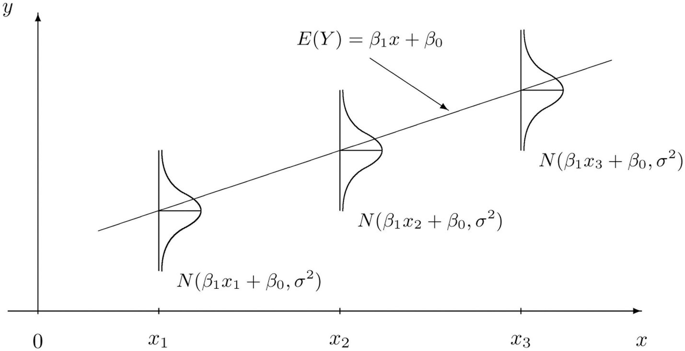

Figure 7.  The probability distribution of $\varepsilon$.

Let’s return to the basic extractor function `summary()` as shown in figure 2 and repeated in figure 8 for our example of predicting weight from height for a sample of 15 adult females.  

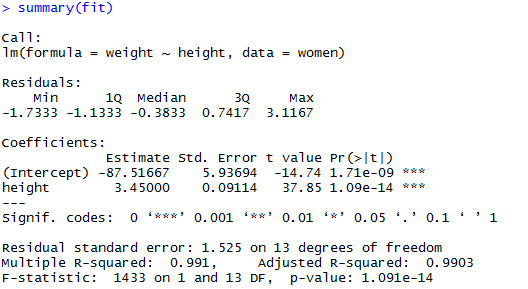

Figure 8.  Summary of the linear regression fit for predicting weight from height.

The following portion of the output gives a superficial view of the distribution of the residuals that may be used as a quick check of the distributional assumptions.
 


The mean of the residuals is zero by definition, so the median should not be far from zero, and the minimum and maximum should be roughly equal in absolute value.  In this example, the absolute value of the maximum is considerably greater than that of the minimum.  However, in view of the small number of observations (15), this is not really something to worry about.

Following is the residual variation, an expression of the variation of the observations around the regression line, estimating the model parameter $\sigma$.


Since the residual standard error measures the spread of the distribution of $y$-values about the least squares line and these errors are assumed to be normally distributed, we should not be surprised to find that most (about 95%) of the observations lie within $2(1.525) = 3.05$ of the least squares line.  For this example, 14 of the 15 data points fall within 3.05 of the least squares line.
The value of the residual standard error will be utilized in tests of model adequacy, in evaluating model parameters, and in providing measures of reliability for future predictions.

## Assessing the Accuracy of the Coefficient Estimates

The estimation of a regression equation is relatively straightforward, but this is merely the beginning.  You should now think about what can be inferred from your result.  In simple linear regression, there’s a natural question that should always be asked:  Is there statistical evidence to support the presence of a relationship between the predictor and the response?  To put it another way, is there evidence that a change in the explanatory variable affects the mean outcome?
The estimated slope and intercept will deviate somewhat from the true values due to sampling variation.  If you were to generate several sets of $y_i$ at the same set of $x_i$, you would observe a distribution of estimated slopes and intercepts.  It is possible from a single sample of $(x_i, y_i)$ to calculate the standard error of the computed estimates, $s.e.(\hat{\beta}_0)$ and $s.e.(\hat{\beta}_1)$.  These standard errors can be used to compute confidence intervals for the parameters and tests for whether a parameter has a specific value.

### Hypothesis Tests on the Coefficients

It is usually of prime interest to test the null hypothesis that $\beta_1 = 0$ since that would imply that the line was horizontal and thus that the $y$’s have a distribution that is the same, whatever the value of $x$, implying there is no statistically significant linear relationship between $x$ and $y$.  You can compute a $t$ test for that hypothesis simply by dividing the estimate by its standard error

$$t=\frac{\hat{\beta}_1}{s.e.(\hat\beta_1)}$$

which follows a $t$ distribution on $n$-$2$ degrees of freedom if the true $\beta_1$ is zero.  A similar test can be calculated for whether the intercept is zero, but you should be aware that it is often a meaningless hypothesis either because there is no natural reason to believe that the line should go through the origin or because it would involve an extrapolation far outside the range of data.

Let’s now focus on the way the estimated regression coefficients are reported in R.  The first column of the coefficients table (figure 9) contains the point estimates of the intercept and slope (the intercept is labeled as such, and the slope is labeled after the name of the predictor variable in the data frame); the table also includes estimates of the standard errors of these statistics.  The standardized t value and a $p$-value are reported for each parameter.  These represent the results of a two-tailed hypothesis test formally defined as

$$H_0: \beta_j  = 0 \\
H_a: \beta_j \neq 0$$

where $j=0$ for the intercept and $j=1$ for the slope, using standard regression notation.

Focus on the row of results for the predictor in figure 9.  With a null value of zero, truth of $H_0$ implies that the predictor has no effect on the response.  The claim here is interested in whether there is *any effect* of the explanatory variable, not the direction of this effect, so $H_a$ is two-sided (via $\neq$).  As with any hypothesis test, the smaller the $p$-value, the stronger the evidence against $H_0$.  With a small $p$-value $(1.09 × 10^{-14})$ attached to this particular test statistic (which you can confirm using the formula $t=\frac{3.45-0}{0.09114}=37.85$), you’d therefore conclude there is strong evidence *against* the claim that the predictor has no effect on the mean level of the response. That means there is a statistically significant linear relationship between the predictor and the response.

The same test is carried out for the intercept, but the test for the slope parameter $\beta_1$ is typically more interesting (since rejection of the null hypothesis for $\beta_0$ simply indicates evidence that the regression line does not strike the vertical axis at zero), especially when the observed data don’t include $x=0$, as is the case here.

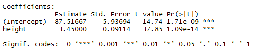

Figure 9.  Coefficients table from the `summary()` function output.

From this, you can conclude that the fitted model suggests there is evidence that an increase in height is associated with an increase in height among the population being studied.  For each additional inch of height, the mean increase in weight is approximately $3.45$ pounds.

### Confidence Intervals

You can also produce confidence intervals for your estimates.  R provides a convenient function for an object of class “`lm`” to do this for you. [[^]](https://stat.ethz.ch/R-manual/R-devel/library/stats/html/confint.html )

To the `confint()` function you pass your model object as the first argument and your desired level of confidence as level.  (figure 10)


Figure 10.  Use of `confint()` function to construct 95% confidence intervals for the regression coefficients.

Figure 10 indicates that you should be 95 percent confident the true value of $\beta_1$ lies somewhere between $3.25$ and 3.65 (to 2 decimal places).  The exclusion of the null value of zero reflects the statistically significant result from earlier.

#### Activity 3:  

Referring to the linear model relating distance to speed using the `cars` dataset, construct the 90% confidence intervals for the $y$-intercept and the slope.

## Using the Model for Estimation and Prediction

We’ll now look at using our fitted model for predictive purposes.  The ability to fit a statistical model means that you not only can understand and quantify the nature of relationships in your data (like the estimated 3.45 pound increase in mean weight per 1 inch increase in height) but can also *predict* values of the outcome of interest, even where you haven’t actually observed the values of any explanatory variables in the original data set.  As with any statistic, though, there is always a need to accompany any point estimates or predictions with a measure of spread.

### Confidence Interval or Prediction Interval?
 
The fitted regression equation can be used for prediction.  We distinguish between two types of predictions:
1. The prediction of the value of the response variable $y$ which corresponds to any chosen value, $x_0$, of the predictor variable. 
1. The estimation of the mean response $\mu_0$, when $x= x_0$. 

For the first case, the predicted value $\hat{y}_0$ is

$$\hat{y}_0 = \hat\beta_0 + \hat\beta_1 x_0.$$

The standard error of this prediction is

$$s.e.(\hat{y}_0) = \hat\sigma \sqrt{1+\frac{1}{n}+\frac{(x_0-\bar{x})^2}{\sum(x_i-\bar{x})^2}}$$

Hence, the confidence limits for the predicted value with confidence coefficient $(1- α)$ are given by

$$\hat{y}_0\pm t_{(n-2,\alpha/2)}s.e.(\hat{y}_0)$$

For the second case, the mean response $\mu_0$ is estimated by

$$\hat\mu_0 = \hat\beta_0 + \hat\beta_1 x_0$$

The standard error of this estimate is

$$s.e.(\hat\mu_0) = \hat\sigma\sqrt{\frac{1}{n}+\frac{(x_0-\bar{x})^2}{\sum(x_i-\bar{x})^2}}$$

from which it follows that the confidence limits for $\mu_0$ with confidence coefficient $(1- α)$ are given by

$$\hat\mu_0 \pm t_{(n-2,\alpha/2)}s.e.(\hat\mu_0)$$

Note that the point estimate of $\mu_0$ is identical to the predicted response $\hat{y}_0$.  The standard error of $\hat\mu_0$ is, however, smaller than the standard error of $\hat{y}_0$.  Intuitively, this makes sense.  There is greater uncertainty (variability) in predicting one observation (the next observation) than in estimating the mean response when $x= x_0$.  The averaging that is implied in the mean response reduced the variability and uncertainty associated with the estimate.

A *prediction interval (PI)* for an observed response is different from the confidence interval (CI) in terms of context.  Where CIs are used to describe the variability of the *mean* response, a PI is used to provide the possible range of values that an *individual realization* of the response variable might take, given $x$.  This distinction is subtle but important:  the CI corresponds to a mean, and the PI corresponds to an individual observation.

### Interpreting Intervals

Continuing with our example, let’s say you want to determine the mean weight for individuals with a height of 66 inches and for individuals with a height of 70 inches.  The point estimates themselves are easy – just plug the desired $x$ values into the regression equation.  First, let’s briefly inspect the names of the members of the `fit` object (figure 11) [[^]](https://www.r-bloggers.com/extracting-information-from-objects-using-names/).


Figure 11.  Names of the members of the fit object.


These members are the components that automatically make up a fitted model object of class “`lm`”.  Note that there’s a component called “`coefficients`”.  
This contains a numeric vector of the estimates of the intercept and slope.

You can extract this component (and any of the other ones listed above) in the same way you would perform a member reference on a named list:  by entering `fit$coefficients` at the prompt (figure 12).

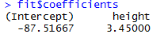

Figure 12.  Extracting the intercept and slope with use of `fit$coefficients`.
Where possible, though, it’s technically preferable for programming purposes to extract such components using a “direct-access” function.  For the `coefficients` component of an “`lm`” object, the function you use is `coef`[[^]](http://www.endmemo.com/program/R/coef.php).

In figure 13, the regression coefficients are extracted from the object and then separately assigned to the objects `beta0.hat` and `beta1.hat`.


Figure 13.  Extraction of the regression coefficients and assignment to variables.

According to the model (figure 14), you can expect mean weights to be around 140.18 and 153.98 pounds for heights of 66 and 70 inches, respectively.  The `as.numeric` coercion function is used simply to strip the result of the annotative names that are otherwise present from the `beta0.hat` and `beta1.hat` objects [[^]](https://www.rdocumentation.org/packages/base/versions/3.5.0/topics/numeric).

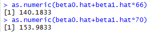

Figure 14.  Calculation of point estimates directly using the regression equation.

#### Activity 4:  

Use the regression equation relating distance to speed, calculate the point estimates of distance to stop for speeds of 15 and 30 miles per hour.  Calculate the estimates directly using the regression equation.

### Confidence Intervals for Mean Weights

To find confidence intervals for the above estimates, R has a built-in `predict` command to do it for you.  To use `predict`, you first need to store your $x$ values in a particular way:  as a column in a new data frame.  The name of the column must match the predictor used in the original call to create the fitted model object.  In this example, we’ll create a new data frame, `xvals`, with the column named `height`, which contains only two values of interest – the heights of 66 and 70 inches (figure 15).  

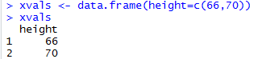

Figure 15.  Creation of a new data frame for values of predictor variable.

Now, when `predict` is called, the first argument must be the fitted model object of interest, `fit` for this example.  Next, in the argument `newdata`, you pass the specially constructed data frame containing the specified predictor values.  To the `interval` argument you must specify “`confidence`” as a character string value.  The confidence level, here set for 95 percent, is passed (on the scale of a probability) to `level` [[^]](http://www.r-tutor.com/elementary-statistics/simple-linear-regression/confidence-interval-linear-regression).

This call will return a matrix with three columns, whose number (and order) of rows correspond to the predictor values you supplied in the `newdata` data frame (figure 16).


Figure 16.  95% confidence intervals for heights of 66 and 70 inches.

The first column, with a heading of `fit`, is the point estimate on the regression line; you can see that these numbers match the values from figure 14.  The other columns provide the lower and upper CI limits as the `lwr` and `upr` columns, respectively.  In this case, you would interpret this as 95 percent confidence that the mean weight of an individual with a height of 66 inches lies somewhere between 139.3 pounds and 141.1 pounds and lies between 152.7 pounds and 155.3 pounds for a height of 70 inches (when rounded to 1 decimal place).  Remember, these CIs, calculated through `predict`, are for the *mean* response value.

#### Activity 5:  

For the `cars` data, construct 99% confidence intervals for speeds of 15 and 30 mph.

### Prediction Intervals for Individual Observations

The `predict` function will also provide your prediction intervals[[^]](http://www.r-tutor.com/elementary-statistics/simple-linear-regression/prediction-interval-linear-regression).

To find the prediction interval for possible individual observations with a certain probability, you simply need to change the interval argument to “`prediction`”.  (figure 17)

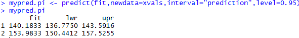

Figure 17.  95% prediction intervals for heights of 66 and 70 inches.

Notice that the fitted values remain the same.  The widths of the PIs, however, are significantly larger than those of the corresponding CIs – this is because raw observations themselves, at a specific $x$ value, will naturally be more variable than their mean.

Interpretation changes accordingly.  The intervals describe where raw individual heights are predicted to lie “95 percent of the time.”  For a height of 66 inches, the model predicts individual weights to lie somewhere between 136.8 pounds and 143.6 pounds with a probability of 0.95; for a height of 70 inches, the same PI is estimated at 150.4 pounds and 157.5 pounds (when rounded to 1 decimal place).

#### Activity 6:

For the `cars` data, construct 99% prediction intervals for speeds of 15 and 30 mph.

### Plotting Intervals

Both CIs and PIs are well suited to visualization for simple linear regression models.  With the code in figure 18, you can start off plotting the data and estimated regression line as in figure 4, but this time using `xlim` and `ylim` in plot to widen the $x$- and $y$-limits a little in order to accommodate the full length and breadth of the CI and PI [[^]](https://thepracticalr.wordpress.com/tag/xlim/).


Figure 18.  R code using `xlim` and `ylim`.

To this you add the locations of the fitted values for $x=66$ and $x=70$, as well as two sets of vertical lines showing the CIs and PIs (figure 19).

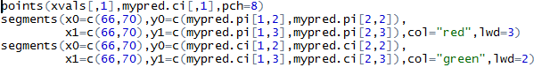

Figure 19.  R code to construct vertical lines showing the CIs and PIs at heights of 66 and 70.

The call to `points` marks the fitted values for these two particular values of $x$ [[^]](http://www.endmemo.com/program/R/points.php).

The first call to `segments` lays down the PIs as thickened vertical red lines, and the second lays down the CIs as the shorter vertical green lines (figure 20).

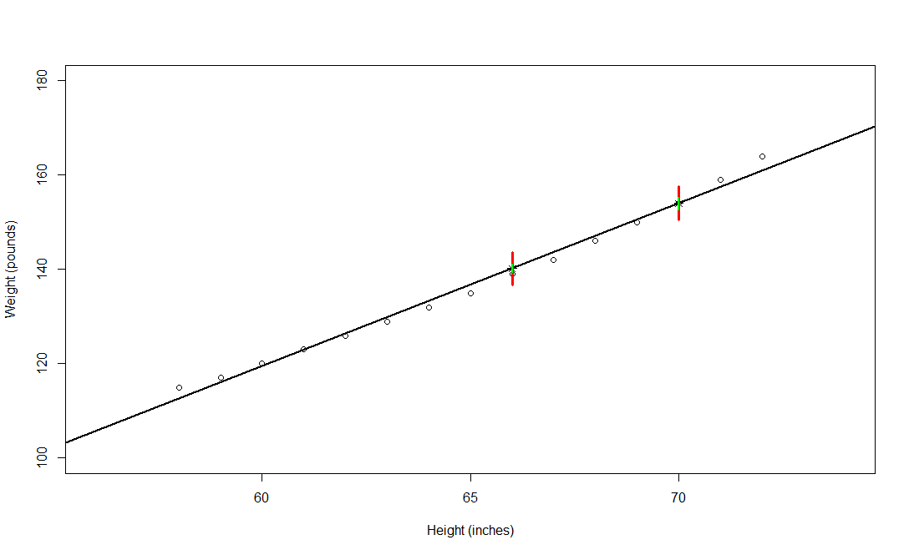

Figure 20.  Plot of PIs and CIs at heights of 66 and 70 inches.

The coordinates for these plotted line segments are taken directly from the `mypred.pi` and `mypred.ci` objects, respectively.
You can also produce “bands” around the fitted regression line that mark one or both of these intervals over $all$ values of the predictor.  From a programming standpoint, this isn’t technically possible for a continuous variable, but you can achieve it practically by defining a fine sequence of values along the $x$-axis (using `seq` with a high `length` value) and evaluating the CI and PI at every point in this fine sequence.  Then you just join resulting points as lines when plotting.

In R, this requires you to rerun the `predict` command as shown in figure 21.

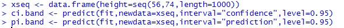

Figure 21.  R code to create CI and PI “bands.”

The first line in this code creates the fine sequence of predictor values and stores it in the format required by the `newdata` argument [[^]](http://www.endmemo.com/program/R/seq.php).

The $y$-axis coordinates for CI and PI bands are stored as the second and third columns of the matrix objects `ci.band` and `pi.band`.

Finally, `lines` is used to add each of the four dashed lines corresponding to the upper and lower limits of the two intervals, and a legend adds a final touch [[^]](https://stat.ethz.ch/R-manual/R-devel/library/graphics/html/lines.html) [[^]](https://datascienceplus.com/mastering-r-plot-part-1-colors-legends-and-lines/) (figure 22).


 
Figure 22.  R code to plot CI and PI “bands.”

Note in figure 23 that the green dashed CI bands meet the vertical green lines and the red dashed PI bands meet the vertical red lines for the two individual $x$ values from earlier, just as you’d expect.
 


Figure 23.  Plot of CI and PI “bands.”

Figure 23 shows the end result of all these additions to the plot.  The “bowing inwards” curvature of the intervals is characteristic of this kind of plot and is especially visible in the CI.  This curve occurs because there is naturally less variation if you’re predicting where there are more data.  For more information on `predict` for linear model objects, take a look at the `?predict.lm` help file.

#### Activity 7:  

For the cars data, plot the 99% CI and PI bands.

### Interpolation vs. Extrapolation

It is important to clarify the definitions of two key terms:  *interpolation* and *extrapolation*.  These terms describe the nature of a given prediction.  A prediction is referred to as interpolation if the $x$ value you specify falls within the range of your observed data; extrapolation is when the $x$ value of interest lies outside this range.  From the point-predictions you just made, you can see that the locations $x=66$ and $x=70$ are examples of interpolation.  $x=73$ is an example of extrapolation.

In general, interpolation is preferable to extrapolation – it makes more sense to use a fitted model for prediction in the vicinity of data that have already been observed.  Extrapolation that isn’t too far out of that vicinity may still be considered reliable, though.  The extrapolation for the individual weight example at $x=73$ is a case in point.  This is outside the range of the observed data, but not by much in terms of scale, and the estimated intervals for the expected value of $\hat{y}= 164.33$ pounds appear not unreasonable given the distribution of the other observations.  In contrast, it would make less sense to use the fitted model to predict individual weight at a height of, say, 82 inches (figure 24).


 
Figure 24.  CI and PI of heights of 73 and 82 inches.

The same is true in the other direction; the intercept $\hat\beta_0$ doesn’t have a particularly useful practical interpretation, indicating that the mean weight of an individual with a height of 0 inches is around -88 pounds.

The main message here is to use common sense when making any prediction from a linear model fit.  In terms of the reliability of the results, predictions made at values within an approximate proximity of the observed data are preferable.

## Coefficients of Correlation and Determination

A correlation coefficient is a symmetric, scale-invariant measure of association between two random variables.  It ranges from -1 to +1, where the extremes indicate perfect correlation and 0 means no correlation.  The sign is negative when large values of one variable are associated with small values of the other and positive if both variables tend to be large or small simultaneously.

### Pearson Correlation

The Pearson correlation is rooted in the two-dimensional normal distribution where the theoretical correlation describes the contour ellipses for the density.  If both variables are scaled to have a variance of 1, then a correlation of zero corresponds to circular contours, whereas the ellipses become narrower and finally collapse into a line segment as the correlation approaches ±1.
The empirical correlation coefficient is

$$r=\frac{\sum(x_i-\bar{x})(y_i-\bar{y})}{\sqrt{\sum(x_i-\bar{x})^2\sum(y_i-\bar{y})^2}}$$

It can be shown that $|r|$ will be less than 1 unless there is a perfect linear relation between $x_i$ and $y_i$, and for that reason the Pearson correlation is sometimes called the “linear correlation”.

It is possible to test the significance of the correlation by transforming it to a $t$-distributed variable, which will be identical with the test obtained from testing the significance of the slope of either the regression of $y$ on $x$ or vice versa.

The function `cor` can be used to compute the correlation between two or more vectors (figure 25) [[^]](http://www.r-tutor.com/elementary-statistics/numerical-measures/correlation-coefficient).

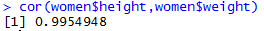

Figure 25.  Calculation of the Pearson correlation coefficient between height and weight.

Pearson’s correlation coefficient confirms that the linear association between height and weight is quite strong.

You can obtain the entire matrix of correlations between all variables in a data frame (figure 26).
 
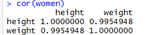

Figure 26.  Matrix of correlations between all variables in a data frame.

This is more interesting when the data frame contains more than two vectors.
However, the calculations above give no indication of whether the correlation is significantly different from zero.  To that end, you need `cor.test` [[^]](https://www.r-bloggers.com/correlation-and-linear-regression/).  It works simply by specifying the two variables (figure 27).
 
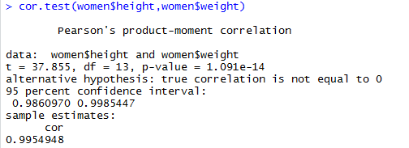

Figure 27.  Use of the cor.test function for the height and weight variables.

We also get a confidence interval for the true correlation.  Notice that it is exactly the same $p$-value as in the regression analysis $(1.091 × 10-14)$ in figure 2.

#### Activity 8:  

Determine the Pearson correlation coefficient for the distance and speed variables in the `cars` dataset.

### Coefficient of Determination

The output of `summary` also provides you with the values of `Multiple R-squared` and `Adjusted R-square`d (figure 28).  Both of these are referred to as the *coefficient of determination*; they describe the proportion of the variation in the response that can be attributed to the predictor.

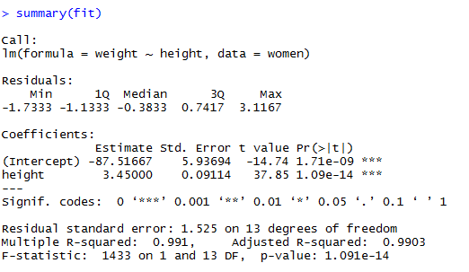
 
Figure 28.  `Multiple R-squared` and `Adjusted R-squared` are part of the `summary` output.

For simple linear regression, the first (unadjusted) measure is simply obtained as the square of the estimated correlation coefficient.  For the height/weight example, first store the estimated correlation between `height` and `weight` as `rho.xy`, and then square it (figure 29).

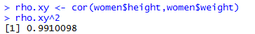
 
Figure 29.  Relation between correlation coefficient and coefficient of determination.

You get the same result as the **Multiple R-squared** value (usually written mathematically as $R^2$).  This tells us that about 99.1 percent of the variation in the individual weights can be attributed to height.

The adjusted measure is an alternative estimate that takes into account the number of predictors that require estimation.  The adjusted measure is generally important only if you’re using the coefficient of determination to assess the overall “quality” of the fitted model in terms of a balance between goodness of fit and complexity. If the (adjusted or unadjusted) $R^2$ value is close to 1, that indicates the linear relationship between $x$ and $y$ is strong and the model fits the data well. If it is close to 0, that indicates the relationship is very weak and the model does not fit the data well.

## Residual Analysis

We have used the `lm()` function to fit an ordinary least squares regression model and the `summary()` function to obtain the model parameters and summary statistics.  Unfortunately, nothing in this printout tells you whether the model you have fit is appropriate.  Your confidence in inferences about regression parameters depends on the degree to which you have met the statistical assumptions of the ordinary least squares model.  Although the `summary()` function describes the model, it provides no information concerning the degree to which we have satisfied the statistical assumptions *underlying* the model.

Why is this important?  Irregularities in the data or misspecifications of the relationships between the predictors and the response variable can lead you to settle on a model that’s wildly inaccurate.  On the one hand, you may conclude that a predictor and a response variable are unrelated when, in fact, they are.  On the other hand, you may conclude that a predictor and a response variable are related when, in fact, they aren’t.  You may also end up with a model that makes poor predictions when applied in real-world settings, with significant and unnecessary error.

A set of techniques called *regression diagnostics* provides the necessary tools for evaluating the appropriateness of the regression model and can help you to uncover and correct problems.  We’ll use functions that come with R’s base installation.
R’s base installation provides numerous methods for evaluating the statistical assumptions in a regression analysis.  The most common approach is to apply the `plot()` function to the object returned by the `lm()` [[^]](http://analyticspro.org/2016/03/07/r-tutorial-how-to-use-diagnostic-plots-for-regression-models/).  Doing so produces four graphs that are useful for evaluating the model fit.  Applying this approach to our simple linear regression example (figure 30) produces the graphs shown in figure 31.


Figure 30.  R code for producing diagnostic plots for the regression of weight on height.

The `par(mfrow=c(2,2))` statement is used to combine the four plots produced by the `plot()` function into one large 2 x 2 graph.  The `par()` function is described in [Quick-R: Combining Plots](https://www.statmethods.net/advgraphs/layout.html).


Figure 31.  Diagnostic plots for the regression of weight on height.

To understand these graphs, consider the assumptions of ordinary least squares regression:
- *Normality* – If the dependent variable is normally distributed for a fixed set of predictor values, then the residual values should be normally distributed with a mean of 0.  The Normal Q-Q plot (upper right) is a probability plot of the standardized residuals against the values that would be expected under normality.  If we’ve met the normality assumption, the points on this graph should fall on the straight 45-degree line.  Because they don’t, we’ve clearly violated the normality assumption.
- *Independence* – We can’t tell if the dependent variable values are independent from these plots.  We have to use our understanding of how the data was collected.  There’s no a priori reason to believe that one woman’s weight influences another woman’s weight.  If we found out that the data were sampled from families, we might have to adjust our assumption of independence.
- *Linearity* – If the dependent variable is linearly related to the independent variables, there should be no systematic relationship between the residuals and the predicted (that is, fitted) values.  In other words, the model should capture all the systematic variance present in the data, leaving nothing but random noise.  In the Residuals vs. Fitted graph (upper left), we see clear evidence of a curved relationship, which suggests that we may want to add a quadratic term to the regression.
- *Homoscedasticity* – If we’ve met the constant variance assumption, the points in the Scale-Location graph (bottom left) should be a random band around a horizontal line.  We seem to meet this assumption.

Finally, the Residuals vs. Leverage graph (bottom right) provides information about individual observations that we may wish to attend to.  The graph identifies outliers, high-leverage points, and influential observations.  Specifically:
- An *outlier* is an observation that isn’t predicted well by the fitted regression model (that is, has a large positive or negative residual).
- An observation with a high *leverage* value has an unusual predictor value.  That is, it’s an outlier in the predictor space.  The dependent variable value isn’t used to calculate an observation’s leverage.
- An *influential observation* is an observation that has a disproportionate impact on the determination of the model parameters.  Influential observations are identified using a statistic called *Cook’s distance*, or *Cook’s D*.

The plots in figures 4 and 31 suggests that we might be able to improve our prediction using a regression with a quadratic term (that is, $x^2$).  We can fit a quadratic equation using the statement in figure 32.


Figure 32.  R code for fitting a quadratic regression equation.

The new term `I(height^2)` requires explanation.  `height^2` adds a height-squared term to the prediction equation.  The `I()` function treats the contents within the parentheses as an R regular expression.  We need this because the `^` operator has a special meaning in formulas that we don’t want to invoke here.

The listing in figure 33 shows the results of fitting the quadratic equation.
 
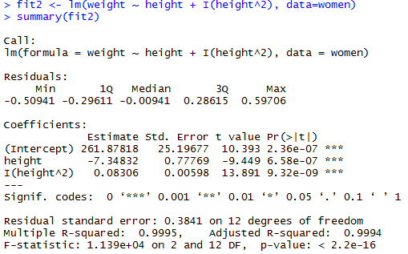

Figure 33.  Regression results of fitting the quadratic equation.

From this new analysis, the prediction equation is

$$\widehat{\mathrm{Weight}}= 261.88 - 7.35 × \mathrm{Height}+ 0.083 \times \mathrm{Height}^2$$

and both regression coefficients are significant at the $p <0.0001$ level.  The amount of variance accounted for has increased to 99.9%.  The significance of the squared term $(t=13.89,p <0.001)$ suggests that inclusion of the quadratic term improves the model fit.  If we look at the plot of `fit2` (figure 34) we can see that the curve does indeed provide a better fit.


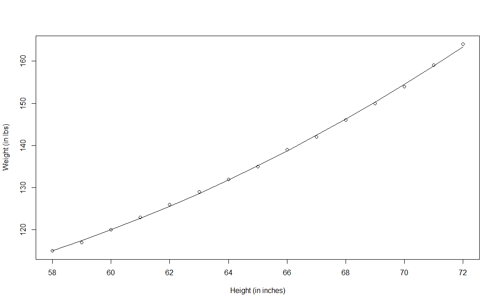


Figure 34.  Plot of quadratic regression for weight predicted by height.

To conclude this discussion on regression diagnostics, let’s look at the diagnostic plots for the quadratic fit.  The necessary code is given in figure 35.

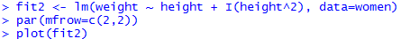

Figure 35.  R code for creating diagnostic plots for the regression of weight on height and height-squared

The resulting graph is provided in figure 36.


Figure 36.  Diagnostic plots for the regression of weight on height and height-squared.

This second set of plots suggest that the quadratic regression provides a better fit with regard to the linearity assumption, normality of residuals (except for the observation 13), and homoscedasticity (constant residual variance).  

#### Activity 9:  

For the linear regression model relating stopping distance to speed, construct the four standard diagnostic plots.

## Durbin-Watson Test for Detecting Residual Correlation

One of the basic assumptions of the regression model is the independence of the errors.  This assumption is sometimes violated when data are collected over sequential time periods because a residual at any one time period sometimes is similar to residuals at adjacent time periods.  This pattern in the residuals is called autocorrelation. When a set of data has substantial autocorrelation, the validity of a regression model is in serious doubt (Berenson, p. 511). The Durbin-Watson statistic is used to measure autocorrelation. This statistic measures the correlation between each residual and the residual for the previous time period. The following equation defines the Durbin-Watson statistic.

$$D=\frac{\sum^n_{i=2}(e_i-e_{i-1})^2}{\sum^n_{i=2}e_i^2}, \\[2em]  \textrm{with } e_i = \textrm{ residual at the time period } i$$

The numerator represents the squared difference between two successive residuals, summed from the second value to the $n$th value and the denominator represents the sum of the squared residuals.

The Durbin-Watson statistic is always between 0 and 4. A value of 2 means that there is no autocorrelation in the sample. Values from 0 to less than 2 indicate positive autocorrelation and values from more than 2 to 4 indicate negative autocorrelation.

Next, we need to determine when the autocorrelation is large enough to conclude that there is significant positive autocorrelation. For this purpose, we compare $D$ to the critical values of the Durbin-Watson statistic (see table below). The critical values depend on $α$, the significance level chosen, $n$, the sample size, and $k$, the number of independent variables in the model (in simple linear regression, $k = 1$).
 
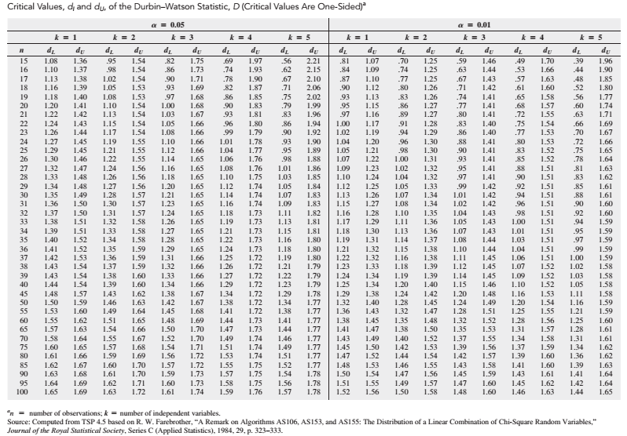

In the table above, two values are shown for each combination of $\alpha$ (level of significance), $n$ (sample size), and $k$ (number of independent variables in the model). The first value, $d_L$, represents the lower critical value.  If $D$ is below $d_L$, we conclude that there is evidence of positive autocorrelation among the residuals. If this occurs, the least-squares method used in this model is inappropriate, and we should use alternative methods. The second value, $d_U$, represents the upper critical value of $D$, above which we would conclude that there is no evidence of positive autocorrelation among the residuals. If $D$ is between $d_L$ and $d_U$, we are unable to arrive at a definite conclusion.

#### Example:

To illustrate positive autocorrelation, consider the case of a package delivery store manager who wants to be able to predict weekly sales. In approaching this problem, the manager has decided to develop a regression model to use the number of customers making purchases as an independent variable. She collects data for a period of 15 weeks and then organizes and stores these data:


Week|	Customers|	Sales|		Week|	Customers|	Sales
:--:|:--:|--:|:--:|:--:|--:
1|	794	| 9.33	|	8	| 875|	11.49
2|	799	| 8.26	|	9	| 880|	12.07
3|	837	| 7.48	|	10	| 905|	12.55
4|	855	| 9.08	|	11	| 886|	11.92
5|	845	| 9.83	|	12	| 843|	10.27
6|	844	| 10.09	|	13	| 904|	11.80
7|	863	| 11.01	|	14	| 950|	12.15
| |	|			|	15	| 841|	9.64

In R, the `car` package provides a function for the Durbin-Watson test to detect serially correlated errors.  After installing the `car` package, figure 37 demonstrates the use of the `durbinWatsonTest()` function for the above example applied to the simple linear regression model with sales as the response variable and customers as the predictor variable where the data was collected sequentially for 15 weeks.  As shown in figure 37, $D = 0.8830$.  In addition, a $p$-value is shown for the test statistic.  With $D$ being well less than 2, we see that the $p$-value is relatively small. 

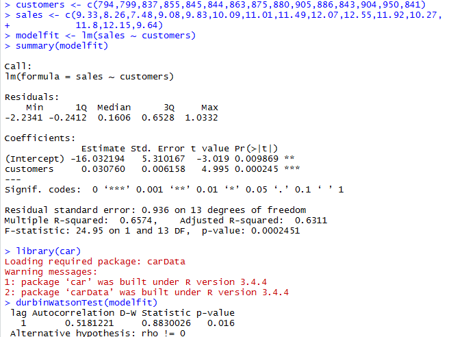

Figure 37.  Use of durbinWatsonTest() function in R.

The significant $p$-value ($p=0.016$) suggests autocorrelation and a violation of an independence of errors.  The presence of correlated errors distorts estimates of standard errors, confidence intervals, and statistical tests, and therefore we should re-estimate the equation.  When autocorrelated errors are indicated, as in this example, two approaches may be followed.  These are (1) work with transformed variables, or (2) introduce additional variables that have time-ordered effects. 

#### Activity 10:  

A pharmaceutical company introduced a new cold medicine.  It is sold across the United States.  Monthly sales for the first two years the product was on the market are reported in the following table.

YEAR|	MONTH|	t|	SALES|	YEAR|	MONTH|	t|	SALES|
:-:|:-:|:-:|:-:|:-:|:-:|:-:|:-:|
1|	Jan.|	1|	3394|	2|	Jan.|	13|	4568
1|	Feb.|	2|	4010|	2|	Feb.|	14|	3710
1|	Mar.|	3|	924	|	2|	Mar.|	15|	1675
1|	Apr.|	4|	205	|	2|	Apr.|	16|	999
1|	May.|	5|	293	|	2|	May.|	17|	986
1|	Jun.|	6|	1130|	2|	Jun.|	18|	1786
1|	Jul.|	7|	1116|	2|	Jul.|	19|	2253
1|	Aug.|	8|	4009|	2|	Aug.|	20|	5237
1|	Sep.|	9|	5692|	2|	Sep.|	21|	6679
1|	Oct.|	10|	3458|	2|	Oct.|	22|	4116
1|	Nov.|	11|	2849|	2|	Nov.|	23|	4109
1|	Dec.|	12|	3470|	2|	Dec.|	24|	5124

1. Consider the simple linear regression model, $y_t= \beta_0+ \beta_1 t$, where $y_t$ is the sales in month $t$.  Fit the simple linear model to the data.
2. Use the Durbin-Watson test to formally test for correlated errors.

## Final Assessment

`trees` is a standard built-in dataset in R.  You can access this dataset simply by typing `trees` in your R console. This data set provides measurements of the girth, height and volume of timber in 31 felled black cherry trees. Note that girth is the diameter of the tree (in inches) measured at 4 ft 6 in above the ground.    Height is measured in feet.  The first six observations are shown below.


 
1. The goal of this exercise is to build a simple regression model that we can use to predict height (Height) by establishing a statistically significant linear relationship with girth.
	- (a) Construct a scatter plot to visualize the linear relationship between the predictor and response.
	- (b) Find the least squares linear regression equation for predicting the height from girth.  
	- (c) Apply the `summary()` function to the object returned by `lm()` in (b).
	- (d) Find the actual, predicted, and residual values of height.
	- (e) Plot the regression line on the scatter plot created in (a).
2. Referring to the linear model relating height to girth using the `trees` dataset, construct the 99% confidence intervals for the y-intercept and the slope.
3. Use the regression equation relating height to girth, calculate the point estimates of height for girths of 8.5 and 10.6 inches.  Calculate the estimates directly using the regression equation.
4. For the `trees` data, construct 95% confidence intervals for girths of 8.5 and 10.6 inches.
5. For the `trees` data, construct 95% prediction intervals for girths of 8.5 and 10.6 inches.
6. Determine the Pearson correlation coefficient for the height and girth variables in the `trees` dataset.
7. For the linear regression model relating cherry tree height to girth, construct the four standard diagnostic plots.

 
## References:

Berenson, M. L.  Basic Business Statistics, 13th Edition, Pearson.

Montgomery, D.C., Peck, E.A., Vining,G.G.  Introduction to Linear Regression Analysis, Fifth Edition, Wiley.   

Senn, S.  “Francis Galton and regression to the mean,” Significance, Volume 8, No. 3, September 2011, The Royal Statistical Society.

Weisberg, S.  Applied Linear Regression, Fourth Edition, Wiley.

