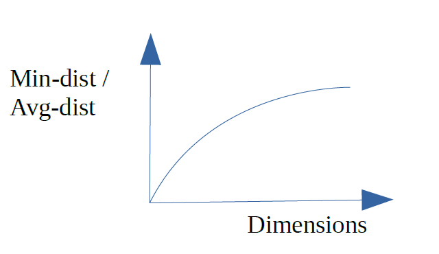
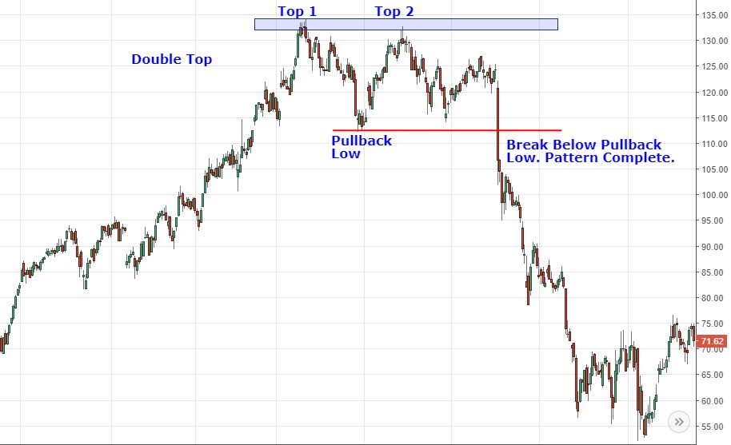
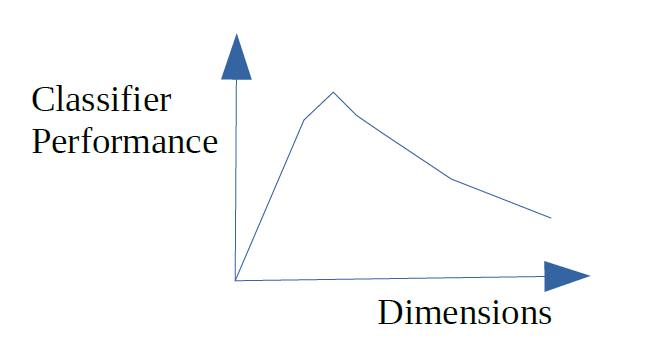

# Module: High Dimensional Data – 1 Credit / 15 hours

**Competency: Big Data**

Author: Jack Pope 

Note to instructors:

*Given that the material in this module provides a good introduction and
motivation for dimension reduction in data sets, and because the subject
matter here may not be enough to merit a 1-credit module, this short
module should precede or be merged with the “Dimension Reduction
methods” module.*

Table of Contents 

|Unit |Topic
|-----|-----
|1 |      Overview
|2 |The Achilles heel of regression
|3 |Over-fitting high dimensional data
|4 |Detecting the curse of dimensionality
|5 |Remedying the curse of dimensionality
|6 |Exercises

## Overview

What a waste for the enterprise, to have teams dedicate many hours to
developing distributed systems of computation across the enterprise,
such as Apache Spark or Hadoop, only to analyze data that is found to be
mostly repetitive or noisy. One should better determine in advance the
extent of resources that are actually required to analyze the data
available.   

It may be the case that the researcher is looking for anomalies in
abundant data. Preprocessing the data will be time consuming. There may
even be a lot of redundant data. Many data fields might contain similar
data. Dealing in “big data” makes the problem worse because broadly
dispersed unstructured data hinders casual inspection. 

To understand the predicaments of high dimensional data, lets for
consider some definitions:

  - Dimensions: features, fields or predictors.  

  - Observations: samples, records, feature vectors.

  - Feature vector: single observations of a set of features.

  - Feature matrix: multiple observations of feature vectors.

  - Longitudinal data: records

  - Latitudinal data: predictors; features

Situations that compound the predicament of high dimensional data:

  - More sample data is not available and predictors outnumber records.

  - Data transformations (linear and non-linear) multiply the number of
    predictors.

  - Lags for time series data multiply the number of predictors.

Data transformations, whether linear or non-linear, have the potential
to multiply the number of predictors. Consider:

predictorCount = predictorCount x transformationCount

If we additionally want to include lags for each time series record and
transformation, then our predictor count could be:

predictorCount = predictorCount x transformationCount x lagCount

One way or another we end up cursed by dimensionality. Predictors exceed
observations and/or we over-fit the data and/or we have data fields that
are redundant.

## The Achilles heel of regression

Regression suffers from too many parameters and multicollinearity with
highly dimensional data. 

We cannot define a regression model if the number or predictors (p)
exceed the number of observations (n), as all p cannot be shown with the
data available to be linearly independent or to have significantly
distinct patterns of data.

A linear regression is considered “well-defined” when its predictor
variables are linearly independent. Consider the classical linear
regression: 

Y = Xβ + ϵ 

If (X′X)<sup>−1</sup> must exist for the OLS estimator β =
(X′X)<sup>-1</sup> X′Y to be valid, then with p \> n we cannot use
OLS.

An expedient but less than ideal solution is to test several randomly
sampled fields of either the original data set or transformations of the
original data. With access to more population of data, we can randomly
sample more records and predictors. A better solution is to first reduce
the dimensionality of the data set.  

In the practice of dimension reduction, we can implement various methods
of regression for highly dimensional data, including PCA regression
(regression on principle components).

Investment portfolio example:

Consider a case of stock market investing, where we want to build a
diversified investment portfolio. We want to know how many stocks are
enough for the portfolio to have diversified away most of the
unsystematic (microeconomic – firm oriented) risk. For the sake of this
example, we will ignore systematic (macroeconomic) risk that affects all
stocks.

In the attempt to avoid risk, suppose the investor purchases hundreds of
corporate stocks. However, many of these stocks exhibit similar daily
trading behavior. They are generally up or down in tandem in the same
time period. In the statistical evaluation of the portfolio, the
respective time series data of these stocks will show multicollinearity,
such that beyond a certain number of portfolio holdings, there is no
reduction in portfolio volatility.   

Research indicates that the optimal number of stocks for a portfolio is
approximately 16. (See
<http://news.morningstar.com/classroom2/course.asp?docId=145385&page=4>
). While other studies conclude that more stocks are needed, the case is
clear: multicollinearity among investment time series data indicates
that a portfolio can be effectively diversified with fewer holdings. 

Related:
<https://www.investopedia.com/articles/stocks/11/illusion-of-diversification.asp>

A small randomly selected portfolio will on average see the same return
as the general market, such as represented by the S\&P 500 Index. To
outperform the market you would need to include at least one
non-correlating investment that outperforms the the market. 

While high dimensionality in the investment portfolio entails redundant
highly correlated investments. I should point out that dimension
reduction of such is distinct from the financial concept known as
“portfolio optimization.” The latter has to do with finding a
portfolio's optimal return/risk combination given various weights of
select assets.

Related:

<http://www.efficientfrontier.com/ef/900/15st.htm>

<https://blog.quantopian.com/markowitz-portfolio-optimization-2/>

Sample density:

The fewer the input features (dimensions), the less separable the
records. To see why, consider in a single time or date dimension two
exchange traded funds representing S\&P 500 (SPY) and US Treasury bonds
(TLT):

```
---0.3---0.5---0.7---0.9---        
               SPY  
               TLT
```

In this one dimension, a single observation in time, the objects of
interest have the same axis point and are, therefore, indistinguishable.
Now if we add a second dimension of price, the objects become separable
in the 2D space, as seen below.

```
   -
0.9-           SPY
   -
0.7-
   -           TLT
0.5-
   -
---0.3---0.5---0.7---0.9---        
```
Yet, even in two dimensions there are going to be patterns that are not
linearly separable. SPY will overlap with the Dow Jones Industrial
Average ETF (DIA) on some occasions. Too look for separation, we can add
more features, such as trade volume, dividends,...

At this point we may be encouraged to further expand dimensions to
linearly separate a tight cluster of data. However, the added feature
dimension reduces exponentially the percentage coverage of the feature
range. We have created “sparseness” in the feature space, in which
population data is not represented.  

As we increase dimensions D over I discrete intervals with n data
samples, the “sample density” is:

density = n / I<sup>D</sup>

For example, consider the density of 8 stocks over 10 time periods in D
dimensions:

|D |n |I |density
|--|--|--|--
|1 |8 |10 |0.8
|2 |8 |10 |0.08
|3 |8 |10 |0.008

This implies that additional dimensions result in each sample having a
smaller footprint in the dimensional space. 

Thus, to train data to represent 15% of a 1D feature range, for 2D we
need a sample that represents 0.15<sup>1/2</sup> or 38.7% of the
population. For 3D, we would need 53% of the population. At some point
we end up over-fitting a model to 100% of the population data, which
makes the model unsuitable for interpreting new data.

A non-linear classifier in fewer dimensions will not necessarily get out
of the woods either, as we can still run into over-fitting problems. The
classifier may still be dependent on specific data without the
flexibility to generalize. 

Lets say we go beyond 3D by adding various transformations on the sample
data, such as moving averages and lags. We are attempting to
differentiate feature vectors that are similar among the sample data.
However, when testing with new unforeseen data then model fails. Having
been reminded of the sparsity problem from adding dimensions, we instead
seek more sample data. The problem is that the population data is too
vast or inaccessible. For example, for the purposes of prediction, we do
not have the luxury of sampling future data. 

A better approach is to use a classifier of relatively few dimensions
among uncorrelated data and an acceptable threshold of error.

Geometrically, as dimensions increase, vertices move away from the
origin and towards the perimeter of the feature space, making distances
between vertices less meaningful. A similar matter is the volume of the
hypersphere as it relates to dimensions. More:
<https://en.wikipedia.org/wiki/Volume_of_an_n-ball>. 

For a given dimension d, consider that the minimum and the maximum
distances may become indiscernible such that:

lim d → ∞ E ( dist max ⁡ ( d ) − dist min ⁡ ( d ) dist min ⁡ ( d ) ) → 0

Accordingly, classification methods that rely on distance measures, such
as KNN, will be compromised by high dimension data. 

More: <https://link.springer.com/chapter/10.1007%2F3-540-49257-7_15>

## Over-fitting high dimensional data

Now, instead of having a portfolio of with dimensions comprised of
distinct stock holdings, we consider a single stock with dimensions as
distinct price patterns in time series data.

It is commonly observed that certain price patterns in time series are
indicative of later trends. One such pattern is called a “double bottom”
and exhibits a “W” shaped pattern. This pattern tends to precede price
increases. A contrary pattern is the double top, which resembles the
letter “M” and tends to precede price drops. 

The following graphics of W and M patterns are from :
<https://www.investopedia.com/university/charts/charts4.asp>

 


We can affect machine learning to recognize such patterns. To do so, we
need to create a classifier that corresponds to the defining points of a
pattern. For example, both the M and W patterns can be minimally
represented with just five points on an XY (price x time) plane. 

With standardized price and time data, each vertex of the pattern W can
be represented by (X,Y) in centile units, from 0.01 to 1. So, each price
data point P is standardized as a percentage of the range between the
maximum and minimum prices in the sample, and any given date D is
described as a percentage of elapsed dates in the sample. (If the data
is erratic, it might first be smoothed using a moving average.) Then,
each of the five pattern points for one particular shape of W and scale
looks like:

Yi = (Pi - Pmin) / (Pmax - Pmin)

Xi = Di / Dn

To train a classifier for M and W, we can use a variety of sample W and
M patterns. For example, the W pattern could be the average of hundreds
of variously shaped W patterns. 

The basic pattern descriptor applicable to both M and W pattern classes:

Pattern = { (X1, Y1), (X2, Y2), (X3, Y3), (X4, Y4), (X5, Y5) }

The condition for pattern W is: 

if(Y2 \< Y1 AND Y3 \> Y2 AND Y4 \< Y3 AND Y5 \> Y4): W

The condition for pattern M is just the opposite:

if(Y2 \> Y1 AND Y3 \< Y2 AND Y4 \> Y3 AND Y5 \< Y4): M

Of course, these simplistic conditions are bound to be inaccurate
without accommodating a certain deviation from each point. For example:

if((Y2 \> Y1 AND Y3 \< Y2 AND Y4 \> Y3 AND Y5 \< Y4) **OR**

((Y2 + 0.01) \> Y1 AND Y3 \< (Y2 + 0.01) AND (Y4 + 0.01) \> Y3 AND Y5 \<
(Y4 + 0.01))): M

We could also included a scaling factor for accommodating the patterns
at various scales. 

Testing the 5 points with 10 shape variations and 10 scales would make
for 5 x 10 10 or 500 feature combinations per time series window per
stock symbol data set. Provided the pattern's scale covers 28 trading
days, a year's worth of times series data (280 business days) entails
14,000 point comparisons, for just that one scale. With all 10 scales
and several years of training data, classifier training could require
some patience. 

Generalization versus over-fitting:

By allowing the classifier to match general features or pattern
variations, its can match unforeseen data. On the other hand, if we try
to train the classifier for any conceivable data point, we are really
just implementing a system of pattern matching that is no different than
a look-up table. Such a system will not work for prediction since future
price patterns have not yet been recorded in the look-up table. This is
a case of over-fitting, as the classifier is unable to generalize about
unforeseen data. 

While the optimal number of dimensions depends on the problem at hand,
the general relationship between classifier performance and dimensions
will be a curve skewed to the left.



## Detecting the curse of dimensionality

  - Examine regression models have a good fit. Good forecasts do not
    necessarily come from models having a good fit.

  - Removing some variables reduces regression standard errors. 

  - Variable pairs generally show strong correlation.

  - Similarly, one independent variable exhibits a high r-squared with
    other independent variables.

  - Parameter estimates vary significantly between sample data sets. 

  - Standard errors on regression coefficients.

  - Where there is multicollinearity and no pairwise correlations are
    high, there may be joint dependencies that are multi-collinear.
    Testing for such requires exponentially more iterations as we
    additionally test for joint dependencies for each independent
    variable pair.

  - Test forecast efficacy having removed independent variables that are
    weakly correlated to the dependent. This will at least clear away
    some redundancy. 

  - Consider Variance Inflation Factors (See
    <https://cran.r-project.org/web/packages/olsrr/vignettes/regression_diagnostics.html>
    )

## Remedying the curse of dimensionality

Let this this section be a segue to the Dimension Reduction module. A
few general solutions to reduce dimensionality as well as the variance
of regression coefficients include:

  - Make sure dimensions do not outnumber observations.

  - Employ dimension reduction techniques, such as PCA and SOM.

  - Employ feature selection algorithms.

  - Beware classifiers that over-fit the data.

  - Cross validate out of sample data.

  - Increase sample size to reduce MSRE.

  - Revise the model to: 
    
      - Use data that is logically more relevant.
      - Look for categorically illogical variables to drop.   
      - Use other data transformations.

Principal Component Analysis (PCA) aims to produce a subset of
uncorrelated linearly separable features from the original feature
matrix. The resulting sub-feature set may or may not be optimal for
classification.

### Other Internet resources


<http://rsta.royalsocietypublishing.org/content/367/1906/4237>

<http://featureselection.asu.edu/algorithms.php>

<https://medium.freecodecamp.org/the-curse-of-dimensionality-how-we-can-save-big-data-from-itself-d9fa0f872335>

## Exercises

In these exercises we will test for the curse of dimensionality.

On web sites such as Google Finance or Yahoo Finance, you can download
the daily closing prices for most stock symbols. Download one year of
data for ten symbols of your choosing. Additionally, download data for
the symbol SPY. Save each download in a separate Cmma Separated Value
(.csv) file. 

Using the Python Programming language and your stock download files,
compete the following tasks:

1.  Standardize all data to values between 0 and 1 for the dates
    downloaded.

2.  Create a correlation matrix for the data of the eleven symbols. Are
    there clues to multicollinearity in the correlation matrix?

1.  Compute pair-wise r-squared among the independent variables. Does
    your correlation matrix corroborate these coefficients?

2.  Assume that each symbol other than SPY is a dimension of SPY. Using
    SPY as the dependent variable, compute multivariate regression
    parameters from the other (independent) symbols (variables). Redo
    the regression using the five least correlated symbols. Then repeat
    this again with the five most correlated symbols. What do can you
    deduce about these three regression models? 

3.  Assume that each symbol other than SPY is a dimension of SPY.
    Generate the average distance between each feature vector (record at
    each date). Next generate the average distance between each feature
    vector using the five least correlated symbols. Repeat this with the
    five most correlated symbols. What do can you deduce about these
    three distance totals? 

Upload your code, question responses and any supporting
documentation.

[](https://medium.freecodecamp.org/the-curse-of-dimensionality-how-we-can-save-big-data-from-itself-d9fa0f872335)
