# Logistic Regression Module

Dave Jacobson, Ph.D. and Halbana Tarmizi, Ph.D.

Competency area: Data Analysis

**Learning objectives**: After this module, students will be able to:

  - Differentiate the differences between modeling qualitative data with
    a binary response variable and simple linear and multiple linear
    regression

  - Hypothesize the form of a logistic regression function for a single
    predictor variable and several predictor variables

  - Linearize the logistic regression function using a logit
    transformation

  - Describe the shape and generate plots of the logistic regression
    model

  - Use the **glm( )** function in R to fit a logistic regression model

  - Find the estimated probability for the response variable for
    specific values of the predictor variable(s) directly using the
    fitted logistic regression model

  - Generate plots of the estimated probabilities

  - Use the **vcov( )** function in R to produce the variance-covariance
    matrix for the regression parameter estimators

  - Conduct hypothesis tests (Wald test and likelihood ratio test) of
    the regression parameters

  - Estimate and interpret odds ratios in the context of logistic
    regression

  - Compute confidence intervals (Wald interval and profile likelihood
    ratio interval) for odds ratios

  - Use the **predict( )** function in R to compute estimated
    probabilities for specific values of the predictor variable(s)

  - Compute confidence intervals (Wald interval and profile likelihood
    ratio interval) for probabilities

### Requirements

The examples, activities, and assessment exercises in this module assume
basic knowledge and experience with the R programming language. If you
are not familiar with R, a good resource is the R module which is also
available on D2L. The code for the examples in this document were
produced using Version 1.1.419 of RStudio. To use the non-base packages,
such as **car** and **mcprofile**, you must install them prior to
referencing them with a command such as the **library( )** function.

Prior to undertaking this module, a basic understanding of elementary
statistics, simple linear regression, and multiple regression is
assumed. From introductory statistics, one should be familiar with
concepts such as probability and sampling distributions, confidence
interval estimation, and hypothesis testing. Simple Linear Regression
and Multiple Regression modules are available on D2L. Another excellent
source for refreshing your memory on both basic statistical topics and
simple linear regression is provided in the next section.

### Supplementary Materials

Besides the information provided in this document, a number of other
materials are posted on D2L for your use in learning multiple
regression. They include:

  - Code for reproducing all of the examples

  - Code for the activities

  - Code for the Final Assessment questions

  - A pdf file of the third edition of **OpenIntro Statistics** by David
    M. Diez, Christopher D. Barr, and Mine Cetinkaya-Rundel. In
    particular, Chapter 8 (pages 372-404) is devoted to “Multiple and
    Logistic Regression.” Pages 385-404 provide additional examples and
    exercises on many of the topics that are covered in the module. The
    first six chapters also can be used as a review of material
    typically covered in an introductory statistics course. In addition,
    Chapter 7 (pages 331-371) is an “Introduction to Linear Regression”
    and the first part of Chapter 8 (pages 372-385) covers multiple
    regression.

  - YouTube videos:
    
      - Logistic Regression: Introduction to Binary Outcomes
    
      - Logistic Regression: Interpretation of Coefficients and
        Forecasting
    
      - Logistic Regression in R, Clearly Explained\!\!\!\!
        
          - A link to the code site is also provided
    
      - StatQuest: Logistic Regression
    
      - Logistic Regression Details Pt1: Coefficients
    
      - Logistic Regression Details Pt2: Maximum Likelihood
    
      - Logistic Regression Details Pt3: R-Squared and p-value

  - For those that may be interested in using Excel instead of R, links
    to the following resources are posted:
    
      - Real Statistics Using Excel: Downloading and installing the Real
        Statistics Resource Pack
    
      - Real Statistics Using Excel: Accessing Real Statistics Data
        Analysis Tools
    
      - YouTube video: Logistic Regression Using Excel
        
          - Data in the example can be downloaded from Kaggle. You must
            create a Kaggle account before downloading the data.

> Following is a list of online materials which are referenced in the
> content of this document. Many of them provide additional explanations
> and examples beyond what is covered in the following
sections.

**Resources:**

<https://www.statmethods.net/advgraphs/layout.html>

https://thomasleeper.com/Rcourse/Tutorials/curve.html

<https://www.statmethods.net/advstats/glm.html>

<https://stat.ethz.ch/R-manual/R-devel/library/stats/html/vcov.html>

<http://cran.r-project.org/web/packages/car/car.pdf>

<https://stats.stackexchange.com/questions/223626/r-anova-vs-anova-for-test-of-categorical-predictor-from-glmer-or-glm-nb-ob?noredirect=1&lq=1>

<https://stats.stackexchange.com/questions/177005/interpreting-glm-output-from-r>

<https://stat.ethz.ch/R-manual/R-devel/library/stats/html/predict.glm.html>

https://cran.r-project.org/web/packages/mcprofile/mcprofile.pdf

### Introduction

In simple linear regression and multiple regression, the response
variable \(y\) is regarded as a continuous quantitative variable. The
predictor variables, however, are quantitative or qualitative. There are
situations, however, where the response variable is qualitative. In this
module, we present methods for dealing with this situation. The methods
presented are very different from the method of least squares used in
simple linear regression and multiple regression.

Consider a procedure in which individuals are selected on the basis of
their scores in a battery of tests. After five years the candidates are
classified as “good” or “poor.” We are interested in examining the
ability of the tests to predict the job performance of the candidates.
Here the response variable, performance, is dichotomous. We can code
“good” as 1 and “poor” as 0, for example. The predictor variables are
the scores in the tests.

In a study to determine the risk factors for cancer, health records of
several people were studied. Date were collected on several variables,
such as age, gender, smoking, diet, and the family’s medical history.
The response variable was the person had cancer (\(y = 1\)) or did not
have cancer (\(y = 0\)).

In the financial community the “health” of a business is of primary
concern. The response variable is solvency of the firm (bankrupt = 0,
solvent = 1), and the predictor variables are the various financial
characteristics associated with the firm. Situations where the response
variable is a dichotomous variable are quite common and occur
extensively in statistical applications.

### Modeling Qualitative Data

The qualitative data with which we are dealing, the binary response
variable, can always be coded as having two values, 0 or 1. Rather than
predicting these two values we try to model the probabilities that the
response takes one of these two values. The limitation of the standard
linear regression model is obvious.

We illustrate this point by considering a simple regression problem in
which we have only one predictor. The same considerations hold for the
multiple regression case. Let \(\pi\) denote the probability that
\(y = 1\). If we use the standard linear model to describe \(\pi\), then
our model for the probability would be

\(\pi = \Pr\left( y = 1 \right) = \ \beta_{0} + \ \beta_{1}x\).

Since \(\pi\) is a probability it must lie between 0 and 1. The linear
function given above is unbounded, and hence cannot be used to model
probability. There is another reason why the ordinary least squares
method is unsuitable. The response variable \(y\) is a binomial random
variable, consequently its variance will be a function of \(\pi\), and
depends on \(x\). The assumption of equal variance (homoscedasticity)
does not hold. We could use the weighted least squares, but there are
problems with that approach. The values of \(\pi\) are not known. In
order to use the weighted least squares approach, we would have to start
with an initial guess for the value of \(\pi\), and then iterate.
Instead of this complex method we will describe an alternative method
for modeling probabilities.

### The Logit Model

The relationship between the probability $\pi$ and \(x\) can often be
represented by a *logistic response function.* It resembles an
*S*-shaped curve. The probability \(\text{π\ }\)initially increases
slowly with increase in \(x\), then the increase accelerates, finally
stabilizes, but does not increase beyond 1. Intuitively this makes
sense. Consider the probability of a questionnaire being returned as a
function of cash reward, or the probability of passing a test as a
function of the time put in studying for it.

The shape of the *S*-curve can be reproduced if we model the
probabilities as
follows:

\(\pi = \Pr\left( y = 1 \right) = \ \frac{e^{\beta_{0} + \beta_{1}x}}{1 + \ e^{\beta_{0} + \beta_{1}x}}\),

where \(e\) is the base of the natural logarithm. The probabilities here
are modeled by the distribution function (cumulative probability
function) of the logistic distribution. There are other ways of modeling
the probabilities that would also produce the *S*-curve. The cumulative
distribution of the normal curve has also been used. This gives rise to
the *probit* model. We will not discuss the probit model in this module,
as we consider the logistic model simpler and superior to the probit
model.

The logistic model can be generalized directly to the situation where we
have several predictor variables. The probability \(\pi\) is modeled
as

\(\pi = \Pr\left( y = 1 \right) = \ \frac{e^{\beta_{0} + \beta_{1}x_{1} + \beta_{2}x_{2} + \cdots + \beta_{p}x_{p}}}{1 + \ e^{\beta_{0} + \beta_{1}x_{1} + \cdots + \beta_{p}x_{p}}}\).

The above equation is called the *logistic regression function*. It is
nonlinear in the parameters \(\beta_{0,}\)
\(\beta_{1,\ \ \ \cdots,\ \ \ }\beta_{p}\). However, it can be
linearized by the *logit transformation.* Instead of working directly
with \(\pi\) we work with a transformed value of \(\pi\). If \(\pi\) is
the probability of an event happening, the ratio \(\pi\) /
\(\left( 1 - \ \pi \right)\) is called the *odds ratio* for the event.
Since

\(1 - \ \pi = \Pr\left( y = 0 \right) = \ \frac{1}{1 + \ e^{\beta_{0} + \beta_{1}x_{1} + \cdots + \beta_{p}x_{p}}}\),

then

\(\frac{\pi}{1 - \ \pi} = \ e^{\beta_{0} + \beta_{1}x_{1} + \cdots + \beta_{p}x_{p}}\).

Taking the natural logarithm of both sides of the above equation, we
obtain

\[\ln\left( \frac{\pi}{1 - \pi} \right) = \ \beta_{0} + \ \beta_{1}x_{1} + \ \cdots + \ \beta_{p}x_{p}.\]

The logarithm of the odds ratio is called the *logit*. It can be seen
from the above that the logit transformation produces a linear function
of the parameters \(\beta_{0},\ \beta_{1},\ \cdots,\ \beta_{p}\). Note
also that while the range of values of \(\pi\) is between 0 and 1, the
range of values of ln\[\(\text{π\ }\)/ \(\left( 1 - \ \pi \right)\)\] is
between \(- \infty\) and \(+ \infty\), which makes the logits (the
logarithm of the odds ratio) more appropriate for linear regression
fitting.

Modeling the response probabilities by the logistic distribution and
estimating the parameters of the model constitutes fitting a logistic
regression. In logistic regression the fitting is carried out by working
with the logits. The logit transformation produces a model that is
linear in the parameters. The method of estimation used is the *maximum
likelihood* method. The maximum likelihood estimates are obtained
numerically, using an iterative procedure. Unlike least squares fitting,
no closed-form expression exists for the estimates of the parameters.

To fit a logistic regression in practice a computer program is
essential. In this module, we will fit the logistic regression equation
with R. After the fitting one looks at the same set of questions that
are usually considered in linear regression. Questions about the
suitability of the model, the variables to be retained, and goodness of
fit are all considered. Tools used are not the usual \(R^{2},\ t\)-, and
\(F\)-Tests, the ones employed in least squares regression, but others
which provide answers to these same questions. Hypothesis testing is
done by different methods, since the method of estimation is maximum
likelihood as opposed to least squares. Information criteria such as AIC
and BIC can be used for model selection. Instead of SSE, the logarithm
of the likelihood for the fitted model is used.

#### Plot of the Logistic Regression Model

The purpose of this example is to examine the shape of the logistic
regression model when there is a single explanatory variable \(x_{1}\).
Consider the model
\(\pi = \ \frac{e^{\beta_{0} + \ \beta_{1}x_{1}}}{1 + \ e^{\beta_{0} + \ \beta_{1}x_{1}}}\),
which is equivalently expressed as
ln\(\left( \frac{\pi}{1 - \ \pi} \right)\) =
\(\beta_{0} + \ \beta_{1}x_{1}\). Suppose that \(\beta_{0} = 1\) and
\(\beta_{1} = 0.5.\) Figure 1 shows this model plotted on the left. The
plot on the right is the same, but with \(\beta_{1} = \  - 0.5\).
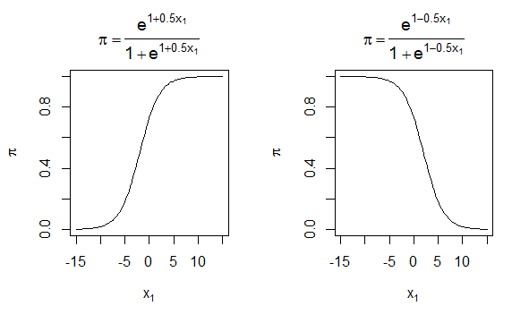

Figure 1. Logistic regression model for \(\beta_{0} = 1\) and
\(\beta_{1} = 0.5\) and \(- 0.5\).

We can make the following generalizations from examining the model and
these plots:

  - \(0\  < \ \pi\  < 1\)

  - When \(\beta_{1}\  > 0\), there is a positive relationship between
    \(x_{1}\) and \(\pi\). When \(\beta_{1}\  < 0\), there is a negative
    relationship between \(x_{1}\) and \(\pi\).

  - The shape of the curve is somewhat similar to the letter *S* (this
    shape is called “sigmoidal”).

  - The slope of the curve is dependent on the value of \(x_{1}\). We
    can show this mathematically by taking the derivative of \(\pi\)
    with respect to \(x_{1}\): \(\partial\pi\)/\(\partial x_{1}\) =
    \(\beta_{1}\pi\left( 1 - \ \pi \right)\).

  - Above \(\pi = 0.5\) is a mirror image of below \(\pi = 0.5\).

In figure 2 is the R code used to create the plots in figure 1.

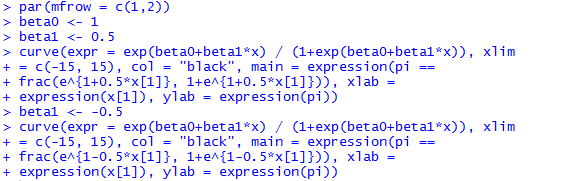

Figure 2. R code used for creating the plots in figure 1.

The **par( )** function sets graphics parameters that control various
plotting options. In our code, we use it to partition the graphics
window into 1 row and 2 columns using the **mfrow** argument, which
stands for “make frame by row.”
([https://www.statmethods.net/advgraphs/layout.html](https://www.statmethods.net/advgraphs/layout.html%20))

The **curve( )** function is used to plot the model. This is a very
useful function for plotting mathematical functions that vary over one
variable. In our example, the **expr** argument contains the logistic
regression model where the letter **x** must be used as the variable
name for the variable plotted on the x-axis. By default, the
mathematical function is evaluated at 101 equally spaced x-axis values
within the range specified by **xlim**. These resulting 101 points are
then joined by straight lines. Also within **curve( )**, we use the
**expression( )** function with the title and axis labels in order to
Greek letters and fractions.
(<https://thomasleeper.com/Rcourse/Tutorials/curve.html>)

*Activity 1:* Generate two plots of the logistic regression model with
\(\beta_{0} = 1\). First, assume \(\beta_{1} = 0.8\). For the second
plot, use \(\beta_{1}\) = \(- 0.8\).

### Logistic Regression and the GLM

The response in the logistic regression formula is the log odds of a
binary outcome of 0 or 1. We only observe the binary outcome, not the
log odds, so special statistical methods are needed to fit the equation.
Logistic regression is a special instance of a *generalized linear
model* (GLM) developed to extend linear regression to other settings.

#### Single Predictor Model

In R, to fit a logistic regression, the **glm** function is used with
the **family** parameter set to **binomial**.
(<https://www.statmethods.net/advstats/glm.html>) A classic example in
logistic regression modeling involves estimating the probability of
thermal distress (TD) for the space shuttle given the temperature at
lift off. For the 23 space shuttle flights before the Challenger mission
disaster in 1986, the following table shows the temperature (\(℉\)) at
the time of the flight and whether at least one primary O-ring suffered
thermal distress.

| **Ft** | **Temperature** | **TD** |
| ------ | --------------- | ------ |
| 1      | 66              | 0      |
| 2      | 70              | 1      |
| 3      | 69              | 0      |
| 4      | 68              | 0      |
| 5      | 67              | 0      |
| 6      | 72              | 0      |
| 7      | 73              | 0      |
| 8      | 70              | 0      |
| 9      | 57              | 1      |
| 10     | 63              | 1      |
| 11     | 70              | 1      |
| 12     | 78              | 0      |
| 13     | 67              | 0      |
| 14     | 53              | 1      |
| 15     | 67              | 0      |
| 16     | 75              | 0      |
| 17     | 70              | 0      |
| 18     | 81              | 0      |
| 19     | 76              | 0      |
| 20     | 79              | 0      |
| 21     | 75              | 1      |
| 22     | 76              | 0      |
| 23     | 58              | 1      |

*Note:* Ft = flight no., TD = thermal distress (1 = yes, 0 = no)

*Source:* Data based on Table 1 in S.R. Dalal, E.B. Fowlkes and B.
Hoadley, *J. Am. Statist. Assoc.,* **84**: 945-957, 1989.

The code in figure 3 shows how we get the data into a data frame.

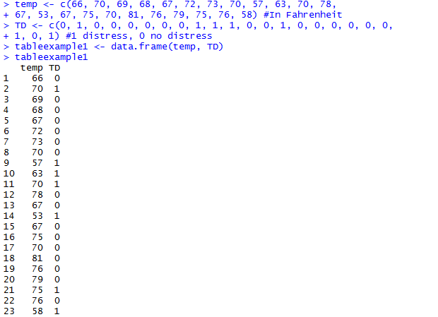

Figure 3. Creation of data frame consisting of temperature and thermal
distress status for space shuttle flights prior to Challenger disaster.

The code in figure 4 fits a logistic regression to model the effect of
temperature on the probability of thermal distress.

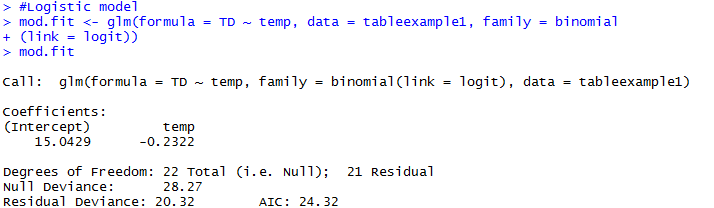

Figure 4. Code for fitting a logistic regression to the space shuttle
data.

The results from **glm( )** are saved into an object that we call
**mod.fit**. The arguments within **glm( )** are:

  - **formula** – Specifies the model with a \~ separating the response
    and explanatory variables.

  - **family** – Gives the type of model to be fit where **binomial**
    states the response type and **logit** is the function on the left
    side of the model.

  - **data** – Name of the data frame containing the variables.

By printing the **mod.fit** object through executing **mod.fit** at the
command prompt, we see that the estimated logistic regression model is

logit(\(\widehat{\pi}\)) = \(15.0429 - 0.2322\)**temp.**

Because there is a negative parameter estimate corresponding to temp,
the estimated probability of thermal distress decreases as the
temperature increases.

There is actually much more information stored within the **mod.fit**
object. Through the use of the **names( )** function, we obtain the list
of items shown in figure 5.

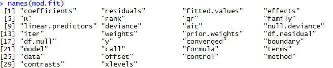

Figure 5. List of items in the **mod.fit** object.

Figure 6 shows **mod.fit$coefficients** contains
\({\widehat{\beta}}_{0}\) and \({\widehat{\beta}}_{1}\).

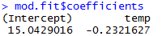

Figure 6. Extraction of coefficients from the **mod.fit** object.

To see a summary of all the information in **mod.fit**, we can use the
**summary( )** function (figure 7).

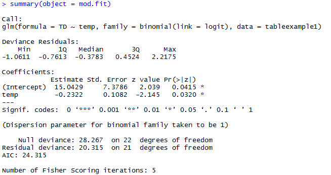

Figure 7. Summary of **mod.fit** object.

The output in figure 7 displays a lot of information about the model
that we will describe throughout this module. For now, note that the
values of \({\widehat{\beta}}_{0}\) and \({\widehat{\beta}}_{1}\) are
displayed in the “Coefficients” table under the “Estimate” header. Also,
it took 5 iterations to obtain these estimates as given by the last line
in the output.

There are only a few simple cases where the parameter estimates in
logistic regression models have closed-form solutions (i.e. we cannot
generally write out the parameter estimates in terms of the observed
data). Instead, we use iterative numerical procedures to successively
find estimates of the regression parameters. When the estimates change
negligibly for successive iterations, we say that they have converged.
If the estimates continue to change noticeably up to a selected maximum
number of iterations, the iterative numerical procedure has not
converged, and those final parameter estimates should not be used.

Within R and most statistical software packages, iteratively reweighted
least squares (IRLS) is the iterative numerical procedure used to find
the parameter estimates. This procedure uses the weighted least squares
criterion, which is commonly used for normal linear regression models
when there is non-constant variance. The IRLS algorithm alternates
between updating the weights and the parameter estimates in an iterative
fashion until convergence is reached. The glm( ) function within R
implements this parameter estimation procedure. “Fisher scoring” is
equivalent to IRLS for logistic regression models.

We can find the estimated probability of thermal distress for a
particular temperature
using:

\[\widehat{\pi} = \ \frac{e^{15.0429 - 0.2322temp}}{1 + \ e^{15.0429 - 0.2322temp}}\]

For example, the probability of thermal distress at a temperature of
56\(℉\) is 0.885 (figure 8).

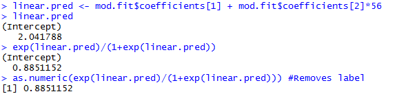

Figure 8. Probability of thermal distress at a temperature of 56\(℉\).

We can estimate the probability of thermal distress at 31\(℉\), the
temperature at the time of the Challenger flight, using the code in
figure 9.

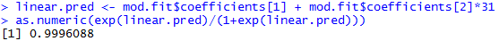

Figure 9. Probability of thermal distress at a temperature of 31\(℉\).

However, note that the minimum temperature in the data used to develop
the model is 53\(℉\). Hence an extrapolation to 31\(℉\ \)may be a
possible problem with using the model at this temperature.

We can plot the model with the **curve( )** function in R using the code
in figure 10.

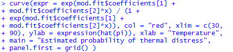

Figure 10. Code for plotting the model in the **mod.fit** object.

The plot is shown in figure 11.

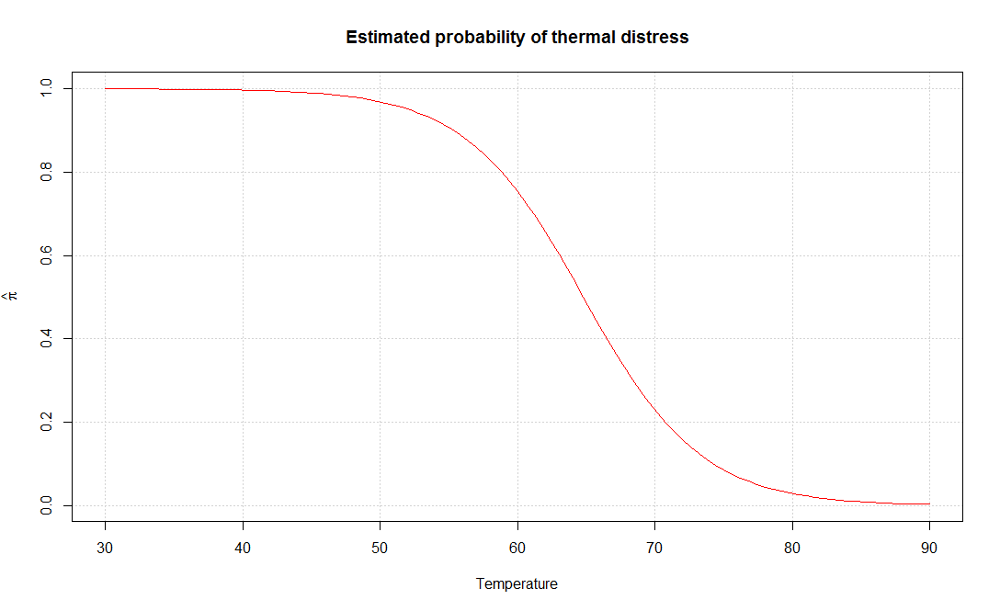

Figure 11. Plot of the model relating probability of thermal distress to
temperature.

*Activity 2:* Hastie and Tibshirani (1990, p. 282) described a study to
determine risk factors for kyphosis, which is severe forward flexion of
the spine following corrective spinal surgery. The age in months at the
time of the operation for the 18 subjects for whom kyphosis was present
were 12, 15, 42, 52, 59, 73, 82, 91, 96, 105, 114, 120, 121, 128, 130,
139, 139, 157 and for the 22 subjects for whom kyphosis was absent were
1, 1, 2, 8, 11, 18, 22, 31, 37, 61, 72, 81, 97, 112, 118, 127, 131, 140,
151, 159, 177, 206.

  - Fit a logistic regression model using age as a predictor of whether
    kyphosis is present (i.e., 1 = kyphosis present, 0 = kyphosis
    absent).

  - Estimate the probability of kyphosis being present at an age of 150
    months.

  - Plot the model with the **curve( )** function in R.

#### Multiple Predictor Model

If more than one explanatory variable is included in the model, the
variable names can be separated by “+” symbols in the **formula**
argument. For example, the following table shows results of a study
about Y = whether a patient having surgery with general anesthesia
experienced a sore throat on waking (1 = yes) as a function of D =
duration of the surgery (in minutes) and T = type of device used to
secure the airway (0 = laryngeal mask airway, 1 = tracheal tube).

| **Patient** | **D** | **T** | **Y** |
| ----------- | ----- | ----- | ----- |
| 1           | 45    | 0     | 0     |
| 2           | 15    | 0     | 0     |
| 3           | 40    | 0     | 1     |
| 4           | 83    | 1     | 1     |
| 5           | 90    | 1     | 1     |
| 6           | 25    | 1     | 1     |
| 7           | 35    | 0     | 1     |
| 8           | 65    | 0     | 1     |
| 9           | 95    | 0     | 1     |
| 10          | 35    | 0     | 1     |
| 11          | 75    | 0     | 1     |
| 12          | 45    | 1     | 1     |
| 13          | 50    | 1     | 0     |
| 14          | 75    | 1     | 1     |
| 15          | 30    | 0     | 0     |
| 16          | 25    | 0     | 1     |
| 17          | 20    | 1     | 0     |
| 18          | 60    | 1     | 1     |
| 19          | 70    | 1     | 1     |
| 20          | 30    | 0     | 1     |
| 21          | 60    | 0     | 1     |
| 22          | 61    | 0     | 0     |
| 23          | 65    | 0     | 1     |
| 24          | 15    | 1     | 0     |
| 25          | 20    | 1     | 0     |
| 26          | 45    | 0     | 1     |
| 27          | 15    | 1     | 0     |
| 28          | 25    | 0     | 1     |
| 29          | 15    | 1     | 0     |
| 30          | 30    | 0     | 1     |
| 31          | 40    | 0     | 1     |
| 32          | 15    | 1     | 0     |
| 33          | 135   | 1     | 1     |
| 34          | 20    | 1     | 0     |
| 35          | 40    | 1     | 0     |

*Source:* Data from D. Collett, in *Encyclopedia of Biostatistics*,
Wiley, New York, 1998, pp. 350-358.

Predictors are D = duration of surgery and T = type of device.

Figure 12 shows how we get the data into a data frame.

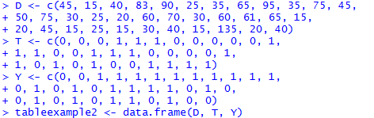

Figure 12. Code for creation of data frame relating Y to D and T.

Figure 13 shows the data frame.

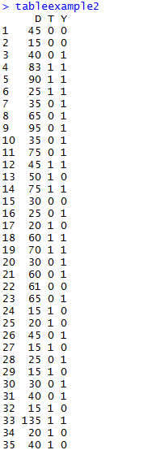

Figure 13. Data frame consisting of the variables D, T, and Y.

We find the estimated logistic regression model using the code in figure
14.

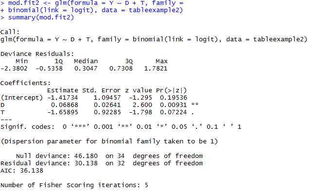

Figure 14. Code for fitting a logistic regression model relating Y to D
and T.

The estimated logistic regression model is
logit\(\left( \widehat{\pi} \right)\) =
\(- 1.41734 + 0.06868D - 1.65895T.\)

*Activity 3:* Suppose you are investigating allegations of gender
discrimination in the hiring practices of a particular firm. An
equal-rights group claims that females are less likely to be hired than
males with the same background, experience, and other qualifications.
The data on the table below was collected on 28 former applicants.

\(y\) = 1 if hired; \(y\) = 0 if not

\(x_{1}\) = Years of higher education (4, 6, or 8)

\(x_{2}\) = Years of experience

\(x_{3}\) = 1 if male applicant; \(x_{3}\) = 0 if female applicant

<table>
<thead>
<tr class="header">
<th>
<strong>HIRING STATUS</strong>

 <strong>y</strong> 
</th>
<th>
<strong>EDUCATION</strong>

<strong>x</strong><strong>1</strong><strong>, years</strong>
</th>
<th>
<strong>EXPERIENCE</strong>

<strong>x</strong><strong>2</strong><strong>, years</strong>
</th>
<th>
<strong>GENDER</strong>

 <strong>x</strong><strong>3</strong> 
</th>
</tr>
</thead>
<tbody>
<tr class="odd">
<td>0</td>
<td>6</td>
<td>2</td>
<td>0</td>
</tr>
<tr class="even">
<td>0</td>
<td>4</td>
<td>0</td>
<td>1</td>
</tr>
<tr class="odd">
<td>1</td>
<td>6</td>
<td>6</td>
<td>1</td>
</tr>
<tr class="even">
<td>1</td>
<td>6</td>
<td>3</td>
<td>1</td>
</tr>
<tr class="odd">
<td>0</td>
<td>4</td>
<td>1</td>
<td>0</td>
</tr>
<tr class="even">
<td>1</td>
<td>8</td>
<td>3</td>
<td>0</td>
</tr>
<tr class="odd">
<td>0</td>
<td>4</td>
<td>2</td>
<td>1</td>
</tr>
<tr class="even">
<td>0</td>
<td>4</td>
<td>4</td>
<td>0</td>
</tr>
<tr class="odd">
<td>0</td>
<td>6</td>
<td>1</td>
<td>0</td>
</tr>
<tr class="even">
<td>1</td>
<td>8</td>
<td>10</td>
<td>0</td>
</tr>
<tr class="odd">
<td>0</td>
<td>4</td>
<td>2</td>
<td>1</td>
</tr>
<tr class="even">
<td>0</td>
<td>8</td>
<td>5</td>
<td>0</td>
</tr>
<tr class="odd">
<td>0</td>
<td>4</td>
<td>2</td>
<td>0</td>
</tr>
<tr class="even">
<td>0</td>
<td>6</td>
<td>7</td>
<td>0</td>
</tr>
<tr class="odd">
<td>1</td>
<td>4</td>
<td>5</td>
<td>1</td>
</tr>
<tr class="even">
<td>0</td>
<td>6</td>
<td>4</td>
<td>0</td>
</tr>
<tr class="odd">
<td>0</td>
<td>8</td>
<td>0</td>
<td>1</td>
</tr>
<tr class="even">
<td>1</td>
<td>6</td>
<td>1</td>
<td>1</td>
</tr>
<tr class="odd">
<td>0</td>
<td>4</td>
<td>7</td>
<td>0</td>
</tr>
<tr class="even">
<td>0</td>
<td>4</td>
<td>1</td>
<td>1</td>
</tr>
<tr class="odd">
<td>0</td>
<td>4</td>
<td>5</td>
<td>0</td>
</tr>
<tr class="even">
<td>0</td>
<td>6</td>
<td>0</td>
<td>1</td>
</tr>
<tr class="odd">
<td>1</td>
<td>8</td>
<td>5</td>
<td>1</td>
</tr>
<tr class="even">
<td>0</td>
<td>4</td>
<td>9</td>
<td>0</td>
</tr>
<tr class="odd">
<td>0</td>
<td>8</td>
<td>1</td>
<td>0</td>
</tr>
<tr class="even">
<td>0</td>
<td>6</td>
<td>1</td>
<td>1</td>
</tr>
<tr class="odd">
<td>1</td>
<td>4</td>
<td>10</td>
<td>1</td>
</tr>
<tr class="even">
<td>1</td>
<td>6</td>
<td>12</td>
<td>0</td>
</tr>
</tbody>
</table>

  - Use the data to fit the estimated logistic regression model.

  - Estimate the probability of being hired when
    \(x_{1} = 4,\ x_{2} = 0,\) and \(x_{3} = 1.\)

We will interpret the output in figures 7 and 14 after describing
generalized linear models in more detail.

#### Generalized Linear Models

Generalized linear models (GLMs) are the second most important class of
models besides regression. GLMs are characterized by two main
components:

  - A probability distribution or family (binomial in the case of
    logistic regression)

  - A link function mapping the response to the predictors (logit in the
    case of logistic regression)

Logistic regression is by far the most common form of GLM. A data
scientist will encounter other types of GLMs. Sometimes a log link
function is used instead of the logit; in practice, use of a log link is
unlikely to lead to very different results from the use of logit for
most applications. The Poisson distribution is commonly used to model
count data (e.g., the number of times a user visits a web page in a
certain amount of time). Other families include negative binomial and
gamma, often used to model elapsed time (e.g., time to failure). In
contrast to logistic regression, application of GLMs with these models
is more nuanced and involves greater care.

### Variance-Covariance Matrix

The estimated variance-covariance matrix for \({\widehat{\beta}}_{0}\),
\(\cdots\), \({\widehat{\beta}}_{p}\) has the form:

\[\begin{bmatrix}
\text{Var}\left( {\widehat{\beta}}_{0} \right) & \cdots & \text{Cov}\left( {\widehat{\beta}}_{0},{\widehat{\beta}}_{p} \right) \\
 \vdots & \ddots & \vdots \\
\text{Cov}\left( {\widehat{\beta}}_{0},{\widehat{\beta}}_{p} \right) & \cdots & \text{Var}\left( {\widehat{\beta}}_{p} \right) \\
\end{bmatrix}\]

Thus, the (1, 1) element is the estimated variance of
\({\widehat{\beta}}_{0}\), the (1, 2) element is the estimated
covariance of \({\widehat{\beta}}_{0}\) and \({\widehat{\beta}}_{1}\),
\(\cdots\) . We will more simply call this matrix a “covariance matrix”
for the remainder of the module.

From the **summary(mod.fit)** output earlier (figure 7), we have

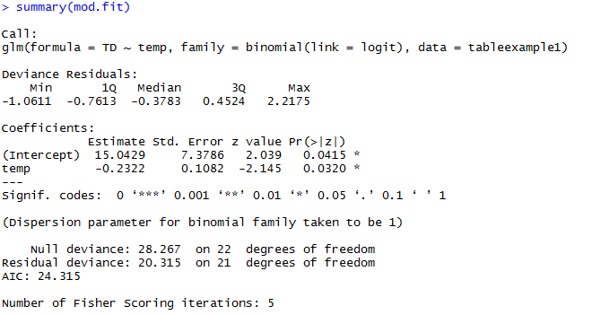

We can limit the displayed output by using the fact that **summary( )**
creates a list with **coefficients** as one component (figure 15).

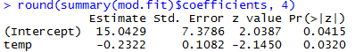

Figure 15. Limited output of the **summary( )** function.

The **Std. Error** column gives the standard errors for the regression
parameter estimators -
\(\widehat{\text{Var}}\left( {\widehat{\beta}}_{0} \right)^{1/2} = 7.3786\)
in the **“(Intercept)”** row and
\(\widehat{\text{Var}}\left( {\widehat{\beta}}_{1} \right)^{1/2} = 0.1082\)
in the **“temp”** row.

The **vcov( )** function produces the estimated covariance matrix
(figure 16).
(<https://stat.ethz.ch/R-manual/R-devel/library/stats/html/vcov.html>)

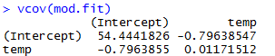

Figure 16. Covariance matrix of the **mod.fit** object.

We can extract the estimated variance for \({\widehat{\beta}}_{1}\) by
specifying the (2, 2) element of the matrix (figure 17).

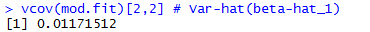

Figure 17. Extraction of the estimated variance for
\({\widehat{\beta}}_{1}\).

Thus, \(\widehat{\text{Var}}\left( {\widehat{\beta}}_{1} \right)\) =
0.01171512, which is the square of 0.1082 given within the coefficients
table.

*Activity 4:* Refer to Activity 2.

  - Use **vcov( )** in R to find
    \(\widehat{\text{Var}}\left( {\widehat{\beta}}_{0} \right)\ \)and
    \(\widehat{\text{Var}}\left( {\widehat{\beta}}_{1} \right).\)

  - Use **summary( )$coefficients** in R to find the estimated standard
    errors for the regression parameters.

*Activity 5:* Refer to Activity 3.

  - Use **vcov( )** in R to find
    \(\widehat{\text{Var}}\left( {\widehat{\beta}}_{0} \right),\ \widehat{\text{Var}}\left( {\widehat{\beta}}_{1} \right)\),
    \(\widehat{\text{Var}}\left( {\widehat{\beta}}_{2} \right)\), and
    \(\widehat{\text{Var}}{\widehat{\beta}}_{3}\).

  - Use **summary( )$coefficients** in R to find the estimated standard
    errors for the regression parameters.

### Hypothesis Tests for Regression Parameters

We often want to assess the importance of an explanatory variable or
groups of explanatory variables. One way to make this assessment is
through using hypothesis tests. For example, suppose we are interested
in the \(r^{\text{th}}\) explanatory variable \(x_{r}\) in the model

logit\(\left( \pi \right)\) =
\(\beta_{0} + \ \beta_{1}x_{1} + \ \cdots + \ \beta_{r}x_{r} + \ \cdots + \ \beta_{p}x_{p}\)

If \(\beta_{r} = 0\), we see that \(x_{r}\) would be excluded from the
model. Thus, we are interested in hypothesis tests of the form:

\[H_{0}:\ \ \beta_{r} = 0\]

\(H_{a}\): \(\beta_{r}\  \neq 0\)

Alternatively, we could state the hypotheses as:

\(H_{0}\):
logit\(\left( \pi \right) = \ \beta_{0} + \ \beta_{1}x_{1} + \ \cdots + \ \beta_{r - 1}x_{r - 1} + \ \beta_{r + 1}x_{r + 1} + \ \cdots + \ \beta_{p}x_{p}\)

\(H_{a}\):
logit\(\left( \pi \right) = \ \beta_{0} + \ \beta_{1}x_{1} + \ \cdots + \ \beta_{r}x_{r} + \ \cdots + \ \beta_{p}x_{p}\)

Notice that the null hypothesis model terms are all included within the
alternative hypothesis model. In other words, the null hypothesis model
is a special case of the alternative hypothesis model. For this reason,
the null hypothesis model is often referred to as a
reduced model and the alternative
hypothesis model is often referred to as a full
model. The purpose of this section is to examine two ways that
hypothesis tests of this form can be performed.

#### Wald Test

The Wald statistic
is

\[Z_{0} = \ \frac{{\widehat{\beta}}_{r}}{\sqrt{\text{Var}\left( {\widehat{\beta}}_{r} \right)}}\]

to test \(H_{0}\): \(\beta_{r} = \ 0\ \)vs. \(H_{a}\):
\(\beta_{r}\  \neq 0\). For a large sample, the test statistic has an
approximate standard normal distribution if the null hypothesis of
\(\beta_{r} = 0\) is true. Thus, reject the null hypothesis if we
observe a test statistic value that is “unusual” for a standard normal
distribution. The \(p\)-value is 2P(Z \> |\(Z_{0}\)|) where Z \~ N(0,1).
Wald test statistics and \(p\)-values are automatically provided for
individual \(\beta\) parameters using code like **summary(mod.fit).**
Recall figure 7 in the temperature and thermal distress example:

Let’s use the Wald test to test the hypothesis that temperature has no
effect: \(Z_{0} = \  - 2.145\) and \(p\)-value \(= 0.0320\). Since
\(p\)-value \(< \ \alpha = 0.05\) (typical significance level), we
reject \(H_{0}:\ \ \beta_{1} = 0.\) There is sufficient evidence to
indicate temperature has an effect on the probability of thermal
distress. If \(\alpha = 0.01\), there would not be a rejection of the
null hypothesis. It is preferable to word a conclusion like: There is
marginal evidence to indicate that
temperature has an effect on the probability of thermal distress.

*Activity 6:* Refer to Activities 2 and 4. Test whether age has a
significant effect using the Wald test.

The Wald test can also be performed for more than one parameter at the
same time. Recall the summary of the **mod.fit2** object of figure 14
for the experiencing sore throat after surgery example:

We will perform Wald tests on both duration of the surgery (D) and type
of device used to secure the airway (T) in the model
logit\(\left( \pi \right) = \ \beta_{0} + \ \beta_{1}D + \ \beta_{2}\text{T.}\)
Here is a summary of the tests using \(\alpha = 0.05:\)

<table>
<thead>
<tr class="header">
<th><strong>Duration of the surgery (D)</strong></th>
<th><strong>Type of device used to secure the airway (T)</strong></th>
</tr>
</thead>
<tbody>
<tr class="odd">
<td>
 <em>H</em>0:  <em>β</em>1 = 0 

 <em>H</em><em>a</em>:  <em>β</em>1  ≠ 0 
</td>
<td>
 <em>H</em>0:  <em>β</em>2 = 0 

 <em>H</em><em>a</em>:  <em>β</em>2  ≠ 0 
</td>
</tr>
<tr class="even">
<td> <em>Z</em>0 = 2.600 </td>
<td> <em>Z</em>0 =  − 1.798 </td>
</tr>
<tr class="odd">
<td><em>p</em>-value = 0.00931</td>
<td><em>p</em>-value = 0.07224</td>
</tr>
<tr class="even">
<td>Reject <em>H</em>0 because <em>p</em>-value &lt; <em>α</em> = 0.05.</td>
<td>Fail to reject <em>H</em>0 because <em>p</em>-value &gt; <em>α</em> = 0.05.</td>
</tr>
<tr class="odd">
<td>There is significant evidence to indicate duration has an effect on the probability of experiencing a sore throat given type of device is in the model.</td>
<td>There is insufficient evidence to indicate type of device has an effect on the probability of experiencing a sore throat given duration of surgery is in the model.</td>
</tr>
</tbody>
</table>

*Activity 7:* Refer to Activities 3 and 5. Perform Wald tests on each of
the independent variables.

#### Likelihood Ratio Test (LRT)

Generally, a better test than the Wald is an LRT. The LRT statistic is:

\(\Lambda\) =
\(\frac{\text{Maximum\ of\ likelihood\ function\ under\ }H_{0}}{\text{Maximum\ of\ likelihood\ function\ under\ }H_{0}\text{\ or\ }H_{a}}\)

To perform a test of \(H_{0}\): \(\beta_{r} = 0\) vs.
\(H_{a}:\ \ \beta_{r}\  \neq 0\), we obtain the estimated probabilities
of success from estimating

logit\(\left( \pi \right)\) =
\(\beta_{0} + \ \beta_{1}x_{1} + \ \cdots + \ \beta_{r - 1}x_{r - 1} + \ \beta_{r + 1}x_{r + 1} + \ \cdots + \ \beta_{p}x_{p}\)

and the estimated probabilities of success from
estimating

logit\(\left( \pi \right) = \ \beta_{0} + \ \beta_{1}x_{1} + \ \cdots + \ \beta_{r}x_{r} + \ \cdots + \ \beta_{p}x_{p}\).

We can then find \(- 2\)ln\(\left( \Lambda \right)\). If the null
hypothesis is true, \(- 2\)ln\(\left( \Lambda \right)\) has an
approximate \(\chi_{1}^{2}\) distribution for a large sample.

There are a number of ways to perform LRTs in R. The easiest way to
perform the tests of interest is to use the **Anova( )** function from
the **car** package.
(<http://cran.r-project.org/web/packages/car/car.pdf>) This package is
not automatically installed in R so we will need to install it prior to
use. The package corresponds to the book “An R Companion to Applied
Regression” by Fox and Weisberg. The code and output is given in figure
18.

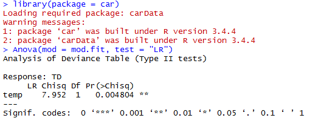

Figure 18. LRT test with the **Anova( )** function for a single
independent variable.

\(- 2\)ln\(\left( \Lambda \right) = 7.952\) and \(p\)-value
\(= 0.004804\). Since \(p\)-value \(< \ \alpha = 0.05\), we reject
\(H_{0}\): \(\beta_{1} = 0.\) There is significant evidence to indicate
temperature has an effect on the probability of thermal distress. LRT is
generally a better test than the Wald test.

*Activity 8:* Refer to Activities 2 and 4. Test whether age has a
significant effect using the likelihood-ratio test (LRT).

Let’s reconsider the model with both duration of the surgery (D) and
type of device used to secure the airway (T) in it:
logit\(\left( \pi \right) = \ \beta_{0} + \ \beta_{1}D + \ \beta_{2}T\).
In figure 19, we perform LRTs for these two variables using **Anova( )**
in R.

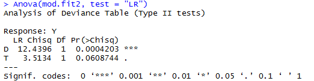

Figure 19. LRT test with the **Anova( )** function for two independent
variables.

For the test of duration with \(H_{0}:\ \ \beta_{1} = 0\) vs.
\(H_{a}:\ \ \beta_{1}\  \neq 0\), we obtain
\(- 2\)ln\(\left( \pi \right) = 12.4396\) with a \(p\)-value of
0.0004203, and we reach the same conclusion as with the previous Wald
test. In fact, it is now highly significant. The \(p\)-value for the
type of device test is given as 0.0608744, which again suggests there is
insufficient evidence that type of device is important (given that the
model includes duration of surgery).

*Activity 9:* Refer to Activities 3 and 5. Perform LRTs for the three
independent variables using **Anova( )** in R.

Within the **stats** package, the **anova( )** function can perform
LRTs. In figure 20, we see what occurs with a somewhat naïve use of it.

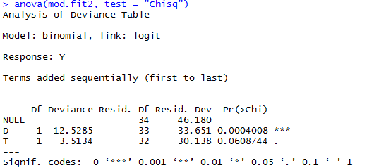

Figure 20. Naïve use of **anova( )** function.

The \(p\)-value for type of device (0.0608744) is the same as from using
**Anova( )**, but the *p*-value for duration of surgery (0.0004008) is
not. The reason for the difference is due to the hypotheses being
tested. The **anova( )** function tests the model’s explanatory
variables in a sequential manner. Thus, the duration test \(p\)-value is
actually for the test of

\(H_{0}:\ \ \)logit\(\left( \pi \right) = \ \beta_{0}\)

\(H_{a}:\ \ \)logit\(\left( \pi \right) = \ \beta_{0} + \ \beta_{1}\)D

because it is listed first in the formula argument of **glm( )**. The
type of device variable is listed second so **anova( )** tests:

\(H_{0}:\ \ \)logit\(\left( \pi \right) = \ \beta_{0} + \ \beta_{1}\)D

\(H_{a}:\ \ \)logit\(\left( \pi \right) = \ \beta_{0} + \ \beta_{1}\)D
\(+ \ \beta_{2}\)T

where duration of surgery is assumed to be in both models.

In order to produce the tests like **Anova( )**, we need to estimate the
\(H_{0}\) and \(H_{a}\) models separately and then use their model fit
objects in a different way with **anova( )** (figure 21).
[(https://stats.stackexchange.com/questions/223626/r-anova-vs-anova-for-test-of-categorical-predictor-from-glmer-or-glm-nb-ob?noredirect=1\&lq=1](file:///C:\\Users\\jx0848tg\\AppData\\Local\\Microsoft\\Windows\\Temporary%20Internet%20Files\\Content.Outlook\\0GLG0KQP\\\(https:\\stats.stackexchange.com\\questions\\223626\\r-anova-vs-anova-for-test-of-categorical-predictor-from-glmer-or-glm-nb-ob%3fnoredirect=1&lq=1))

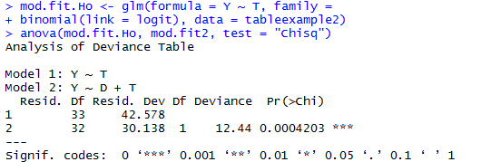

Figure 21. Use of **anova( )** function to compare reduced and full
models.

We obtain the same results as before with
\(- 2\)ln\(\left( \Lambda \right)\) = 30.138 and a \(p\)-value =
0.0004203. The use of **anova( )** helps to emphasize a reduced and full
model approach to obtaining the \(- 2\)ln\(\left( \Lambda \right)\)
statistic.

### Odds Ratios

A logistic regression model can be written
as

ln\(\left( \frac{\pi}{1 - \ \pi} \right) = \ \beta_{0} + \ \beta_{1}x_{1} + \ \cdots + \ \beta_{r}x_{r} + \ \cdots + \ \beta_{p}x_{p}\)

where the left-side of the model is the log odds of a success. Using a
similar interpretation as for normal linear regression models, we can
look at \(\beta_{r}\) then to interpret the effect that \(x_{r}\) has on
this log odds of a success. We can then form odds ratios by looking at
these odds of success at different values of \(x_{r}\).

For ease of presentation, consider the logistic regression with only one
explanatory variable \(x\):

ln\(\left( \frac{\pi}{1 - \ \pi} \right) = \ \beta_{0} + \ \beta_{1}x\)

We can re-write this model as

\[\text{Odds}_{x} = \ e^{\beta_{0} + \ \beta_{1}x}\]

where we replaced the \(\frac{\pi}{1 - \ \pi}\) to help with the
notation. For example, the odds of experiencing thermal distress are
\(\text{Odds}_{temperature = 60} = \ e^{\beta_{0} + \ \beta_{1}60}\) for
the space shuttle example, where temperature at lift off is the only
explanatory variable and it is set to a value of 60\(℉\).

If we increase \(x\) by \(c\)-units, the odds of a success
becomes

\[\text{Odds}_{x + c} = \ e^{\beta_{0} + \ \beta_{1}\left( x + c \right)}\]

To interpret the effect of increasing \(x\) by \(c\)-units, we can form
an odds ratio:

OR =
\(\frac{\text{Odds}_{x + c}}{\text{Odds}_{x}} = \ \frac{e^{\beta_{0} + \ \beta_{1}\left( x + c \right)}}{e^{\beta_{0} + \ \beta_{1}x}} = \ e^{c\beta_{1}}\)

Notice that \(x\) falls out. Thus, it does not matter what the value of
\(x\) is, the odds ratio remains the same for a \(c\)-unit increase.
This is one of the main reasons why logistic regression is the most used
way to model binary response data.

OR = \(e^{c\beta_{r}}\) for the model given at the beginning of this
section.

There are a number of ways to interpret the odds ratio in the context of
logistic regression. We recommend using the following:

The odds of a success change by \(e^{c\beta_{1}}\) times for every
\(c\)-unit increase in \(x\).

It is also common to say “increase” instead of “change” when
\(e^{c\beta_{1}}\) \> 1, and “decrease” when \(e^{c\beta_{1}}\) \< 1.

Suppose \(x\) only has two levels coded as 0 or 1 as is commonly done
for indicator variables in normal linear regression. This leads
to

\(\text{Odds}_{x = 0} = \ e^{\beta_{0} + \ \beta_{1}0} = \ e^{\beta_{0}}\)
and \(\text{Odds}_{x = 1} = \ e^{\beta_{0} + \ \beta_{1}}\)

as the only possible odds. The odds ratio becomes

OR =
\(\frac{e^{\beta_{0} + \ \beta_{1}}}{e^{\beta_{0}}} = \ e^{\beta_{1}}\)

In this situation, we could say

The odds of a success are \(e^{\beta_{1}}\) times as large for \(x = 1\)
than for \(x = 0.\)

To find the estimated odds ratio, simply replace the parameter with its
corresponding estimate:

OR = \(e^{c{\widehat{\beta}}_{1}}\)

The interpretation of the odds ratio now needs to have an “estimated”
inserted in the appropriate location. This estimate is the maximum
likelihood estimate (MLE).

Consider the model with only temperature at lift off as the explanatory
variable:

logit\(\left( \widehat{\pi} \right) = 15.0429 - 0.2322\)**temp**

To estimate the odds ratio, we can simply use the **exp( )** function
(figure 22).

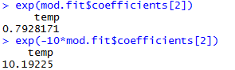

Figure 22. Calculation of the estimated odds ratio for **temp**.

We see that exp\(\left( {\widehat{\beta}}_{1} \right)\) = 0.7928 with
\(c = 1\). The odds of thermal distress decrease by 0.7928 times for
every 1-degree increase in temperature. Because a 1-degree increment is
rather small (range in temperature in the previous 23 flights was from
53-81\(℉\)), we instead focus on the change in the odds of thermal
distress for a 10-degree increment. Also, because the estimated odds of
thermal distress are lower for an increase in temperature
(\(e^{c{\widehat{\beta}}_{1}}\  < 1\) for \(c\  > 0\)), we focus on
\(c = \  - 10\) for our primary interpretation. Thus, we find that the
estimated odds of thermal distress increase by 10.19 times for every
10-degree decrease in the temperature.

*Activity 10:* Refer to Activities 2 and 4. Calculate the estimated odds
ratio for age with \(c = 1\) and \(c = 12.\)

#### Confidence Intervals for OR

Because the estimated odds ratio is a statistic, it will vary from
sample to sample. Therefore, we need to find a confidence interval for
*OR* in order to make inferences with a particular level of confidence.

Wald confidence intervals are the easiest to calculate. First, an
interval for \(c\beta_{1}\) needs to be
found:

\[c{\widehat{\beta}}_{1}\  \pm cZ_{1 - \alpha/2}\sqrt{\text{Var}\left( {\widehat{\beta}}_{1} \right)}\]

where \(\text{Var}\left( {\widehat{\beta}}_{1} \right)\) is obtained
from the estimated covariance matrix for the parameter estimates. Notice
where \(c\) is located in the interval calculation. The second \(c\)
comes about through
\(\text{Var}\left( c{\widehat{\beta}}_{1} \right) = \ c^{2}\text{Var}\left( {\widehat{\beta}}_{1} \right)\).
\[Recall that for a random variable \(Y\) and constant \(a\),
\(\text{Var}\left( \text{aY} \right) = \ a^{2}\text{Var}\left( Y \right)\).\]

To find the \(\left( 1 - \ \alpha \right)\) Wald confidence interval for
\(\text{OR}\), we use the exponential
function:

\[e^{c{\widehat{\beta}}_{1}\  \pm cZ_{1 - \alpha/2}\sqrt{\text{Var}\left( {\widehat{\beta}}_{1} \right)}}\]

The standard interpretation of the confidence interval is

With \(\left( 1 - \ \alpha \right)100\%\) confidence, the odds of a
success change by an amount between

\<lower limit\> to \<upper limit\> times for every \(c\)-unit increase
in \(x\),

where the appropriate numerical values are inserted with \< \>.

The Wald confidence interval generally has a true confidence level close
to the stated confidence interval only when there are large samples.
When the sample size is not large, profile
likelihood ratio (LR) confidence intervals generally perform
better. In most settings, there are no closed-form solutions for the
lower and upper limits, so iterative numerical procedures are needed to
find them. Once the confidence interval limits for \(\beta_{1}\) are
found, say, “lower” and “upper,” we use the exponential function and
take into account a value of \(c\) to find the
\(\left( 1 - \ \alpha \right)100\%\) profile LR confidence interval for
\(\text{OR}\):

\[e^{c\  \times lower}\  < OR\  < \ e^{c\  \times upper}\]

A few additional comments are needed about odds ratios before proceeding
to an
example.

#### Comments About the Use of Odds Ratios with Logistic Regression Models

1.  In many instances, inverting odds ratios less than 1 is helpful for
    interpretation purposes.

2.  An appropriate value of \(c\) should be chosen in the context of the
    explanatory variable. For example, if \(0.1\  < x\  < 0.2,\) a value
    of \(c = 1\) would not be appropriate. Additionally, if
    \(0\  < x\  < 1000,\) a value of \(c = 1\) may not be appropriate as
    well. Absent any other guidance, taking \(c\) to be the standard
    deviation of \(x\) can be a reasonable choice.

3.  When there is more than one explanatory variable, the odds ratio can
    be shown to be \(e^{c\beta_{r}}\) for \(x_{r}\) in the model. The
    same interpretation of the odds ratio *generally* can be made with
    the addition of “holding the other explanatory variables constant.”
    This is basically the same as what is done in normal linear
    regression.

#### Confidence Intervals for the Space Shuttle Example

To account for the variability in the odds ratio estimator, we would
like to calculate a confidence interval for the actual odds ratio
itself. The code for the profile likelihood ratio interval is given in
figure 23.

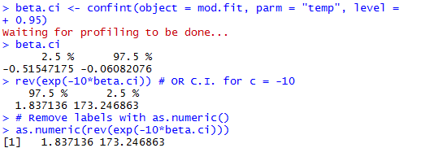

Figure 23. Code for the Profile Likelihood Ratio Confidence Interval.

The **confint( )** function first finds an interval for \(\beta_{1}\)
itself.
([https://stats.stackexchange.com/questions/177005/interpreting-glm-output-from-r](https://stats.stackexchange.com/questions/177005/interpreting-glm-output-from-r%20))
The 95% profile LR confidence interval for the **temp** parameter is
\(- 0.5155\  < \ \beta_{1}\  < \  - 0.0608.\) We then use the **exp( )**
function to find the confidence interval for \(\text{OR}\). Using
\(c = \  - 10\), the 95% profile LR interval for the odds ratio is
\(1.84\  < OR\  < \  < 173.25\) where \(OR = \ e^{- 10\beta_{1}}\). With
95% confidence, the odds of thermal distress increase by an amount
between 1.84 to 173.25 times for every 10-degree decrease in
temperature. Because the interval is entirely above 1, there is
sufficient evidence that a 10-degree decrease in temperature
significantly increases the odds of thermal distress. Note that we use
**as.numeric( )** in figure 23 to prevent unnecessary labels from being
printed.

In order to calculate a Wald interval, we need to use the specific
method function **confint.default( )** (figure 24).

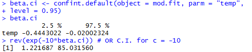

Figure 24. Code for Wald confidence interval.

We used the **confint.default( )** function for part of the
calculations, because there is no “Wald” like option in **confint( )**.
The 95% Wald confidence interval for the **temp** parameter is
\(- 0.4443\  < \ \beta_{1}\  < \  - 0.0200.\) Using \(c = \  - 10,\) we
obtain the 95% Wald interval \(1.22\  < OR < 85.03.\)

To see how these calculations are performed without the
**confint.default( )** function, figure 25 is an example of how to
program into R the corresponding formula.

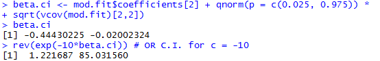

Figure 25. Code for computing the Wald confidence interval directly.

The **vcov( )** function calculates the estimated covariance matrix for
the parameter estimates using the information within **mod.fit**. By
specifying **vcov(mod.fit)\[2,2\]**, we extract
\(\widehat{\text{Var}}\left( {\widehat{\beta}}_{1} \right)\) from the
matrix. The **mod.fit$coefficients\[2\]** syntax extracts
\({\widehat{\beta}}_{1}\) from the vector of parameter estimates.
Putting these elements together, we calculate the confidence interval
for \(\beta_{1}\) and then the desired confidence interval for the odds
ratio.

*Activity 11:* Refer to Activities 2 and 4.

  - Find the 95% Wald confidence interval for \(\beta_{1}\).

  - Find the 95% profile LR confidence interval for \(\beta_{1}\).

  - Find the 95% Wald \(\text{OR}\) confidence interval for \(c = 12.\)

  - Find the 95% profile LR confidence interval for \(c = 12.\)

### Probability of Success

As shown earlier, the estimate for \(\pi\)
is

\[\widehat{\pi} = \ \frac{e^{{\widehat{\beta}}_{0} + \ {\widehat{\beta}}_{1}x_{1} + \ \cdots + \ {\widehat{\beta}}_{p}x_{p}}}{1 + \ e^{{\widehat{\beta}}_{0} + \ {\widehat{\beta}}_{1}x_{1} + \ \cdots + \ {\widehat{\beta}}_{p}x_{p}}}\]

As an example, we again use the **mod.fit** object from the logistic
regression model that uses only **temp** as an explanatory variable.
Figures 26 and 27 show two ways that the estimated probability of
thermal distress can be calculated for a temperature of 50 degrees.

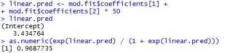

Figure 26. Direct calculation of the probability of thermal distress at
a temperature of \(50℉\).

The first way directly calculates the linear predictor as
\({\widehat{\beta}}_{0} + \ {\widehat{\beta}}_{1}x = 15.0429 - 0.2322\  \times 50 = 3.4348\)
resulting in
\(\widehat{\pi} = \ \frac{e^{3.4348}}{1 + \ e^{3.4348}} = 0.9688.\)

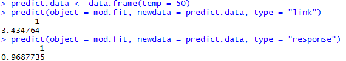

Figure 27. Use of the **predict( )** function to calculate the
probability of thermal distress at a temperature of \(50℉\).

The second way to calculate \(\widehat{\pi}\) is to use the **predict(
)** function. To use **predict( )**, a data frame must contain the
explanatory variable values at which the estimates of \(\pi\) are
desired. This data frame is included then in the **newdata** argument of
**predict( )**. Additionally, the **object** argument specifies where
the model fit information from **glm( )** is located, and the **type =
“response”** argument value instructs R to estimate \(\pi\).
Alternatively, the **type = “link”** argument value instructs R to
estimate \(\beta_{0} + \ \beta_{1}x\).
(<https://stat.ethz.ch/R-manual/R-devel/library/stats/html/predict.glm.html>)

*Activity 12:* Refer to Activities 2 and 4. Use the **predict( )**
function in R to estimate the probability of kyphosis being present at
an age of 180 months (15 years).

*Activity 13:* Refer to Activities 3 and 5. Using the direct approach,
estimate the probability of being hired when
\(x_{1} = 4,\ x_{2} = 3,\ \)and \(x_{3} = 0.\)

Because \(\widehat{\pi}\) is a statistic, it will vary from sample to
sample. Therefore, we need to find a confidence interval for \(\pi\) in
order to make inferences with a particular level of confidence. Both
Wald and profile LR intervals will be discussed next.

#### Wald Interval

To find a confidence interval for \(\pi\), consider again the logistic
regression model with only one explanatory variable \(x\):

ln\(\left( \frac{\pi}{1 - \ \pi} \right) = \ \beta_{0} + \ \beta_{1}x\)
or
\(\pi = \ \frac{e^{\beta_{0} + \ \beta_{1}x}}{1 + \ e^{\beta_{0} + \ \beta_{1}x}}\)

To find a Wald confidence interval for \(\pi\), we need to first find an
interval for \(\beta_{0} + \ \beta_{1}x\) (or equivalently for
logit\(\left( \pi \right)\)):

\[{\widehat{\beta}}_{0} + \ {\widehat{\beta}}_{1}x\  \pm \ Z_{1 - \alpha/2}\sqrt{\text{Var}\left( {\widehat{\beta}}_{0} + \ {\widehat{\beta}}_{1}x \right)}\]

where

\[\text{Var}\left( {\widehat{\beta}}_{0} + \ {\widehat{\beta}}_{1}x \right) = Var\left( {\widehat{\beta}}_{0} \right) + \ x^{2}\text{Var}\left( {\widehat{\beta}}_{1} \right) + 2xCov\left( {\widehat{\beta}}_{0},\ {\widehat{\beta}}_{1} \right)\]

and
\(\text{Var}\left( {\widehat{\beta}}_{0} \right),\ Var\left( {\widehat{\beta}}_{1} \right)\),
and
\(\text{Cov}\left( {\widehat{\beta}}_{0},\ {\widehat{\beta}}_{1} \right)\)
are obtained from the estimated covariance matrix for the parameter
estimates.

To find the \(\left( 1 - \ \alpha \right)100\%\ \)Wald confidence
interval for \(\pi\), we use the exp(\(\bullet )\ /\ \)\[1 +
exp(\(\bullet\))\]
transformation:

\[\frac{e^{{\widehat{\beta}}_{0} + \ {\widehat{\beta}}_{1}x\  \pm \ Z_{1 - \alpha/2}\sqrt{\text{\ Var}\left( {\widehat{\beta}}_{0} + \ {\widehat{\beta}}_{1}x \right)}}}{1 + \ e^{{\widehat{\beta}}_{0} + \ {\widehat{\beta}}_{1}x\  \pm \ Z_{1 - \ \alpha/2}\sqrt{\text{Var}\left( {\widehat{\beta}}_{0} + \ {\widehat{\beta}}_{1}x \right)}}}\]

To calculate a Wald confidence interval for \(\pi\), the easiest way is
to use the **predict( )** function to calculate
\({\widehat{\beta}}_{0} + \ {\widehat{\beta}}_{1}x\) and
\(\widehat{\text{Var}}\left( {\widehat{\beta}}_{0} + \ {\widehat{\beta}}_{1}x \right)\)
first. We then calculate the confidence interval for \(\pi\) using the
appropriate code for the above equations (figure 28).

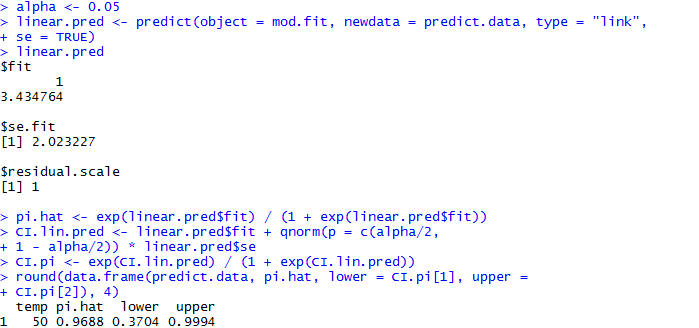

Figure 28. Calculation of Wald confidence interval for \(\pi\).

We use the **se = TRUE** argument value within **predict( )** to find
\(\widehat{\text{Var}}\left( {\widehat{\beta}}_{0} + \ {\widehat{\beta}}_{1}x \right)\)1/2,
the “standard error” for
\({\widehat{\beta}}_{0} + \ {\widehat{\beta}}_{1}x\). The 95% Wald
confidence interval for \(\pi\) is \(0.3704\  < \ \pi\  < 0.9994\).

*Activity 14:* Refer to Activities 2 and 4. Calculate a 95% Wald
confidence interval for \(\pi\) at an age of 180 months.

Using the original Wald confidence interval equation again, we can also
calculate more than one interval at a time and include more than one
explanatory variable. Figure 29 is an example using the estimated model

logit\(\left( \widehat{\pi} \right) = \  - 1.4173 + 0.0687D - 1.6590T\)

that we found earlier and then saved the results from **glm( )** in an
object called **mod.fit2**.

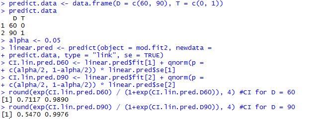

Figure 29. Code for calculating two confidence intervals at a time and
including two explanatory variables.

*Activity 15:* Refer to Activities 3 and 5. Calculate 95% Wald
confidence intervals for \(\pi\), the probability of being hired, when
\(x_{1} = 4,\ x_{2} = 3,\ x_{3} = 0\) and when
\(x_{1} = 4,\ x_{2} = 0,\ x_{3} = 1.\) Use **data.frame(x1 = c(4, 4), x2
= c(3, 0), x3 = c(0, 1))**.

#### Profile Likelihood Ratio Interval

Profile LR confidence intervals for \(\pi\) can be found as well, but
they can be much more difficult computationally to find than for
\(\text{OR}\). This is because a larger number of parameters are
involved. For example, the one explanatory variable model
logit\(\left( \pi \right) = \ \beta_{0} + \ \beta_{1}x\) is a linear
combination of \(\beta_{0}\) and \(\beta_{1}\). The numerator of
\(- 2\)ln\(\left( \Lambda \right)\) involves maximizing the likelihood
function with a constraint for this linear combination.

The **mcprofile** package (not in the default installation of R)
provides a general way to compute profile likelihood ratio intervals.
Earlier versions of it produced questionable results at times. Current
versions generally do not have problems.
[(https://cran.r-project.org/web/packages/mcprofile/mcprofile.pdf](file:///C:\\Users\\jx0848tg\\AppData\\Local\\Microsoft\\Windows\\Temporary%20Internet%20Files\\Content.Outlook\\0GLG0KQP\\\(https:\\cran.r-project.org\\web\\packages\\mcprofile\\mcprofile.pdf))
Still, we recommend using the following approach with this package:

1.  Calculate a Wald interval.

2.  Calculate a profile likelihood ratio interval with the **mcprofile**
    package.

3.  Use the profile LR interval as long as it is not outlandishly
    different than the Wald and there are no warning messages given by R
    when calculating the interval. Otherwise, use the Wald interval.

To find a profile LR interval for \(\pi\) at a lift off temperature of
50 degrees, we use the code in figure 30.

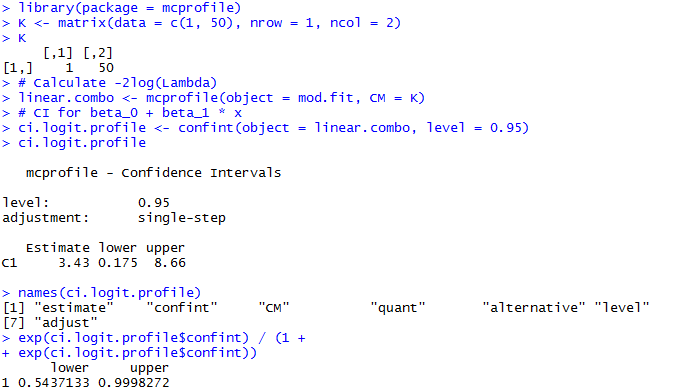

Figure 30. Profile LR interval for \(\pi\) at a temperature of 50
degrees.

After the initial call to the **library( )** function for the
**mcprofile** package, we create a matrix **K** that contains
coefficients for the linear combination of interest. In this case, we
want to first find a confidence interval for
\(\mathbf{1\  \times \ }\mathbf{\beta}_{\mathbf{0}}\mathbf{+ 50\  \times \ }\mathbf{\beta}_{\mathbf{1}}\)**.**
The **mcprofile( )** function calculates
\(- 2\)ln\(\left( \Lambda \right)\) for a large number of possible
values of the linear combination, where the argument **CM** is short for
“contrast matrix.” The **confint( )** function finds the 95% profile LR
interval to be \(0.175\  < \ \beta_{0} + 50\beta_{1}\  < 8.66\). We use
the
**exp(**\(\mathbf{\bullet}\)**)/\[1+exp(**\(\mathbf{\bullet}\)**)\]**
transformation then to find the interval for \(\pi\) as
\(0.5437\  < \ \pi\  < 0.9998\).

*Activity 16:* Refer to Activities 2 and 4. Calculate a 95% profile LR
confidence interval for \(\pi\) at an age of 180 months.

**Final Assessment**

1.  The following table refers to a sample of subjects randomly selected
    for an Italian study on the relation between income and whether one
    possesses a travel credit card (such as American Express). At each
    level of annual income in millions of lira, the table indicates the
    number of subjects sampled and the number of them possessing at
    least one travel credit card. (Note: one million lira at the time of
    the study is currently worth about 500 euros.) Logistic regression
    was used to relate the probability of having a travel credit card to
    income.

| **Income** | **Number of Cases** | **Credit Cards** |
| ---------- | ------------------- | ---------------- |
| 24         | 1                   | 0                |
| 27         | 1                   | 0                |
| 28         | 5                   | 2                |
| 29         | 3                   | 0                |
| 30         | 9                   | 1                |
| 31         | 5                   | 1                |
| 32         | 8                   | 0                |
| 33         | 1                   | 0                |
| 34         | 7                   | 1                |
| 35         | 1                   | 1                |
| 38         | 3                   | 1                |
| 39         | 2                   | 0                |
| 40         | 5                   | 0                |
| 41         | 2                   | 0                |
| 42         | 2                   | 0                |
| 45         | 1                   | 1                |
| 48         | 1                   | 0                |
| 49         | 1                   | 0                |
| 50         | 10                  | 2                |
| 52         | 1                   | 0                |
| 59         | 1                   | 0                |
| 60         | 5                   | 2                |
| 65         | 6                   | 6                |
| 68         | 3                   | 3                |
| 70         | 5                   | 3                |
| 79         | 1                   | 0                |
| 80         | 1                   | 0                |
| 84         | 1                   | 0                |
| 94         | 1                   | 0                |
| 120        | 6                   | 6                |
| 130        | 1                   | 1                |

*Source:* Based on data in *Categorical Data Analysis*, Quaderni del
Corso Estivo di Statistica e Calcolo delle Probabilita, no. 4, Instituto
di Metodi Quantitativi, Universita Luigi Bocconi, by R. Piccarretta.

Use the following code to create a data frame:

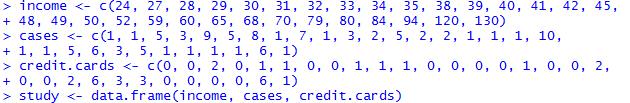

Your data.frame should be the following:

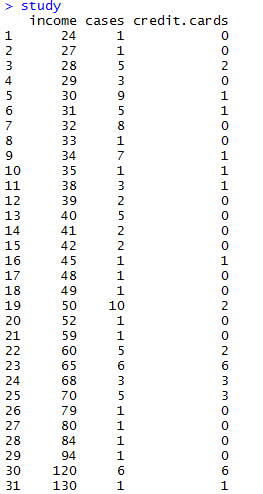

Use the following code to create the logistic regression model:

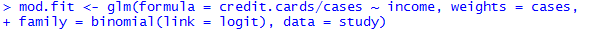

1.  The estimated logistic regression equation is
    logit\(\left( \widehat{\pi} \right) =\) \_\_\_\_\_\_\_\_\_\_ +
    \_\_\_\_\_\_\_\_\_\***income.**

2.  Because there is a positive parameter estimate corresponding to
    income, the estimated probability of having a travel credit card
    \_\_\_\_\_\_\_\_\_ as income increases.

3.  The estimated odds of having a travel credit card multiply by
    \_\_\_\_\_\_\_\_\_ times for each one million lira increase in
    annual income.

4.  The estimated odds of having a travel credit card multiply by
    \_\_\_\_\_\_\_\_\_ times for each ten million lira increase in
    annual income.

5.  Based on the 95% Wald confidence interval for \(\beta_{1}\), can we
    conclude that annual income has a significant effect on predicting
    the probability of having a travel credit card? Why or why not?

6.  The 95% profile LR confidence interval for \(\beta_{1}\) is
    \_\_\_\_\_\_\_\_\_\_ \(< \ \beta_{1}\  <\) \_\_\_\_\_\_\_\_\_\_.

7.  Using a 95% profile LR confidence interval, the odds of owning a
    travel credit card increase by an amount between
    \_\_\_\_\_\_\_\_\_\_ to \_\_\_\_\_\_\_\_\_ times for every 10
    million lira increase in annual income.

8.  Using an LRT, test the hypothesis that annual income has no effect
    on predicting the probability of owning a travel credit card.

9.  The estimated probability of owning a travel credit card when annual
    income is 90 million lira is \_\_\_\_\_\_\_\_\_.

10. The 95% profile LR confidence interval for \(\pi\) when annual
    income is 90 million lira is \_\_\_\_\_\_\_\_\_\_ \(< \ \pi\  <\)
    \_\_\_\_\_\_\_\_\_.

<!-- end list -->

2.  Recall the example with the response variable of hiring status based
    on the three explanatory variables of years of education, years of
    experience, and gender. Assume that we ignore gender and fit a
    logistic regression model relating the probability of being hired to
    years of education (\(x_{1} =\) 4, 6, or 8) and years of experience
    (\(x_{2}\)).

<!-- end list -->

1.  The estimated logistic regression model is
    logit\(\left( \widehat{\pi} \right)\) = \_\_\_\_\_\_\_\_\_\_ +
    \_\_\_\_\_\_\_\_\_\_\(x_{1}\) + \_\_\_\_\_\_\_\_\_\_\(x_{2}\).

2.  Assume that someone is hired with no experience. Determine the
    estimated probability \(\left( \widehat{\pi} \right)\) of being
    hired with 4, 6, and 8 years of education. Also calculate the 95%
    Wald CI for \(\pi\) for each of the three cases.

3.  Use the LRT results to test the significance of the two explanatory
    variables. Use \(\alpha = 0.05.\)

4.  Based on the results in (c), should a revised model be considered?
    If so, what model?

5.  Fit the following logistic regression model:
    logit\(\left( \pi \right) = \ \beta_{0} + \ \beta_{1}x_{2}\). The
    estimated logistic regression model is
    logit\(\left( \widehat{\pi} \right) = \ \)\_\_\_\_\_\_\_\_\_\_ +
    \_\_\_\_\_\_\_\_\_\_\(x_{2}\).

6.  Refer to part (e). Estimate the probability of being hired with 10
    years of experience.

7.  Refer to part (e). Test whether years of experience has a
    significant effect using the Wald test.

8.  Refer to part (e). The estimated odds of being hired increase by
    \_\_\_\_\_\_\_\_\_\_ times for every 1-year increase in years of
    experience.

9.  Of the two models considered, which is the most parsimonious?

<!-- end list -->

3.  The failure of an O-ring on the space shuttle Challenger’s booster
    rockets led to its destruction in 1986. Using data on previous space
    shuttle launches, Dalal et al. (1989) examine the probability of an
    O-ring failure as a function of temperature at launch and combustion
    pressure. Data from their paper is included in the table below.

| **Flight** | **Temp** | **Pressure** | **O.ring** | **Number** |
| ---------- | -------- | ------------ | ---------- | ---------- |
| 1          | 66       | 50           | 0          | 6          |
| 2          | 70       | 50           | 1          | 6          |
| 3          | 69       | 50           | 0          | 6          |
| 4          | 68       | 50           | 0          | 6          |
| 5          | 67       | 50           | 0          | 6          |
| 6          | 72       | 50           | 0          | 6          |
| 7          | 73       | 100          | 0          | 6          |
| 8          | 70       | 100          | 0          | 6          |
| 9          | 57       | 200          | 1          | 6          |
| 10         | 63       | 200          | 1          | 6          |
| 11         | 70       | 200          | 1          | 6          |
| 12         | 78       | 200          | 0          | 6          |
| 13         | 67       | 200          | 0          | 6          |
| 14         | 53       | 200          | 2          | 6          |
| 15         | 67       | 200          | 0          | 6          |
| 16         | 75       | 200          | 0          | 6          |
| 17         | 70       | 200          | 0          | 6          |
| 18         | 81       | 200          | 0          | 6          |
| 19         | 76       | 200          | 0          | 6          |
| 20         | 79       | 200          | 0          | 6          |
| 21         | 75       | 200          | 2          | 6          |
| 22         | 76       | 200          | 0          | 6          |
| 23         | 58       | 200          | 1          | 6          |

Below are the variables:

  - **Flight:** Flight number

  - **Temp:** Temperature (\(℉\)) at launch

  - **Pressure:** Combustion pressure (psi)

  - **O.ring:** Number of primary field O-ring failures

  - **Number:** Total number of primary field O-rings (six total, three
    each for the two booster rockets)

The authors used logistic regression to estimate the probability an
O-ring will fail. In order to use this model, the authors needed to
assume that each O-ring is independent for each launch. This assumption
is necessary since logistic regression assumes that each response has a
binomial distribution, and independence of trials is required for the
binomial. Because three O-rings are on each rocket, there may be
dependencies (e.g. installed by the same workers, failure in one perhaps
could lead to failure in another, …) in their success or failure. Note
that a subsequent analysis helped to alleviate the authors’ concerns
about independence.

Create a data frame using the following code:

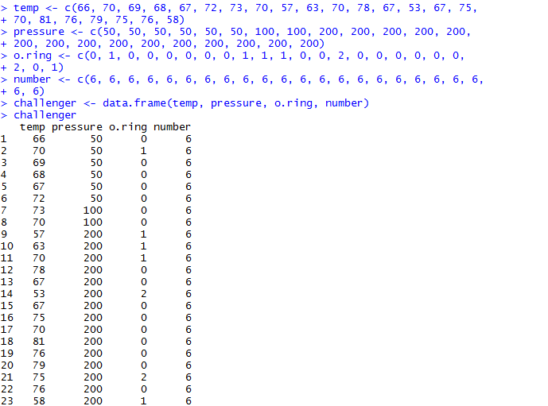

1.  Estimate the logistic regression model using the explanatory
    variables (**temp** and **pressure**) in a linear form. Use
    **o.ring/number** as the response variable in your model. Use the
    following code to create your model:

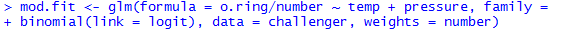

logit\(\left( \widehat{\pi} \right) = \ \)\_\_\_\_\_\_\_\_\_\_ +
\_\_\_\_\_\_\_\_\_\_**temp** + \_\_\_\_\_\_\_\_\_\_**pressure**

2.  Use the Wald test results to test the significance of the two
    explanatory variables. Use \(\alpha = 0.05\).

3.  A logistic regression model was fit using only **temp** as a
    predictor of O-ring failure. Use the following code:

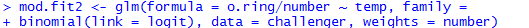

The estimated logistic regression model is
logit\(\left( \widehat{\pi} \right) = \ \)\_\_\_\_\_\_\_\_\_\_ +
\_\_\_\_\_\_\_\_\_\_**temp.**

4.  Test whether **temp** has a significant effect using the Wald test.

5.  The odds of O-ring failure decrease by \_\_\_\_\_\_\_\_\_ times for
    every 1-degree increase in temperature.

6.  The odds of O-ring failure increase by \_\_\_\_\_\_\_\_\_ times for
    every 10-degree decrease in temperature.

7.  Of the two models considered, which is the most parsimonious?

**References:**

Agresti, A. An Introduction to Categorical Data Analysis, Second
Edition, Wiley, 2007.

Azen, R and Walker, C.M. Categorical Data Analysis for the Behavioral
and Social Sciences, Routledge, 2011.

Collett, D. Chapter in the Encyclopedia of Biostatistics, pp. 350-358,
1998.

Dalal, S.R., Fowlkes, E.B., Hoadley, B. “Risk Analysis of the Space
Shuttle: Pre-Challenger Prediction of Failure,” *Journal of the American
Statistical Association*, Volume 84, No. 408, pp. 945-957, 1989.

Hastie, T. and Tibshirani, R. Generalized Additive Models, Chapman and
Hall, 1990.

Piccarretta, R. Categorical Data Analysis, Quaderni del Corso Estivo di
Statistica e Calcolo delle Probabilita, no. 4, Instituto di Metodi
Quantitativi, Universita Luigi Bocconi.

Hosmer, Jr., D.W., Lemeshow, S., and Sturdivant, R.X. Applied Logistic
Regression, Third Edition, Wiley, 2013.
